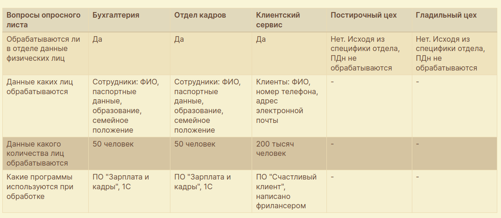

# 02.03. Классификация и категоризация информации, информационных систем - Лебедев Д.С.

### Задание 1 "Уровни защищённости ИСПДн предприятия"
> Заполненные отделами запросные листы:
> 
> 
> Особые условия для задания:
> - угрозы 1-го типа не актуальны
> - угрозы 2-го типа актуальны только для ПО, выполненного фрилансером.
> 
> Требования к результату выполнения задания:
> 1. Выявите ИСПДн;
> 2. Приведите критерии определения уровня защищённости;
> 3. Определите уровень защищённости каждой ИСПДн.

*Ответ:* 

1. Исходя из полученных сведений, на предприятии выявлены следующие ИСПДн:
- ИСПДн №1 - ПО "Зарплата и кадры";
- ИСПДн №2 - ПО "Счастливый клиент".

2. Критерии определения уровня защищённости:
- Категория обрабатываемых данных ПДн;
- Количество субъектов ПДн;
- Чьи ПДн обрабатываются (сотрудники, клиенты);
- Наличие недокументированных возможностей в ПО ИСПДн, (типы угроз);

3. Определение уровня защищенности ИСПДн

**ИСПДн №1, ПО "Зарплата и кадры":**
- Категория обрабатываемых данных - иные ПДн;
- Количество субъектов ПДн - 100 (50+50);
- Субъекты ПДн - сотрудники оператора;
- НДВ не актуальны по условиям задания, 3 тип угроз.

*Исходя из критериев, необходимо обеспечить 4 уровень защищенности данной ИСПДн*. Основание - п. 12 "б" ПП РФ от 01.11.2012 N 1119

**ИСПДн №2, ПО "Счастливый клиент":**
- Категория обрабатываемых данных - общедоступные ПДн;
- Количество субъектов ПДн - 200000;
- Субъекты ПДн - не сотрудники оператора (клиенты);
- НДВ актуальны по условиям задания, 2 тип угроз.

*Исходя из критериев, необходимо обеспечить 2 уровень защищенности данной ИСПДн*. Основание - п. 10 "г" ПП РФ от 01.11.2012 N 1119

### Задание 2 «Туристический портал»*
> Изучить [техническое задание](_att/010203_tz.docx) "Выполнение работ по созданию информационной системы "Туристический портал Пермского края" с выполнением работ по разработке и внедрению системы защиты информации с поставкой, установкой, настройкой средств защиты информации и аттестацией информационной системы по требованиям защиты информации"
> 
> Ответить на вопросы:
> 1. Из каких подсистем состоит система (перечислите их названия)?
> 2. Какие три режима функционирования режима предусмотрены (кратко опишите, для чего каждый режим предназначен и какие функции в каждом режиме доступны)?
> 3. Какие требования доступности предъявляются к системе?
> 4. Какие требования предъявляются к подсистеме регистрации и учёта (а конкретно к журналированию событий)?
> 5. Какие меры должны быть включены в комплекс организационных и технических мер, направленных на нейтрализацию актуальных угроз безопасности?
> 6. Какие документы из состава эксплуатационной документации должны быть разработаны на систему защиты информации?
> 7. И самый главный вопрос: кто должен определять класс защищённости этой системы и как?

*Ответ:* 

1. Система должна включать следующие подсистемы:
- Подсистема "Портал" (WEB-версия Системы);
- Подсистема "Мобильное приложение";
- Подсистема "Административный интерфейс".

2. Для Системы должны быть определены следующие режимы функционирования:

-  Штатный режим. Основной режим функционирования системы. Функции круглосуточного функционирования, с перерывами на обслуживание; 
- Сервисный режим (режим для проведения обслуживания, реконфигурации и пополнения технических и программных средств Системы новыми компонентами. Настройка, подготовка, испытания системы). Техническое обслуживание, модернизация аппаратно-программного комплекса, устранение аварийных ситуаций.
- Аварийный режим. При возникновении нештатной ситуации и невозможности штатной работы. Функциональная возможность переведения системы в сервисный режим.

3. Доступность функций Системы в режиме – 24 часа в день, 7 дней в неделю (24х7). Система должна обеспечивать возможность одновременной работы не менее 500 пользователей при определенных характеристиках времени отклика.

4. Необходимо обеспечить обязательное ведение журнала событий с указанием следующих значений для каждого события :
- уникальный порядковый номер записи;
- дата и время события;
- ФИО пользователя;
- наименование события.

Необходимо обеспечить недоступность изменения записей журнала для всех пользователей, в том числе и административного персонала.

5. Комплекс организационных и технических мер, направленных на нейтрализацию актуальных угроз безопасности, определенных с учетом специфики Системы и условий ее функционирования, должен предусматривать:
- идентификацию и аутентификацию субъектов доступа и объектов доступа;
- управление доступом субъектов доступа к объектам доступа;
- защиту машинных носителей информации, на которых хранятся и (или) обрабатывается конфиденциальная информация;
- регистрацию событий безопасности;
- антивирусную защиту;
- обнаружение (предотвращение) вторжений;
- контроль (анализ) защищенности информации;
- обеспечение целостности информационной системы и информации; 
- обеспечение доступности информации;
- защиту технических средств;
- ограничение программной среды;
- защиту среды виртуализации (при использовании механизмов виртуализации);
- защиту информационной системы, ее средств, систем связи и передачи данных;
- выявление инцидентов (одного события или группы событий), которые могут привести к сбоям или нарушению функционирования информационной системы и (или) к возникновению угроз безопасности информации (далее – инциденты), и реагирование на них;
- управление конфигурацией информационной системы и системы защиты информации.

6. Требования к разработке эксплуатационной документации на систему защиты информации. Эксплуатационная документация на систему защиты информации Системы, кроме прочего, должна включать в себя:
- Руководство администратора на систему защиты информации Системы;
- Руководство пользователя на систему защиты информации Системы;
- Инструкцию по эксплуатации комплекса средств защиты информации и иных технических средств;
- Технический паспорт Системы;
- Описание технологического процесса обработки информации.
- Руководство администратора на систему защиты информации Системы должно содержать инструкции по установке, настройке, регламентным работам, а также формы журналов учета, связанных с эксплуатацией системы защиты информации Системы.
- Руководство пользователя системы защиты информации Системы должно содержать инструкции, необходимые для работы со средствами защиты (в т.ч. криптографическими) при осуществлении доступа к Системе.
- Инструкция по эксплуатации комплекса средств защиты информации и иных технических средств должна содержать всю информацию, необходимую для работы со средствами защиты (в т.ч. криптографическими) и иными техническими средствами при эксплуатации системы защиты информации Системы.
- Технический паспорт Системы должен содержать сведения об используемых в Системе технических средствах (в т.ч. о схемах размещения технических средств), средствах защиты информации и программном обеспечении, а также формы журналов учета, связанных с эксплуатацией системы защиты информации Системы.
- Описание технологического процесса обработки информации должно в полной мере описывать процесс обработки информации в Системе.

5. Определение класса защищенности. Класс защищённости определяет заказчик при проектировании на основе категории информации и нормативных требований, окончательное подтверждение даёт аттестующий центр в ходе проверки. Аттестующий центр (ФСТЭК/ФСБ-аккредитованный) проверяет соответствие системы заявленному классу защищённости, выдаёт аттестат соответствия (для госинформсистем) или акт проверки.

---
```
все верно, принимается!
```