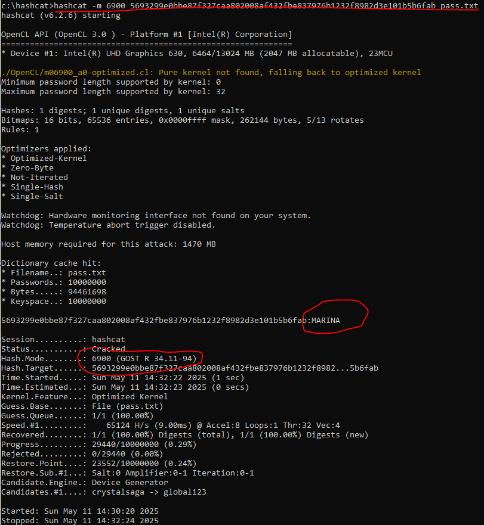
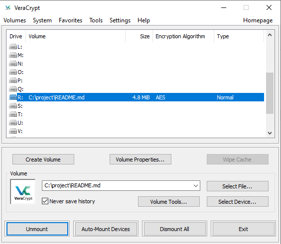

# 03.01. Теоретические основы криптографии, симметричные криптосистемы - Лебедев Д.С.

### Задание 1 - HashCat
> Каким-то образом у вас оказался хэш пароля. Вот такой: `5693299e0bbe87f327caa802008af432fbe837976b1232f8982d3e101b5b6fab`.
> 
> Что нужно сделать: вам нужно попробовать по длине хэша угадать его тип (это будет один из тех, что упоминался на лекции, как минимум, в табличке в конце лекции).
> 
> В качестве ответа пришлите название функции хэширования и "угаданный" пароль.

*Ответ:* 
- Количество символов в хэш-сумме - 64. C наибольшей долей вероятности, это SHA-256. Еще 64 символа могут использоваться в хэш-функциях SHA3-256, BLAKE2s, но эти типы менее распространены.
- Оказалось, пароль - `MARINA`, функция кеширования - `GOST R 34.11-94`

### Задание 2 - VeraCrypt
> VeraCrypt - Open Source ПО для шифрования дисков.
> 
> Позволяет делать достаточно много вещей, но нас будет интересовать одна ключевая функция: возможность создать виртуальный зашифрованный диск и "подключать" к вашей ОС, при этом все операции чтения/записи с этого диска будут происходить прозрачно для пользователя.
> 
> Результаты: Отправьте контейнер и пароль к нему

*Ответ:* 

Установлена программа VeraCrypt, зашифрован файл с данными, проверен примонтированный диск с зашифрованными данными

[Контейнер](_att/010301-02-README.md)  
Пароль: `Z$7XxSeo!2x!RYjP5X#V`

