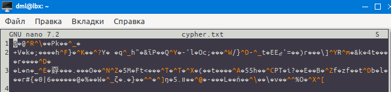
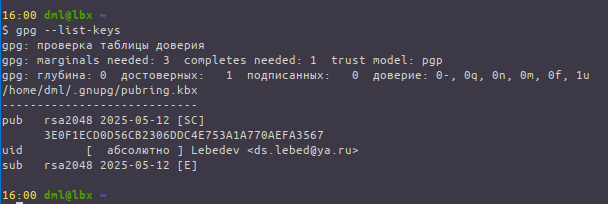
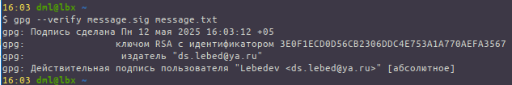
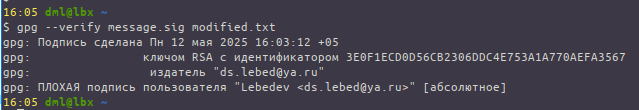
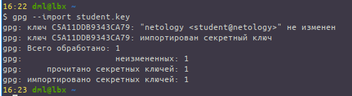
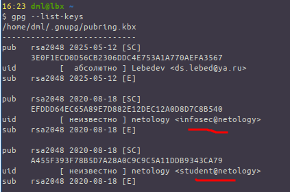
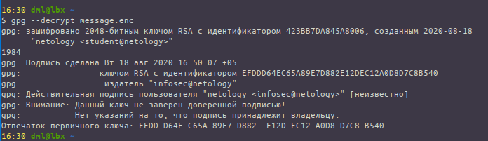

# 03.02. Асимметричные криптосистемы - Лебедев Д.С.

https://github.com/netology-code/ibb-homeworks/tree/IBB-33/08_crypto_assymetric

ДЗ выполняется на хосте с ОС Debian 12 (lxde)
### Задание 1 - OpenSSL
> Шаг 1. Создайте закрытый ключ с длиной 2048  
> Шаг 2. Сгенерируйте открытый ключ на базе закрытого  
> Шаг 3. Создайте файл message.txt со своей фамилией  
> Шаг 4. Зашифруйте сообщение с помощью публичного ключа
> 
> Откройте файл cypher.txt в любом текстовом редакторе, удостоверьтесь, что он не читабелен.
> 
> Шаг 5. Убедитесь, что файл cyper.txt расшифровывается:
> 
> В качестве результата пришлите:
> - Публичный и приватный ключ (public.key и private.key)
> - Passphrase (строкой)
> - Зашифрованный файл (cypher.txt)

*Выполнение задания:* 

Лог выполненных команд  
```sh
15:33 dml@lbx ~
$ openssl genpkey -algorithm RSA -pkeyopt rsa_keygen_bits:2048 -aes256 -out private.key
.+++++++++++++++++++++++++++++++++++++++++++++++++++++++++++++++++*..+...+..+.+..+....+......+........+.+......+...+.....+.+.....+......+...+.+..............+++++++++++++++++++++++++++++++++++++++++++++++++++++++++++++++++*.......+...........+....+......+.........+.....+++++++++++++++++++++++++++++++++++++++++++++++++++++++++++++++++
......+............+....+........+.......+...........+...+.+......+.....+...+.+......+++++++++++++++++++++++++++++++++++++++++++++++++++++++++++++++++*....+..+.+...........+..........+......+........+++++++++++++++++++++++++++++++++++++++++++++++++++++++++++++++++*.....+........+......+....+...........+...+.....................+....+++++++++++++++++++++++++++++++++++++++++++++++++++++++++++++++++
Enter PEM pass phrase:
Verifying - Enter PEM pass phrase:
15:34 dml@lbx ~
$ openssl pkey -pubout -in private.key -out public.key
Enter pass phrase for private.key:
15:35 dml@lbx ~
$ openssl pkeyutl -encrypt -pubin -inkey public.key -in message.txt -out cypher.txt
15:38 dml@lbx ~
$ openssl pkeyutl -decrypt -inkey private.key -in cypher.txt -out decrypted.txt
Enter pass phrase for private.key:
15:38 dml@lbx ~
```

  

- [Файл public.key](_att/010302/public.key)
- [Файл private.key](_att/010302/private.key)
- Passphrase `siberian315`
- [cypher.txt](_att/010302/cypher.txt)

### Задание 2 - GnuPG
> - Шаг 1. Генерация keypair
> - Шаг 2. Просмотр ключей
> - Шаг 3. Подпись сообщения
> - Шаг 4. Проверка подписи (ложное сообщение)
> - Шаг 5. Экспорт публичного ключа
> 
> В качестве результата пришлите:
> - Публичный ключ (шаг 5)
> - Файл сообщения и подпись к нему (шаг 3)

*Выполнение задания:* 

  

  

  

- [Файл public.gpg](_att/010302/public.gpg)
- [Файл сообщения](_att/010302/message.txt) и [подпись к нему](_att/010302/message.sig)

### Задача 3* - GnuPG: decrypt
> - Шаг 1. Импортируйте ключи
> - Шаг 2. Убедитесь, что ключи импортированы
> - Шаг 3. Расшифруйте сообщение и проверьте подпись
> 
> В качестве результата пришлите:
> 
> 1. Содержимое зашифрованного сообщения (текст)
> 2. Результат проверки подписи (валидна или нет)

*Выполнение задания:*   

1.   
  

2.   


3.   
  

Я так понимаю, текст - `1984` ))), а подпись не валидна.

---
```
Все верно, единственный момент - подпись всё таки валидна (об этом говорит good signature)  
Работа принимается
```