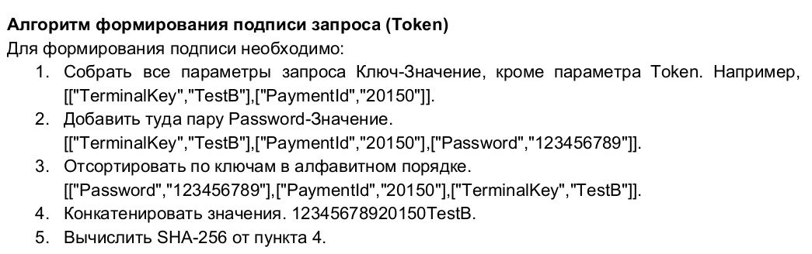
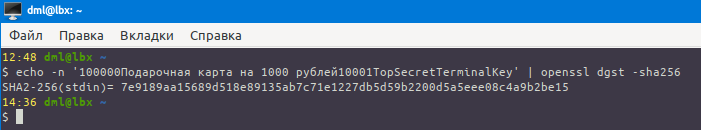
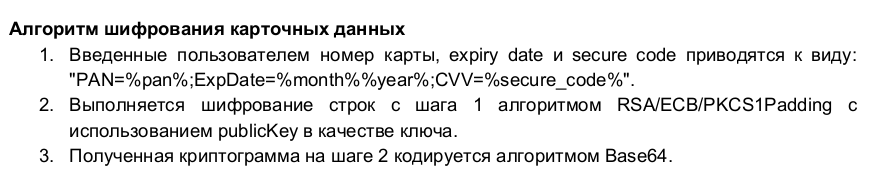
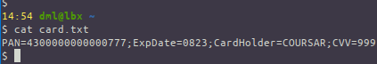
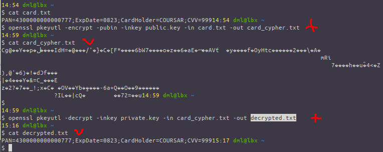
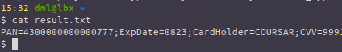

# 04.01. Финансовые системы - Лебедев Д.С.

### Задание 1 - ГОСТ Р 57580
> Вам необходимо изучить ГОСТ Р 57580. Документ состоит из двух частей:
> 
> 1. ГОСТ Р 57580.1-2017
> 2. ГОСТ Р 57580.2-2018

> Ответьте на следующие вопросы:
> 
> 1. Что такое контур безопасности?
> 2. Что/кто является субъектом доступа (в рамках данного стандарта)? Какие основные типы их рассматриваются?
> 3. Что такое компрометация аутентификационных данных?
> 4. Что такое фактор аутентификации? На какие категории подразделяются факторы?
> 5. Что такое однофакторная и многофакторная аутентификация?
> 6. Чем событие ЗИ отличается от инцидента ЗИ?
> 7. Что такое компенсирующие меры? В каких случаях они применяются?
> 8. Сколько уровней ЗИ определяет стандарт? Перечислите их.
> 9. Какой из всех возможных объектов атак нарушитель выберет с наибольшей вероятностью (с точки зрения авторов стандарта)?
> 10. Для оценки полноты реализации процессов системы ЗИ используют качественную модель оценивания. Приведите уровни соответствия с их описанием, указанные в данной модели?
> 11. Что рекомендуется использовать в качестве основных источников свидетельств для оценки соответствия ЗИ?

*Ответ:* 

1. Что такое контур безопасности?

*ГОСТ Р 57580.1-2017 п3.10*: контур безопасности: Совокупность объектов информатизации, определяемая областью применения настоящего стандарта, используемых для реализации бизнес-процессов и (или) техно­логических процессов финансовой организации единой степени критичности (важности), для которой финансовой организацией применяется единая политика (режим) защиты информации (единый набор требований к обеспечению защиты информации).

2. Что/кто является субъектом доступа (в рамках данного стандарта)? Какие основные типы их рассматриваются?

*ГОСТ Р 57580.1-2017 п3.14*: субъект доступа: Работник финансовой организации или иное лицо, осуществляющий фи­зический и (или) логический доступ, или программный сервис, осуществляющий логический доступ.

Основные типы субъектов доступа:
- пользователи
- эксплуатационный персонал
- технический (вспомогательный) персонал
- программные сервисы

3. Что такое компрометация аутентификационных данных?

*ГОСТ Р 57580.1-2017 п3.26*: компрометация аутентификационных данных: Событие, связанное с возникновением возможности использования аутентификационных данных субъектом, не являющимся легальным вла­дельцем указанных аутентификационных данных.

4. Что такое фактор аутентификации? На какие категории подразделяются факторы?

*ГОСТ Р 57580.1-2017 п3.27*: фактор аутентификации: Блок данных, используемых при аутентификации субъекта или объекта доступа.

Факторы аутентификации подразделяются на следующие три категории:
- что-то, что субъект или объект доступа знает, например пароли легальных субъектов доступа, ПИН-коды;
- что-то, чем субъект или объект доступа обладает, например данные, хранимые на персональных техниче­ских устройствах аутентификации: токенах, смарт-картах и иных носителях;
- что-то, что свойственно субъекту или объекту доступа, например биометрические данные физического лица — легального субъекта доступа.

5. Что такое однофакторная и многофакторная аутентификация?

- *ГОСТ Р 57580.1-2017 п3.28*: однофакгорная аутентификация: Аутентификация, для осуществления которой использу­ется один фактор аутентификации.
- *ГОСТ Р 57580.1-2017 п3.29*: многофакторная аутентификация: Аутентификация, для осуществления которой использу­ются два и более различных факторов аутентификации.  

6. Чем событие ЗИ отличается от инцидента ЗИ?

Разница между ними заключается в степени критичности и последствиях для системы. 
- Событие ЗИ - любое зафиксированное отклонение от нормального функционирования системы, которое может (но не обязательно) указывать на угрозу безопасности;
- Инцидент ЗИ - подтвержденное событие, которое привело или может привести к нарушению конфиденциальности, целостности или доступности данных.

7. Что такое компенсирующие меры? В каких случаях они применяются?

Согласно *ГОСТ Р 57580*, компенсирующие меры - это альтернативные (иные) способы защиты, внедряемые в случаях, когда:
- Требования стандарта не могут быть выполнены в полном объеме из-за технических или организационных ограничений.
- Основные меры недостаточны для обеспечения требуемого уровня безопасности.

8. Сколько уровней ЗИ определяет стандарт? Перечислите их.

*ГОСТ Р 57580.1-2017 п6.7*: Настоящий стандарт определяет три уровня защиты информации:
- уровень 3 - минимальный;
- уровень 2 - стандартный;
- уровень 1 - усиленный.

9. Какой из всех возможных объектов атак нарушитель выберет с наибольшей вероятностью (с точки зрения авторов стандарта)?

Авторы стандарта предполагают, что нарушитель с наибольшей вероятностью выберет для атаки критичные платежные системы и данные, обеспечивающие проведение финансовых операций. Это связано с их прямой материальной ценностью и высоким потенциалом ущерба.

*Доработка:*

```
ГОСТ Р 57580.1-2017А.3:  
...необходимо учитывать, что из всех возможных объектов атак с наибольшей вероятностью нарушитель выберет наиболее слабо контролируемый, где его деятельность будет оставаться необнаруженной максимально долго.
```


10. Для оценки полноты реализации процессов системы ЗИ используют качественную модель оценивания. Приведите уровни соответствия с их описанием, указанные в данной модели.

*ГОСТ Р 57580.2-2018 п6.9*: Для оценки полноты реализации процессов системы ЗИ используют следующую качествен­ную модель оценивания:
- а) нулевой уровень соответствия: организационные и технические меры процесса системы ЗИ не реализуются или реализуются в единичных случаях. Общие подходы (способы) реализации органи­зационных и технических мер процесса системы ЗИ не установлены. Контроль и совершенствование реализации организационных и технических мер процесса системы ЗИ не осуществляются.
- б) первый уровень соответствия: организационные и технические меры процесса системы ЗИ реализуются в незначительном количестве, бессистемно и/или эпизодически. Общие подходы (спосо­бы) реализации организационных и технических мер процесса системы ЗИ не установлены. Контроль и совершенствование реализации организационных и технических мер процесса системы ЗИ не осу­ществляются;
- в) второй уровень соответствия: организационные и технические меры процесса системы ЗИ реализуются в значительном количестве на постоянной основе. Общие подходы (способы) реализации организационных и технических мер процесса системы ЗИ установлены в единичных случаях. Реали­зация организационных и технических мер процесса системы ЗИ осуществляется на усмотрение ис­полнителя. Контроль и совершенствование реализации организационных и технических мер процесса системы ЗИ практически не осуществляются:
- г) третий уровень соответствия: организационные и технические меры процесса системы ЗИ реализуются в значительном количестве на постоянной основе в соответствии с общими подходами (способами), установленными в финансовой организации. Контроль и совершенствование реализации организационных и технических мер процесса системы ЗИ осуществляются бессистемно и/или эпизо­дически;
- д) четвертый уровень соответствия: организационные и технические меры процесса системы ЗИ реализуются в полном объеме на постоянной основе в соответствии с общими подходами (способа­ми), установленными в финансовой организации. В финансовой организации в основном реализованы контроль и совершенствование реализации организационных и технических мер процесса системы ЗИ;
- е) пятый уровень соответствия: организационные и технические меры процесса системы ЗИ реализуются в полном объеме на постоянной основе в соответствии с общими подходами (способами), установленными в финансовой организации. В финансовой организации реализованы постоянный кон­троль и необходимое своевременное совершенствование реализации организационных и технических мер процесса системы ЗИ.


11. Что рекомендуется использовать в качестве основных источников свидетельств для оценки соответствия ЗИ?

*ГОСТ Р 57580.2-2018 п6.13*: Оценку соответствия ЗИ следует основывать на свидетельствах, в качестве основных источ­ников которых рекомендуется использовать:
- документы проверяемой организации и иные материалы проверяемой организации в бумажном или электронном виде и. при необходимости, документы третьих лиц, относящиеся к обеспечению ЗИ финансовой организации и находящиеся в распоряжении проверяемой организации;
- устные высказывания сотрудников проверяемой организации в процессе проводимых опросов в области оценки соответствия ЗИ;
- результаты наблюдений членов проверяющей группы за процессами системы ЗИ и деятельно­стью сотрудников проверяемой организации в области оценки соответствия ЗИ;
- параметры конфигураций и настроек технических объектов информатизации и средств ЗИ;
- технические и программные средства сбора свидетельств полноты реализации мер ЗИ (анализ электронных журналов регистрации, анализ фактических настроек, анализ уязвимостей, проведение тестирования на проникновение и т.п.).

Выбор конкретных источников свидетельств при проведении оценки соответствия ЗИ осуществля­ет проверяющая организация (проверяющая группа) с учетом предложений проверяемой организации обеспечения максимальной достоверности оценки соответствия ЗИ.

### Задание 2 - Тинькофф Мобильный SDK
> В рамках документации описано формирование подписи сообщения (в терминологии документа - Token), которая позволяет верифицировать, что сообщение действительно от вас. Вам нужно найти описание этого алгоритма и подписать следующий документ:
> 
> ```
> {
>   "TerminalKey": "TerminalKey",
>   "Amount": "100000",
>   "OrderId": "10001",
>   "Description": "Подарочная карта на 1000 рублей"
> }
> ```
> 
> В качестве пароля (password) используйте строку TopSecret.
> 
> При пересылке любых данных важно удостовериться, что они не изменились. Для этого вместе с данными пересылается специальный токен - это хэш-функция от строки, получаемой из исходных данных. Способ получения подобного токена описан в документации Тинькофф. Теперь попробуем сформировать токен.
> 
> В качестве результата пришлите токен для указанного документа.

*Выполнение задания:* 

1. Изучаем документацию, алгоритм формирования подписи запроса:

  

2. Сортируем значения в нашем запросе в соответствии с алфавитом:

```
{
  "Amount": "100000"
  "Description": "Подарочная карта на 1000 рублей"
  "OrderId": "10001"
  "Password": "TopSecret"
  "TerminalKey": "TerminalKey"
}
```

3. Методом конкатенации создаём строку из ключевых значений:

`100000Подарочная карта на 1000 рублей10001TopSecretTerminalKey`

4. Вычислить SHA-256 от этой строки:

```
echo -n '100000Подарочная карта на 1000 рублей10001TopSecretTerminalKey' | openssl dgst -sha256
```

  

Получен токет для указанной строки (документа):

`7e9189aa15689d518e89135ab7c71e1227db5d59b2200d5a5eee08c4a9b2be15`

### Шифрование карточных данных*

> В рамках документации описывается механизм передачи карточных данных с мобильного устройства на сервер (они не передаются в открытом виде). Вам нужно найти описание этого алгоритма и зашифровать следующие карточные данные:
> 
> PAN=4300000000000777
> ExpDate=0823
> CardHolder=COURSAR
> CVV=999
> 
> Публичный и приватный ключи в наличии.
> 
> Что нужно: 
> 1. Зашифровать указанные данные в соответствии с алгоритмом, указанным в документации (не забудьте проверить, что они нормально расшифровываются после вашего шифрования)
> 2. Прислать перечень команд, использованных вами для шифрования и расширования

*Выполнение задания:* 

1. Изучение алгоритма из документации:

  

1. Приводим файл с данными к нужному виду

  

2. Шифруем строку с использованием public.key

```sh
openssl pkeyutl -encrypt -pubin -inkey public.key -in card.txt -out card_cypher.txt
```

Проверяем декодированием:

```sh
openssl pkeyutl -decrypt -inkey private.key -in card_cypher.txt -out decrypted.txt
```

  

3. Кодируем в base64, чтоб передавать только символы ASCII:  

```sh
openssl enc -base64 -in card_cypher.txt -out card_cypher.txt.base64
```

4. Передаем зашифрованные данные файлом `card_cypher.txt.base64` и расшифровываем приватным ключом в `result.txt`:

```sh
openssl enc -d -base64 -in card_cypher.txt.base64 -out card_cypher.enc.txt
openssl pkeyutl -decrypt -inkey private.key -in card_cypher.enc.txt -out result.txt
cat result.txt
```



Скорее всего, можно зашифровать и привести к base64 одной командой