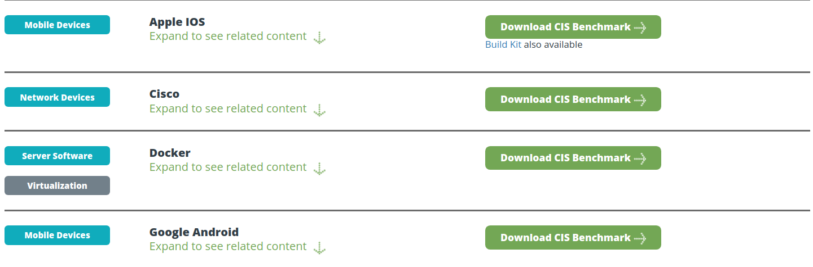

# 04.02. Международные и отраслевые стандарты - Лебедев Д.С.
### Задача №1 - ГОСТ Р ИСО/МЭК 27000-2021

> Вам необходимо изучить ГОСТ Р ИСО/МЭК 27000-2021
>
> Ответьте на следующие вопросы:
>
> 1. Что СМИБ?
> 2. Что такое актив? Какие виды активов бывают? Являются ли сотрудники активом?
> 3. Что такое атака?
> 4. Какие дополнительные свойства также могут быть включены в понятие информационная безопасность? Что они означают (дайте им определение)?
> 5. Что такое риск информационной безопасности?

*Ответ:*   

1. Система менеджмента информационной безопасности (СМИБ) включает в себя политику, процедуры, руководящие принципы и связанные с ними ресурсы и мероприятия, коллективно управляемые организацией в целях защиты ее информационных активов. СМИБ обеспечивает системный подход к созданию, внедрению, функционированию, мониторингу, анализу, поддержке и усилению ИБ организации для достижения бизнес-целей. Она основывается на оценке рисков и уровнях принятия рисков организацией, предназначенных для эффективной обработки рисков и управления ими.

2. Актив (п. 4.1) - информация и связанные с ней процессы, системы, сети и персонал, используемые для достижения целей, стоящих перед организацией. Основные виды активов:
- Информационные активы (БД, пароли, ключи шифрования, патенты и т.д.);
- Программные активы (прикладное ПО, ОС, CRM, антивирусы и т.д.)
- Физические активы (ЦОДы, серверы, компьютеры, сетевые устройства и т.д.)
- Услуги
- Нематериальные активы (репутация организации, бренд, доверие клиентов)
- Люди (персонал, сотрудники, обладающие знаниями и навыками)

3. п. 3.2: Атака (attack): Попытка уничтожения, раскрытия, изменения, блокирования, кражи, получения несанкционированного доступа к активу или его несанкционированного использования.

4. п. 3.28: информационная безопасность (ИБ) (information security): Сохранение конфиденциальности (3.10), целостности (3.36) и доступности (3.7) информации.

Примечание - Этот термин может включать в себя и другие дополнительные свойства, такие как подлинность (3.6), подотчетность, неотказуемость (3.48) и достоверность (3.55).

- подлинность (authenticity): Свойство, определяющее, что фактический субъект или объект совпадает с заявленным.
- неотказуемость (non-repudiation): Способность удостоверять имевшее место событие или действие, которые в дальнейшем не могут быть поставлены под сомнение
- подотчётность (accountability): Возможность однозначно связать действия или изменения с конкретным субъектом (пользователем, системой).
- достоверность (reliability): Свойство соответствия предусмотренному поведению и результатам.

5. ...риск описывается как потенциальное событие и его последствия или как их сочетание. В контексте систем менеджмента информационной безопасности риски в области информационной безопасности могут выражаться в виде влияния неопределенности на цели информационной безопасности (п. 3.61). 
 
По ISO/IEC 27000: Риск информационной безопасности (information security risk) - Потенциальная возможность того, что с помощью уязвимости создадут угрозу активу или группе активов, которая приведёт к ущербу для организации.


### Задача №2 - CIS Benchmarks*

> Организация CIS предоставляет возможность скачать и просмотреть CIS Benchmarks:
> 
> 
> 
> Возможность эта предоставляется бесплатно, но необходимо будет заполнить ряд сведений о себе (персональных данных).
> 
> Вам необходимо ознакомиться с бенчмарками на:
> - Apple iOS (iOS 13 v1.0.0)
> - Google Android (v1.3.0)
> 
> И ответить на следующие вопросы:
> 
> 1. Сколько `configuration profiles` определяется в каждом документе? Приведите краткую их характеристику (на что направлены, для чего предназначены)
> 2. iOS: из каких соображений рекомендуется отключить опцию `Allow Siri while device is locked`?
> 3. iOS: из каких соображений рекомендуется включить опцию `Force fraud warning`?
> 4. iOS: к каким последствиям приведёт включение опции `Maximum number of failed attempts`?
> 5. Android: из каких соображений рекомендуется включить опцию `Allow remote lock and erase`?
> 6. Android: из каких соображений рекомендуется отключить опцию `Make pattern visible`? Что из себя представляет `shoulder surfing attack`?
> 7. Android: из каких соображений рекомендуется обеспечить отсутствие `Guest profiles`?

*Ответ:*   

1. Сколько `configuration profiles` определяется в каждом документе? Приведите краткую их характеристику (на что направлены, для чего предназначены)

**CIS Apple iOS 17 Benchmark**, список профилей конфигурации:

> 1. Автоматическая блокировка экрана - Требует установки времени автоматической блокировки экрана.
> 2. Требование пароля при блокировке устройства - Обеспечивает обязательное использование пароля или биометрической аутентификации.
> 3. Минимальная длина пароля - Устанавливает минимальную длину пароля.
> 4. Сложность пароля - Требует использования букв, цифр и специальных символов.
> 5. Блокировка после неудачных попыток ввода пароля - Настраивает задержку или стирание данных после нескольких неудачных попыток.
> 6. Отключение простых паролей - Запрещает использование легко угадываемых комбинаций.
> 7. Ограничение повторного использования паролей - Запрещает повторное использование предыдущих паролей.
> 8. Таймаут сеанса при бездействии - Автоматический выход из учетных записей после периода неактивности.
> 9. Шифрование данных устройства - Активирует полное шифрование хранилища.
> 10. Отключение Siri на заблокированном устройстве - Предотвращает использование Siri без разблокировки.
> 11. Отключение Центра уведомлений на заблокированном экране - Ограничивает доступ к уведомлениям без аутентификации.
> 12. Отключение виджетов на заблокированном экране - Запрещает просмотр виджетов без разблокировки.
> 13. Ограничение доступа к USB-аксессуарам при блокировке - Предотвращает использование USB-устройств для взлома.
> 14. Отключение автоматического подключения к Wi-Fi - Запрещает автоматическое подключение к неизвестным сетям.
> 15. Отключение AirDrop для всех контактов - Ограничивает AirDrop только доверенными устройствами.
> 16. Блокировка Handoff (продолжения работы между устройствами Apple) - Отключает функцию, если она не требуется.
> 17. Ограничение использования iCloud для резервного копирования - Требует шифрования резервных копий и контроля над данными.
> 18. Отключение синхронизации паролей через iCloud Keychain - Запрещает хранение паролей в iCloud, если это противоречит политике безопасности.
> 19. Ограничение доступа к App Store - Блокирует установку непроверенных приложений (только доверенные источники).
> 20. Отключение автоматических загрузок приложений - Запрещает автоматическую установку купленных приложений на других устройствах.
> 21. Блокировка изменения настроек аккаунтов - Предотвращает несанкционированное добавление или удаление учетных записей.
> 22. Ограничение изменения настроек VPN и фильтрации трафика - Запрещает пользователям отключать VPN или изменять параметры безопасности.
> 23. Отключение персонализированной рекламы - Запрещает сбор данных для таргетированной рекламы.
> 24. Ограничение отслеживания местоположения - Требует явного разрешения для доступа к геоданным.
> 25. Принудительное использование Managed Open-In (для корпоративных устройств) - Контролирует, какие приложения могут открывать корпоративные данные.

**CIS Google Android Benchmark**, список профилей конфигурации:

> 1. Level 1 (L1) - Corporate/Basic Security - Настройки, обеспечивающие базовую безопасность без значительного влияния на функциональность. Рекомендуется для большинства корпоративных устройств.  
> 2. Level 2 (L2) - High Security. Более строгие настройки, повышающие безопасность за счет возможного снижения удобства.  Подходит для устройств, обрабатывающих конфиденциальные данные.  
> 3. BitLocker Encryption (если применимо). Профиль, связанный с шифрованием данных (обычно актуален для Windows, но в Android Benchmark может упоминаться в контексте корпоративных политик).  
> 4. Custom (User-Defined). Позволяет администраторам создавать собственные профили на основе рекомендаций CIS.

2. iOS: из каких соображений рекомендуется отключить опцию `Allow Siri while device is locked`?  

Доступ к Siri на заблокированном устройстве может позволить неавторизованным пользователям получить доступ к информации, которая в противном случае была бы им недоступна, такой как сообщения, контакты и множество других данных.

3. iOS: из каких соображений рекомендуется включить опцию `Force fraud warning`?

Эта рекомендация относится к функции Safari, которая предупреждает конечных пользователей о посещении подозрительных мошеннических веб-сайтов.

4. iOS: к каким последствиям приведёт включение опции `Maximum number of failed attempts`?

Установка количества неверных попыток входа в систему. При превышении - удалениее криптографического ключа устройства (ключа шифрования). Это обеспечивает конфиденциальность информации, хранящейся на устройстве.

5. Android: из каких соображений рекомендуется включить опцию `Allow remote lock and erase`?

Параметр разрешает удаленную блокировку и удаление данных. Позволяет пользователям удаленно заблокировать свое устройство с помощью нового пароля или стереть все данные в случае потери или кражи устройства.

 6. Android: из каких соображений рекомендуется отключить опцию `Make pattern visible`? Что из себя представляет `shoulder surfing attack`?

Так называемая "атака через плечо". Видимо, имеется в виду возможность "подглядеть" за пользователем устройства во время ввода шаблона разблокировки.

Данный параметр отключает видимость шаблона, если он используется в качестве механизма блокировки устройства

7. Android: из каких соображений рекомендуется обеспечить отсутствие `Guest profiles`?

Гостевой профиль позволяет пользователям создавать временные профили для гостей или других лиц, которым может потребоваться использовать устройство без доступа к персональным данным владельца. В результате гости могут устанавливать вредоносные приложения или выполнять другие действия, которые ставят под угрозу общую безопасность устройства.

---

```
Всё верно, принято
```
