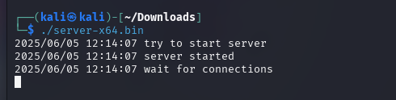
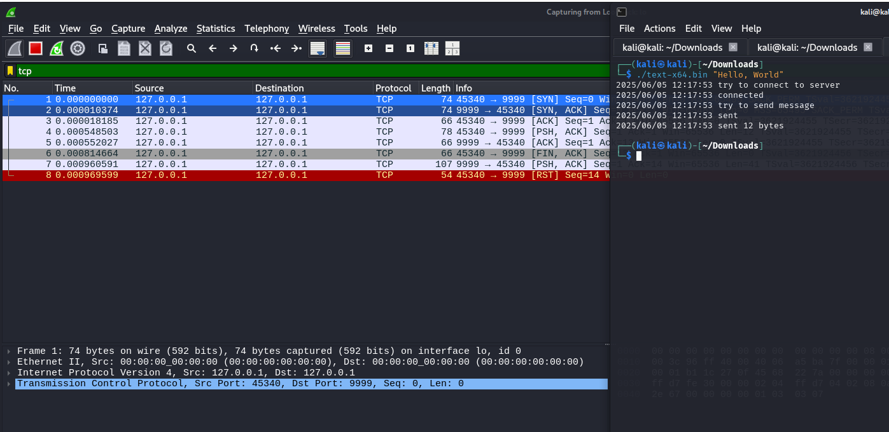

# 01.01. Виртуальные машины, работа в командной строке, Linux, Windows - Лебедев Д.С.

https://github.com/netology-code/ibnet-homeworks/tree/master/01_vm
### Задача "Анализ диска"
> 1. Создайте виртуальную машину с ОС Ubuntu или Kali Linux.  
> 2. Подключить [файл образа диска](_att/020101/disk.vhd) в виртуальной машине VirtualBox и посмотреть, что находится на диске.  
> 
> В качестве результата пришлите названия документов, располагающихся на диске.

*Выполнение задания:*   

1. В VirtualBox создана ВМ Debian 12
2. Подключен образ жесткого диска для исследования

  

3. Читаем смонтированный диск

  
