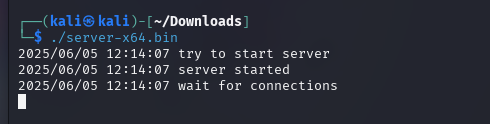
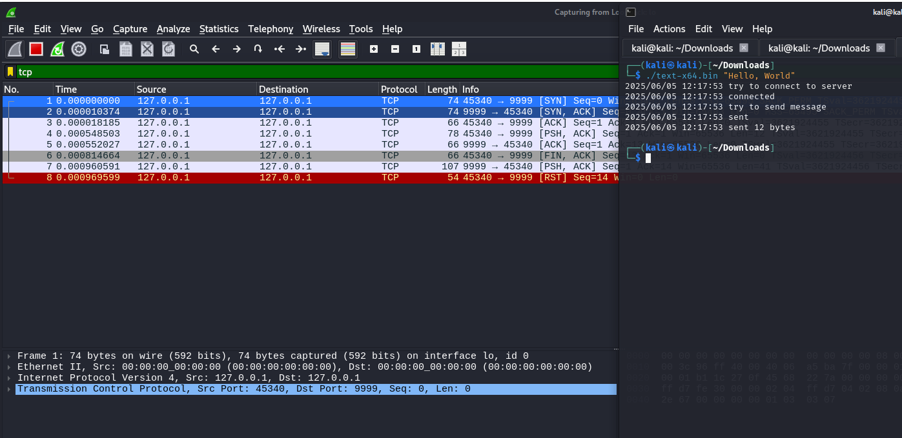
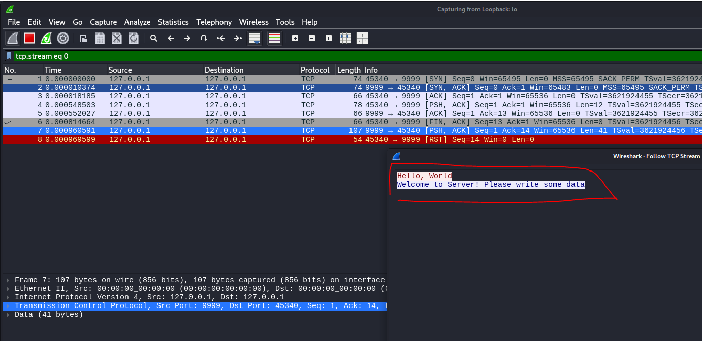
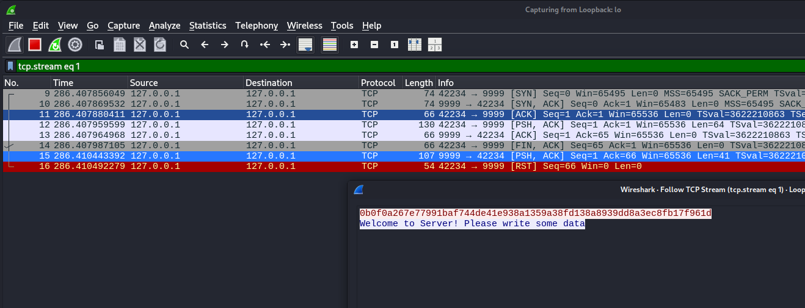
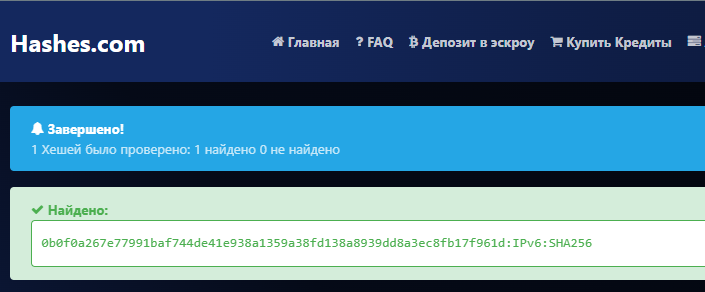

# 01.02. Сетевые технологии, ключевые устройства - Лебедев Д.С.

https://github.com/netology-code/ibnet-homeworks/blob/master/02_intro/README.md
### Задача "Знакомство с Wireshark"
> 1. Откройте виртуальную машину, в поисковой строке введите wireshark:
> 2. Вас попросят ввести пароль вашего пользователя для подтверждения (kali, если вы скачивали OVA с официального сайта):
> 3. В запустившемся окне вам необходимо выбрать интерфейс `Loopback: lo`
> 4. Сохраните файлы в каком-либо каталоге (например, в Downloads):
> 5. Откройте терминал в данном каталоге (см. руководство по терминалу, открывается аналогично Ubuntu):
> 6. Выполните в первой вкладке следующую команду (выставление прав на запуск приложений): `chmod +x *.bin`
> 7. Запустите в первой вкладке сервер командой: `./server-x64.bin`
> 8. Запустите во второй вкладке тестовый клиент для отправки сообщения: `./text-x64.bin "Hello, World"` (сервер должен продолжать работать)
> 9. В окне Wireshark вы должны увидеть следующее:
> 10. Щёлкните правой кнопкой мыши на первой строке и выберите опции как на скриншоте:
> 11. Вы увидите взаимодействие между клиентом и сервером в текстовом виде в кодировке ASCII:
> 12. Запустите целевой клиент во второй вкладке: `./task-x64.bin`
> 
> Попробуйте проанализировать сетевое взаимодействие целевого клиента с сервером. В качестве сообщения клиент должен передать хэш SHA-256. Воспользуйтесь в этот раз не hashcat, а предвычисленными таблицами для хэшей, например crackstation.net для подбора захэшированного сообщения. Если не получится через crackstation.net, то поробуйте через hashes.com
> 
> **Результат**
> В качестве результата пришлите сообщение, переданное клиентом task-x64.bin серверу.

*Выполнение задания:*   

1. Запуск программы - сервера:

  

2. Передача текстового сообщения:

  

3. Анализ текста:

  

4. Передача и анализ сообщения с хэшем:

  

5. Сообщение, переданное клиентом: `0b0f0a267e77991baf744de41e938a1359a38fd138a8939dd8a3ec8fb17f961d`

6. Расшифровка хэша на сайте:

  
