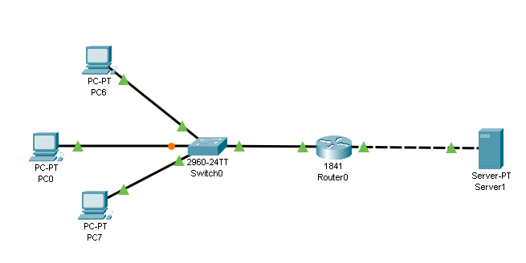
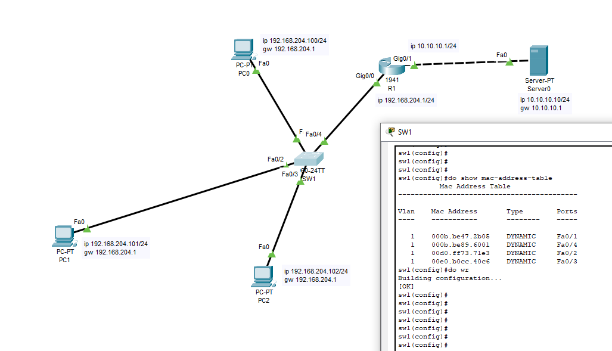
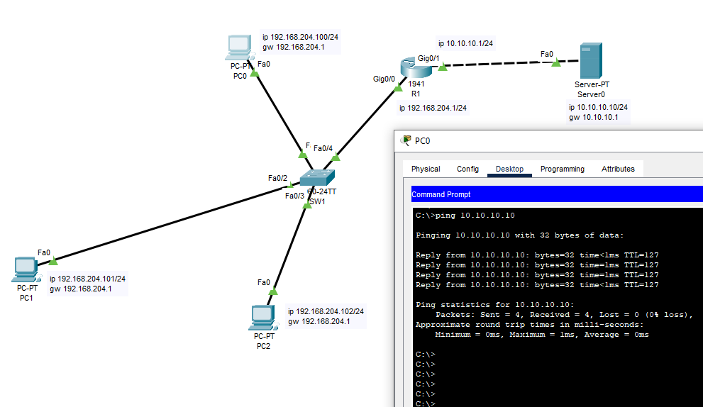
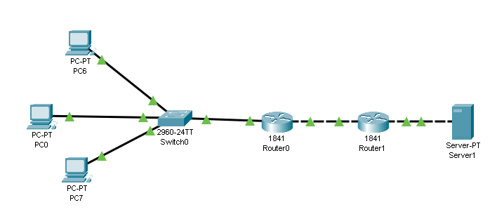
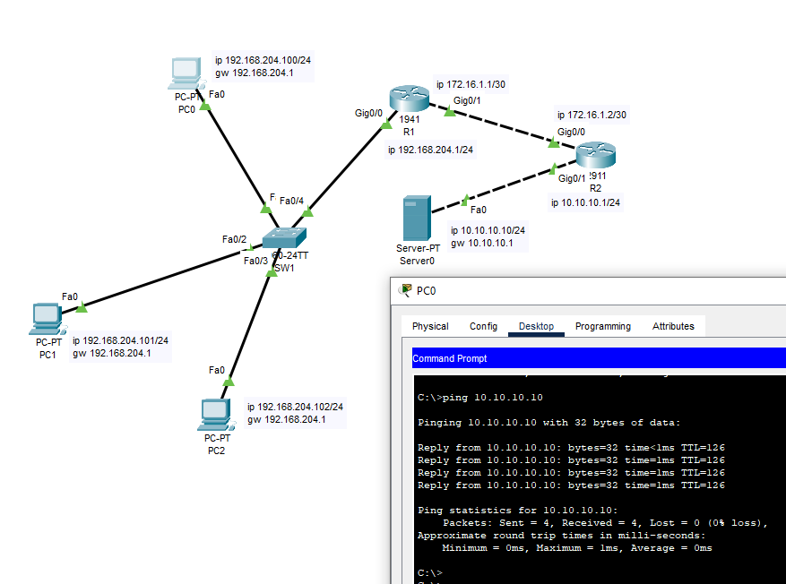

# 01.02. Протоколы сетевого уровня (IPv4, IPv6) - Лебедев Д.С.

https://github.com/netology-code/ibnet-homeworks/tree/v2/02_ip
### Задание 1. PC0
> Схема сети  
> 
> 
> 
> К указанной схеме подключить ещё один компьютер (PC0 на изображении) к коммутатору, провести необходимые настройки оборудования, убедиться, что новый компьютер имеет доступ к серверу (с помощью команды `ping` ip-адрес-сервера)
> 
> Для данной схемы сети вывести заполненную таблицу коммутации на коммутаторе Switch0 (команда для вывода таблицы коммутации: `show mac-address-table`).
> 
> Пришлите pkt-файл и скриншот таблицы коммутации в качестве ответа к ДЗ.

*Выполнение задания:*   

В эмуляторе CPT реализована схема, проведены настройки устройств

  

  

[PKT файл задания 1](_att/020102/020102-01-1.pkt)

### Задание 2*. Router1
> Схема сети  
> 
> 
> 
> Реализуйте схему, указанную выше (для этого необходимо добавить Router1 и произвести на нём необходимые настройки по аналогии с лекцией).
> 
> Убедитесь, что с PC0 проходит ping до сервера.
> 
> Пришлите pkt-файл в качестве ответа к ДЗ.

*Выполнение задания:*   

Реализована схема, настроены маршрутизаторы

  

Конфиг маршрутизатора R1  

```sh
R1(config)#do sh run
...
!
interface GigabitEthernet0/0
 ip address 192.168.204.1 255.255.255.0
 duplex auto
 speed auto
!
interface GigabitEthernet0/1
 ip address 172.16.1.1 255.255.255.252
 duplex auto
 speed auto
!
...
!
ip classless
ip route 10.10.10.0 255.255.255.0 172.16.1.2 
!
...
```

Конфиг маршрутизатора R2

```sh
interface GigabitEthernet0/0
 ip address 172.16.1.2 255.255.255.252
 duplex auto
 speed auto
!
interface GigabitEthernet0/1
 ip address 10.10.10.1 255.255.255.0
 duplex auto
 speed auto
!
...
ip classless
ip route 192.168.204.0 255.255.255.0 172.16.1.1 
!
...
```

[PKT файл задания 2](_att/020102/020102-02-1.pkt)

---
```
Всё верно, принято
```
