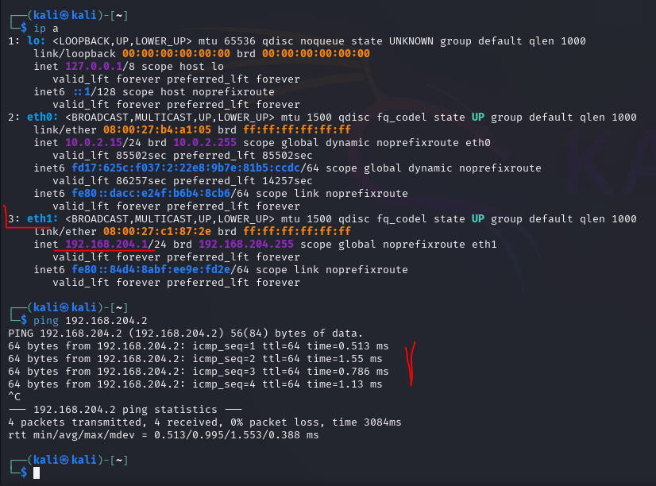
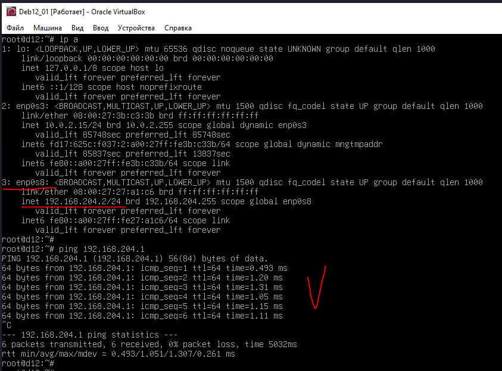
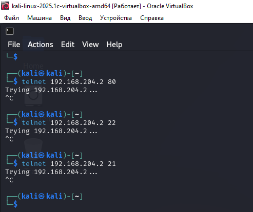
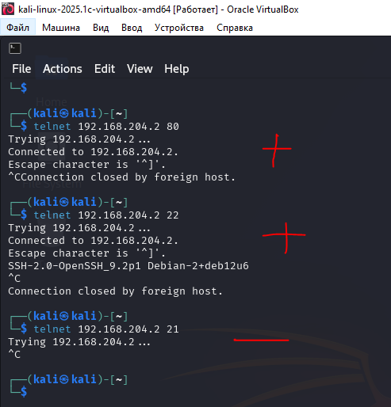
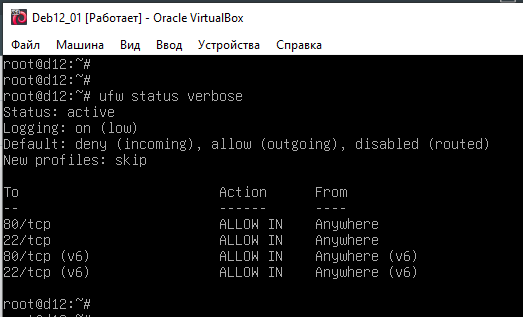
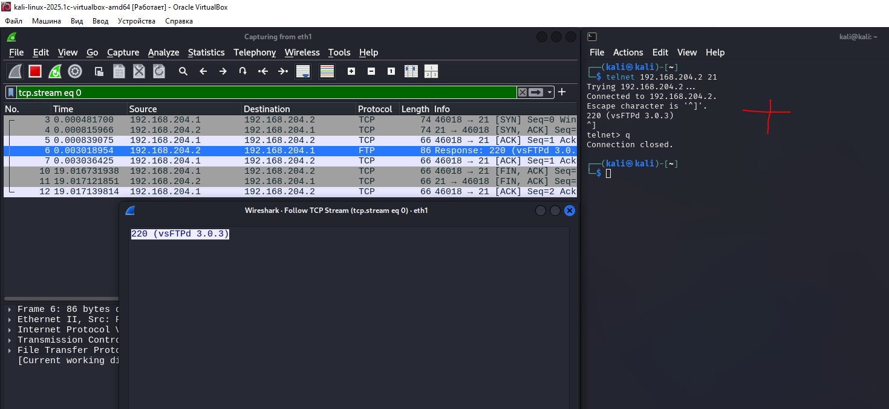
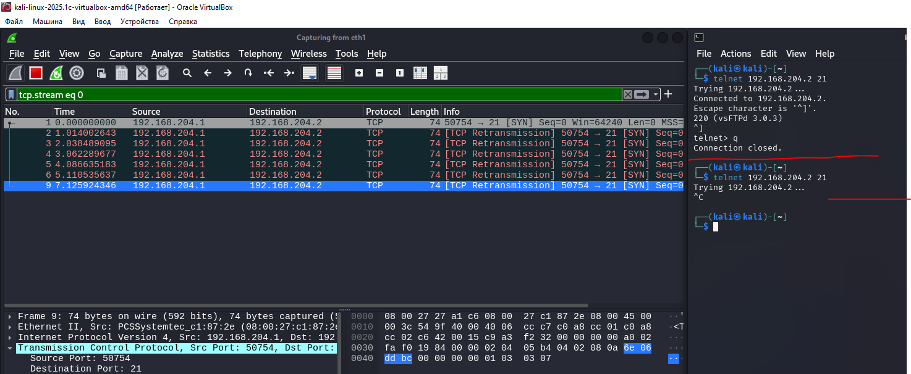

# 01.03. Протоколы транспортного уровня: TCP, UDP - Лебедев Д.С.

https://github.com/netology-code/ibnet-homeworks/blob/v2/03_tcpudp/README.md
### Задание Firewall
> В рамках данной лабораторной работы сделаем базовые настройки МЭ для Linux.  
> Для выполнения этого ДЗ потребуются две виртуальные машины: Ubuntu и Kali.  
> Задание предполагает знакомство с базовой работой МЭ, позволяющей открывать доступ к определённым портам. По умолчанию применяется правило "всё, что явно не разрешено - запрещено".  
> В качестве результата работы пришлите вывод команды sudo ufw status verbose.

*Выполнение задания:*   

1. Настроены дополнительные сетевые интерфейсы на ВМ `Kali` и `Debian 12`, проверена сетевая связность

 

  

2. На ВМ Debian 12 установлено требуемое ПО: ufw, nginx, openssh-server, vsftpd, telnet. Включен МЭ. Правил на МЭ нет, а значит, запрещены все входящие:

  

3. После разрешения на МЭ пропуска трафика http и ssh (ftp не разрешен) происходит соединение:

  

4. Действующие правила МЭ:

  

### Задание Wireshark
> Откройте в Kali Wireshark и проследите, как происходит процесс соединения при отключенном МЭ и при включенном (на 21 порт не стоит allow).  
> В качестве ответа опишите разницу в процессе установления соединения (или попытках установления соединения) при отключенном МЭ и при включенном МЭ (на 21 порт не стоит allow).

*Выполнение задания:*   

1. При выключенном МЭ разрешены все соединения, происходит обмен сообщениями с активным FTP сервером. Успешно проходит установление соединения.

  

2. После включения МЭ UFW начинает действовать правило "запрещено то, что не разрешено". Так как отсутствует правило для FTP (21 порт), порт закрыт, никакого ответа клиенту от сервера не поступает, рукопожатия не происходит.

  

---
```
сделано правильно, объяснили разницу верно, принимается!
```