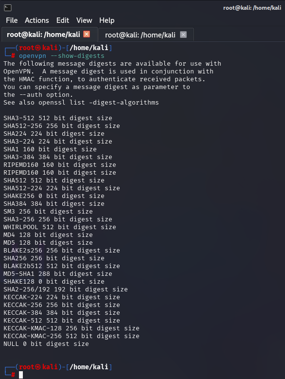

# 02.01. Виртуальные частные сети VPN - Лебедев Д.С.

https://github.com/netology-code/ibnet-homeworks/tree/ibnet-51/04_vpn
### Задание 1. Настройка сетевого окружения, установка и настройка OpenVPN

В рамках задания в VirtualBox развернуты виртуальные машины (ВМ):
1. Debian 12, Адаптер 1 - NAT и Адаптер 2 - Internal Network (10.10.10.11 - вручную, через `/etc/network/interfaces`)
2. Kali, Адаптер 1 - NAT и Адаптер 2 - Internal Network (10.10.10.12 - вручную, через `network manager`)

На ВМ установлено ПО `OpenVPN`

### Задание 2. Тестирование соединения в режиме PlainText

На ВМ создается туннель без механизмов шифрования и аутентификации. Для тестирования используется утилита `netcat`.

Используемые команды:

```sh
--- Debian 12 ---
openvpn --ifconfig 10.1.0.1 10.1.0.2 --dev tun
nc -l -p 3000

--- Kali Linux ---
openvpn --ifconfig 10.1.0.2 10.1.0.1 --dev tun --remote 10.10.10.11
nc 10.1.0.1 3000
```

В данном случае данные передаются через VPN туннель в открытом виде, что наблюдается в анализаторе Wireshark.


### Задание 3. Тестирование соединения в режиме Shared Key

Используется сгенерированный ключ, переданный на клиентскую ВМ. Для тестирования используется утилита `netcat`.

  


Используемые команды:

```sh
--- Kali Linux ---
scp vpn.key dml@10.10.10.11:/home/dml/vpn.key
openvpn --ifconfig 10.1.0.2 10.1.0.1 --dev tun --remote 10.10.10.11 --secret vpn.key --cipher aes-256-cbc --providers legacy default
nc 10.1.0.1 3000

--- Debian 12 ---
openvpn --ifconfig 10.1.0.1 10.1.0.2 --dev tun --secret /home/dml/vpn.key --cipher aes-256-cbc --providers legacy default
nc -l -p 3000
```

В данном случае данные передаются через VPN туннель зашифрованными, что наблюдается в анализаторе Wireshark.

### Ответы на вопросы к заданию

1. Пришлите скриншот Wireshark, где видно, что данные передаются в открытом виде (для раздела PlainText).


2. Пришлите скриншот Wireshark, где видно, что данные не передаются в открытом виде (для раздела Shared Key).


На сервере или на клиенте запустите команду с флагом `--verb 3`, например, на `Kali - openvpn --ifconfig 10.1.0.2 10.1.0.1 --dev tun --remote 10.10.10.11 --secret vpn.key --cipher aes-256-cbc --verb 3`

  

Внимательно изучите вывод и пришлите ответы на следующие вопросы:

3. Какая версия OpenSSL используется?

```
OpenSSL 3.4.0 (сборка от 22 октября 2024 года)
```

4. Какой алгоритм (и с какой длиной ключа) используется для шифрования?

```
aes-256-cbc:
- Алгоритм: AES (Advanced Encryption Standard)
- Режим: CBC (Cipher Block Chaining)
- Длина ключа: 256 бит
```

5. Какой алгоритм (и с какой длиной ключа) используется для HMAC аутентификации?

```
Алгоритм SHA-1, длина ключа 160 бит
```

Посмотрите все доступные алгоритмы с помощью команд: `sudo openvpn --show-ciphers` и `sudo openvpn --show-digests` соответственно.

Укажите конкретные с помощью флага `--cipher`, например, `--cipher AES-128-CBC` (или просто `--cipher AES128`) и `--auth`, например, `--auth SHA256`, соответственно (удостоверьтесь, что после указания иных алгоритмов в логе вывод тоже меняется).

```
Не смог добиться измения вывода флагами --cipher и --auth, хотя всё должно быть легко... Баг?

ЧДЯНТ?
openvpn --show-ciphers --cipher AES-128-CBC
openvpn --show-ciphers --data-ciphers AES-128-CBC
openvpn --show-digests --auth SHA1

Одинаково
```

--help

```
--auth alg      : Authenticate packets with HMAC using message
                  digest algorithm alg (default=SHA1).
                  (usually adds 16 or 20 bytes per packet)
                  Set alg=none to disable authentication.
--cipher alg    : Encrypt packets with cipher algorithm alg.
                  You should usually use --data-ciphers instead.
                  Set alg=none to disable encryption.
--data-ciphers list : List of ciphers that are allowed to be negotiated.

```


 

  

6. Что будет выведено в консоли сервера (`sudo openvpn --ifcoopenvpn --show-ciphersnfig 10.1.0.1 10.1.0.2 --dev tun --secret vpn.key --cipher AES128 --auth SHA256 --verb 3`), если:

6.1. Подключиться с клиента командой: `sudo openvpn --ifconfig 10.1.0.2 10.1.0.1 --dev tun --remote 10.10.10.11 --secret vpn.key --cipher AES256 --auth SHA256 --verb 3`

  

Не совпадает алгоритм шифрования (cipher AES128 - cipher AES256)

6.2. Подключиться с клиента командой: `sudo openvpn --ifconfig 10.1.0.2 10.1.0.1 --dev tun --remote 10.10.10.11 --secret vpn.key --cipher AES128 --auth SHA512 --verb 3`

  

Не совпадает алгоритм HMAC (Hash-based Message Authentication Code) (auth SHA256 - auth SHA512)
 