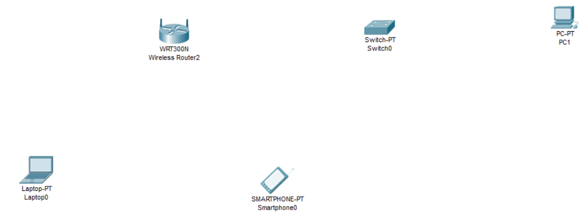
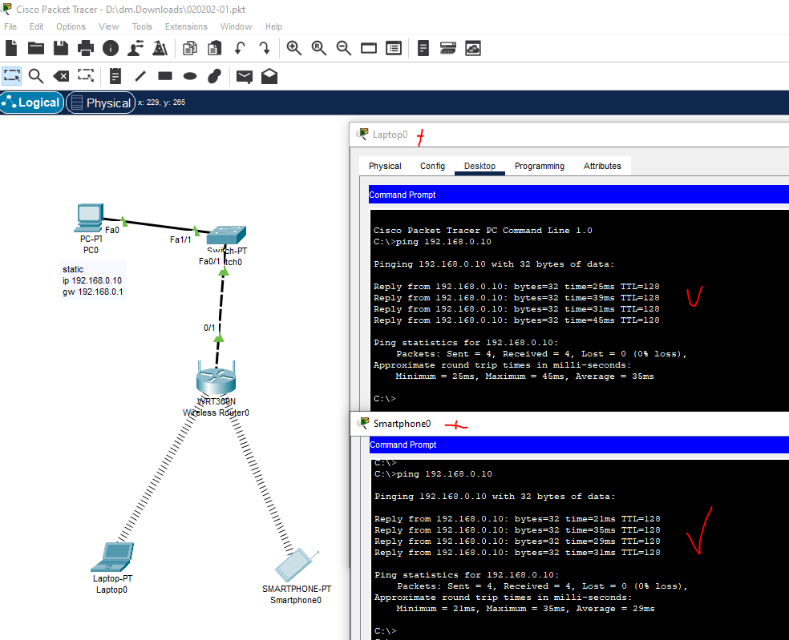

# 02.02. Беспроводные сети Wi-Fi - Лебедев Д.С.
https://github.com/netology-code/ibnet-homeworks/tree/v2/05_wifi
### Лабораторная работа

> В рамках данной лабораторной работы мы попрактикуемся в создании фрагмента беспроводной сети.
> 
> Для понимания этапов организации беспроводной связи необходимо создать фрагмент беспроводной сети. Делать мы это будем в Cisco Packet Tracer.
> 
> Наша задача - создать в ней точку доступа и подключить беспроводные устройства. При подключении необходимо использовать протокол аутентификации WPA2-Personal с алгоритмом шифрования AES.
> 
> Успешным результатом выполнения лабораторной работы будет получение ответа обмена ICMP-пакетами между сетевыми устройствами.
> 
> **Схема**
> 
> 
> 
> Используйте для организации схемы следующие устройства:
> 1. WiFi-роутер WRT300
> 2. Два WiFi устройства: Laptop и Smartphone.
> 3. Коммутатор Switch-PT.
> 4. Персональный компьютер PC-PT.
> 
> **Инструкция по выполнению**
> 
> На Wi-Fi роутере настройте следующие параметры:
> - SSID - test
> - Channel - 10-2.457 GHz
> - аутентификация - WPA2-PSK
> - парольную фразу выберите самостоятельно
> - тип шифрования - AES
> 1. На устройствах с модулями Wi-Fi выполните идентичные настройки и удостоверьтесь в наличии связи с роутером
> 2. Соедините Wi-Fi роутер cо свичом
> 3. На PC настройте статический IP-адрес из той же подсети, в которой находятся беспроводные устройства. Адресом шлюза необходимо установить адрес Wi-Fi роутера
> 4. Обменяйтесь ICMP-пакетами с эмуляторов командной строки беспроводных устройств с PC.
> 
> Пришлите pkt-файл в качестве ответа к ДЗ.

### Выполнение работы

Организована схема с использованием wi-fi роутера, выполнены настройки беспроводной сети на роутере и клиентах. Клиенты получают адрес по DHCP, PC0 имеет статический IP адрес 192.168.0.10, подключен к роутеру через LAN порт.

Проверена сетевая связность.

  

[PKT - файл задания](_att/020202/020202-01.pkt)
