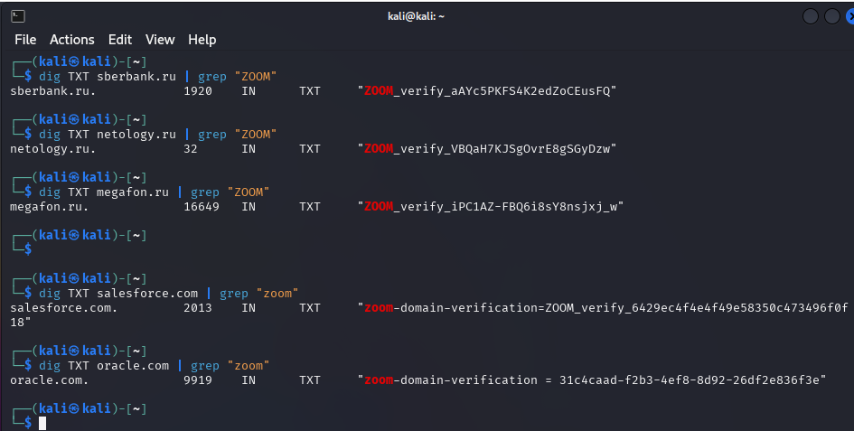
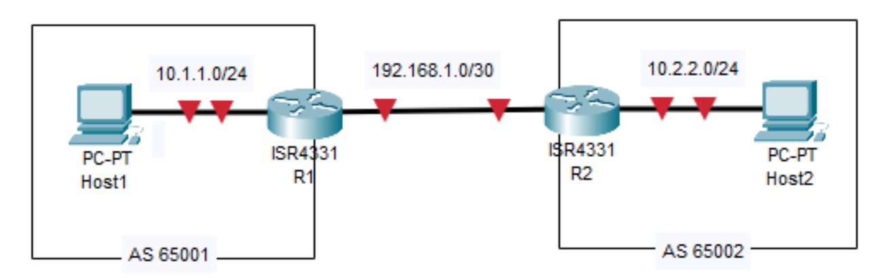
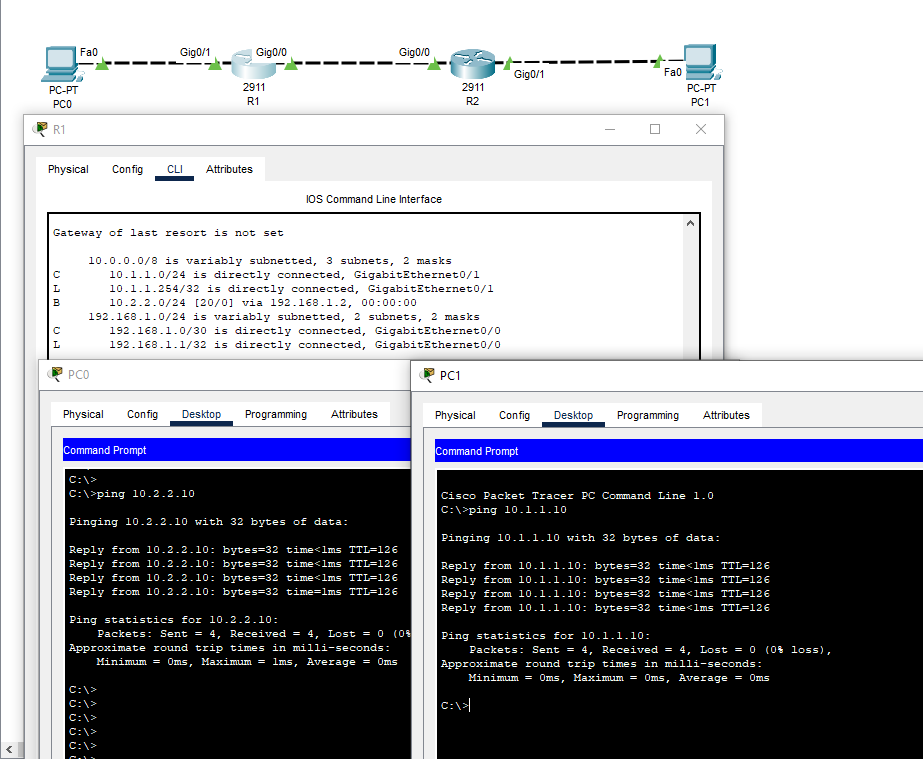
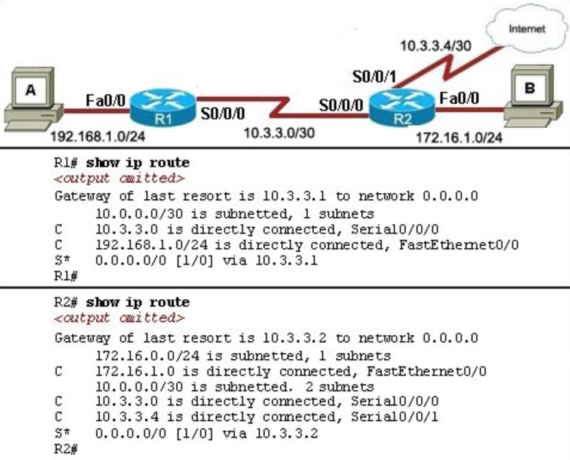

# 02.03. Работа сети Интернет BGP, DNS - Лебедев Д.С.
https://github.com/netology-code/ibnet-homeworks/tree/v2/06_internet

### 1. Zoom
> На любой Linux-машине (можете использовать Kali) с помощью утилиты dig найдите 5 компаний (доменов), которые скорее всего используют Zoom для своей работы.
> 
> В качестве результата необходимо отправить:
> 
> 1. Описание (своими словами) как вы производили поиск
> 2. Список из 5 доменов
> 3. Скриншоты вывода dig для каждого домена

### Выполнение задания

Zoom часто требует добавления TXT-записи в DNS. Поиск производился исходя из результатов запроса к DeepSeek об использовании компаниями данного сервиса.

Конечно, задание немного устарело, российские компании массово перешли на отечественное ПО. Но всё-таки удалось найти несколько, а так же парочку зарубежных:

```sh
dig TXT sberbank.ru | grep "ZOOM"
dig TXT netology.ru | grep "ZOOM"
dig TXT megafon.ru | grep "ZOOM"
--
dig TXT salesforce.com | grep "zoom"
dig TXT oracle.com | grep "zoom"
```

    

### 2. BGP
> Создайте в Cisco Packet Tracer следующую топологию:
> 
> 
> 
> Настройте сетевую схему, используя следующие параметры:
> 
> Host1:
> - IP: 10.1.1.10/24
> - Default route : 10.1.1.254
> R1
> - IP gi0/0/0: 10.1.1.254/24
> - IP gi0/0/1: 192.168.1.1/30
> - BGP AS 65001
> R2
> - IP gi0/0/0: 10.2.2.254/24
> - IP gi0/0/1: 192.168.1.2/30
> - BGP AS 65002
> Host2
> - IP 10.2.2.10/24
> - Default route: 10.2.2.254
> 
> Запустите ping между Host1 и Host2 (он должен быть успешен).
> 
> В качестве результата пришлите сконфигурированную топологию в формате .pkt

### Выполнение задания

Настройка маршрутизатора R1:

```sh
Router(config)#host R1
R1(config)#int gi0/1
R1(config-if)#ip addr 10.1.1.254 255.255.255.0
R1(config-if)#no sh

R1(config-if)#int gi0/0
R1(config-if)#ip addr 192.168.1.1 255.255.255.252
R1(config-if)#no sh

R1(config-if)#exi
R1(config)#rou bgp 65001
R1(config-router)#neighbor 192.168.1.2 remote-as 65002
R1(config-router)#network 10.1.1.0 mask 255.255.255.0

R1(config-router)#exi 
R1(config)#do wr
```

Настройка маршрутизатора R2:

```sh
Router(config)#host R2
R2(config)#int gi0/0
R2(config-if)#ip addr 192.168.1.2 255.255.255.252
R2(config-if)#no sh

R2(config-if)#int gi0/1
R2(config-if)#ip addr 10.2.2.254 255.255.255.0
R2(config-if)#no sh

R2(config-if)#exi
R2(config)#rou bgp 65002
R2(config-router)#neighbor 192.168.1.1 remote-as 65001
R2(config-router)#network 10.2.2.0 mask 255.255.255.0

R2(config-router)#exi
R2(config)#do wr
```

Проверка сетевой связности:

  

[PKT - файл задания](_att/020203/020203-02.pkt)

### 3. Internet*
> Хост А успешно пингует Хост Б, но пинг между Хост А и Интернетом не работает.
> 
> Опишите своими словами, что настроено неправильно:
> 
>   
> 
> В качестве результата пришлите ответ, что именно неправильно настроено в сетевой схеме.
### Ответ

Запись `10.0.0.0/30 is subnetted, 1 subnets` в таблице маршрутизации на R1 означает, что он знает только одну подсеть.  Сеть 10.0.0.0 разделена на подсети с маской `/30`, и в данный момент активна одна такая подсеть на 2 хоста. И это не подсеть интернета, а сеть между роутерами.

Надо бы так, например:
`10.0.0.0/8 is variably subnetted, 2 subnets, 2 masks`
- 10.0.0.0/8 - это основная сеть, из которой выделены подсети.
- variably subnetted - означает, что сеть 10.0.0.0/8 разделена на подсети с разными масками.
- 2 subnets - в таблице маршрутизации присутствуют 2 подсети из этой сети.
- 2 masks - эти две подсети имеют разные маски подсети.

---
```
выполнено без замечаний, ответы верны.  
Работа принимается.
```