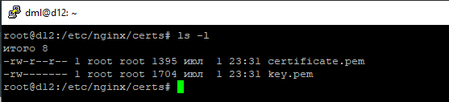
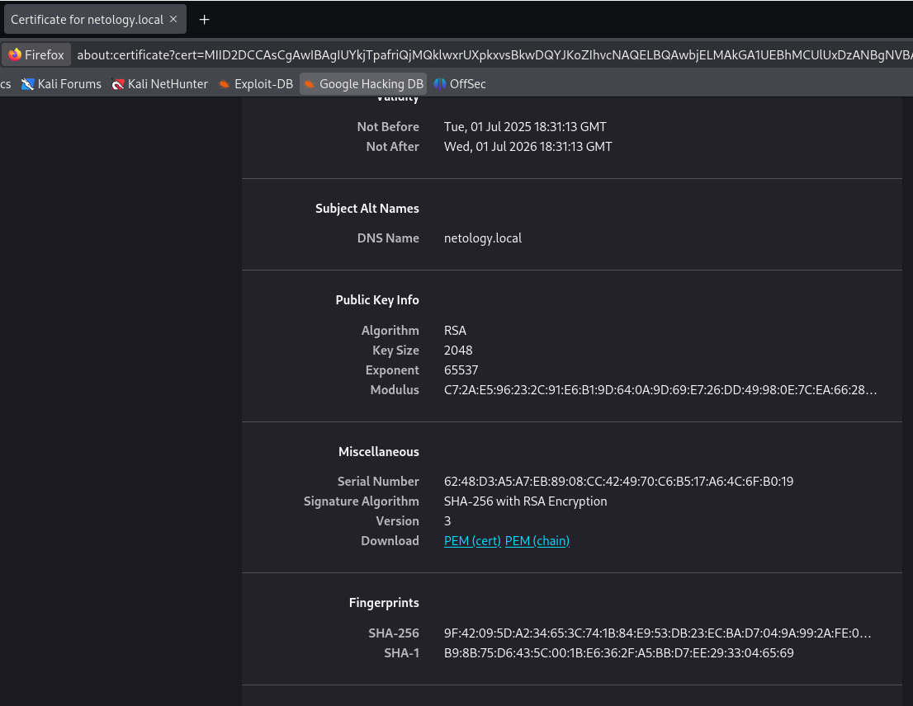
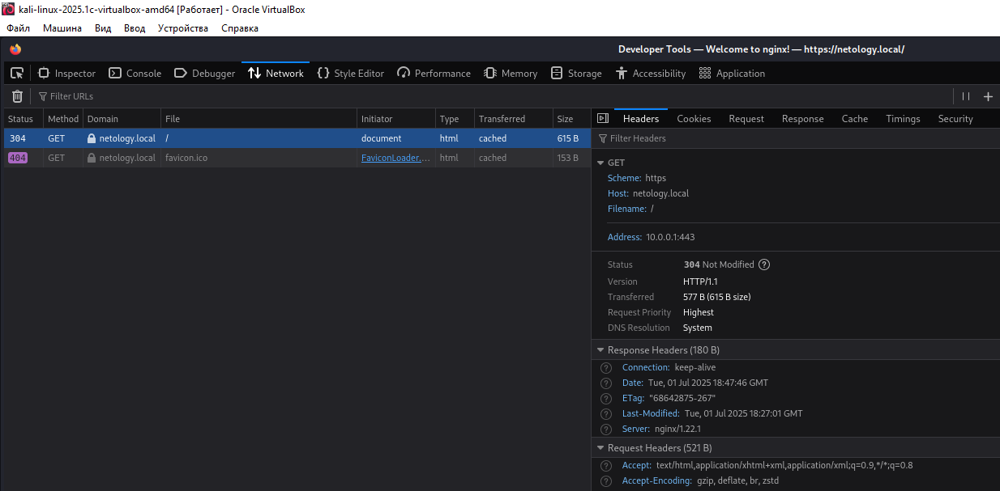
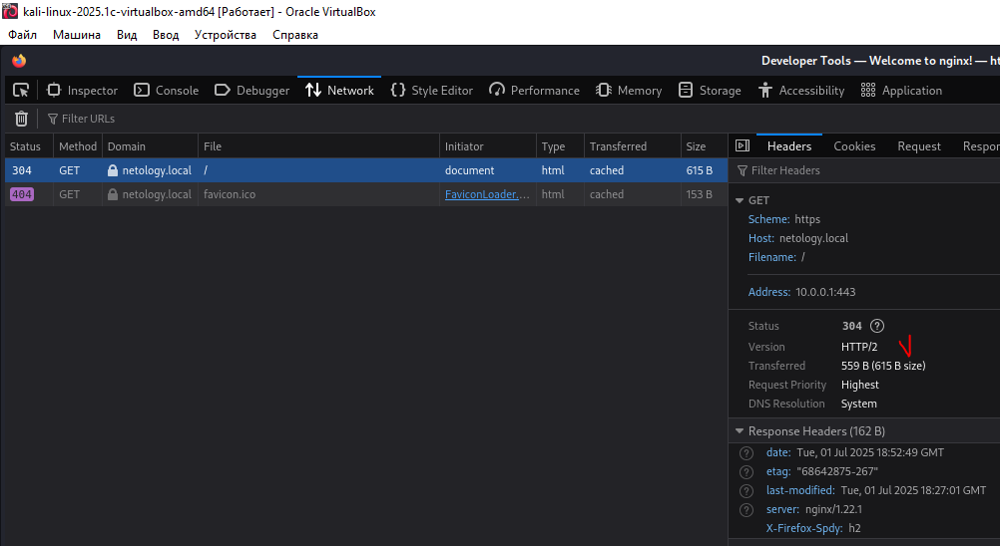
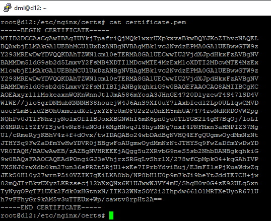
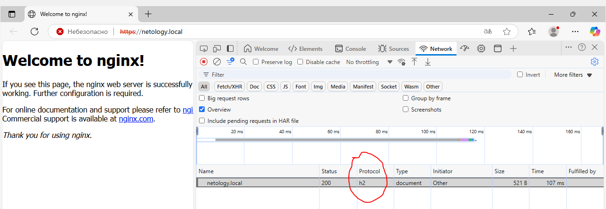
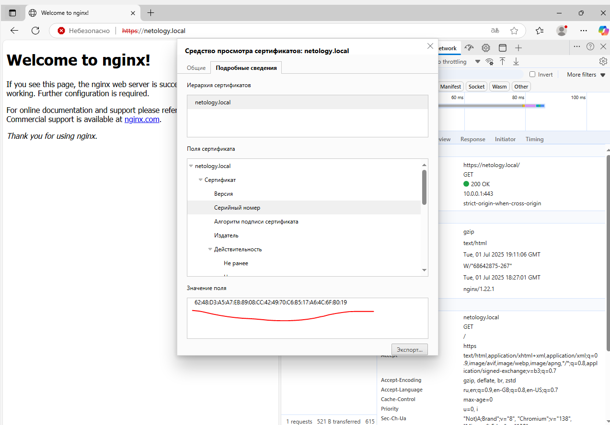

# 02.04. Работа сети Интернет HTTP, HTTPS, HTTP2 - Лебедев Д.С.
https://github.com/netology-code/ibnet-homeworks/tree/v2/07_internet
### Задание
> Настройте сервер ..., пришлите:
> - сертификат
> 
> Скриншоты открытия веб-сервера в Windows (в браузере Chrome), на которых видно:
> - что страница загружается по HTTP2
> - скриншот серийного номера сертификата при просмотре в браузере

### Выполнение
В соответствии с заданием настроены виртуальные машины (ВМ) Debian 12, Kali Linux, Windows 10x32.

На ВМ Debian 12 настроен http-сервер nginx, установлено ПО openssl, сгенерирован сертификат и настроен конфиг сервера для работы по HTTP2.

  

На ВМ Kali Linux проверена работа сервера в локальной сети по протоколам HTTP1.1 и HTTP2:

  

  

  

**Далее по заданию:**

Сгенерированный сертификат:

  

Анализ работы веб-сервера в ВМ Windows 10 (http2, и серийник сертификата):

  

  

---
```
страница грузится по http2, принимается
```