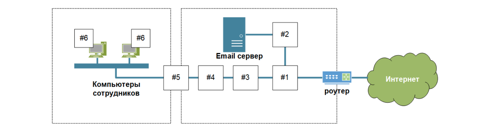

# 03.01. Основы сетевой безопасности - Лебедев Д.С.
https://github.com/netology-code/ibnet-homeworks/tree/v2/08_basics
### 1. Ритейл
> Вы являетесь экспертом ИБ в крупной ритейл компании. Компания в условиях пандемии COVID-19 переводит продажи в онлайн (интернет) и запускает Интернет-Сайт.
> 
> 
> 
> Какие средства защиты информации вы порекомендуете:
> 
> #1 - для разграничения доступа из Интернета к публикуемому сервису  
> #2 - для определения и подавления DDoS атаки на ваш интернет магазин  
> #3 - для определения и блокирования сложных WEB атак на ваш интернет-магазин, когда злоумышленники используют SQL инъекцию для получения доступа к вашей базе клиентов  
> Ответ пришлите в текстовом файле, в котором в свободной форме опишите предлагаемое решение для каждого “квадрата” (желательно тип средства защиты информации и короткий текст почему).

#### Выполнение задания 1

1. Для разграничения доступа из Интернета к публикуемому сервису:

Межсетевой экран (Firewall). Выполняет роль фильтра между Интернетом и внутренней сетью, обеспечивая доступ только к определенным ресурсам (публичному веб-серверу), ограничивая нежелательный трафик. Это помогает снизить риск несанкционированного доступа и защитить внутренние ресурсы компании.

На данном рубеже так же можно использовать связку Межсетевой экран (Firewall) + Web Application Firewall (WAF).

2. Для определения и подавления DDoS атаки на ваш интернет магазин:

DDoS-защита (возможно, облачный сервис). Облачные DDoS-решения отслеживают аномальный сетевой трафик и предотвращают его до того, как он достигнет интернет-магазина. Актуально для защиты от перегрузки сервера запросами, что позволяет поддерживать доступность ресурса для пользователей.

Возможно использование локального, либо гибридного Anti-DDoS решения.

3. Для определения и блокирования сложных WEB атак:

Веб-аппликационный фаервол (WAF). Анализирует и фильтрует HTTP-трафик, защищая от таких атак, как SQL-инъекции, XSS, и других веб-уязвимостей, которые могут использовать злоумышленники для доступа к базе данных и пользовательской информации. Это важно для защиты данных клиентов и целостности системы.

Наилучшим решением будет использование связки из WAF + SIEM (мониторинг и реагирование) + DAST/SAST сканеров уязвимостей.

### 2. Промышленность
> Вы являетесь экспертом ИБ в крупной промышленной компании. В компании появились новые инвестиции и руководство компании планирует модернизировать систему электронной почты и сделать более безопасным доступ сотрудников в Интернет.
> 
> 
> 
> Какие средства защиты информации вы порекомендуете:
> 
> #1 для разграничения доступа из Интернета в DMZ   
> #2 для защиты электронной почты от вирусов и спама  
> #3 - для определения и блокирования вредоносного ПО  
> #4 для контроля WEB трафика, URL фильтрации  
> #5 для разграничения доступа между корпоративной сетью и DMZ  
> #6 для защиты от вредоносного ПО на рабочей станции  
> Ответ пришлите в текстовом файле, в котором в свободной форме опишите предлагаемое решение для каждого “квадрата” (желательно тип средства защиты информации и короткий текст почему).
> 
#### Выполнение задания 2

1. Для разграничения доступа из Интернета в DMZ:

Межсетевой экран (Firewall). Обеспечивает разделение внешней и внутренней сети, создавая демилитаризованную зону (DMZ), куда помещается сервер электронной почты. Это снижает риск проникновения злоумышленников из Интернета в корпоративную сеть.

Так же нужно максимально изолировать внутреннюю сеть, используя VLAN.

2. Для защиты электронной почты от вирусов и спама:

Антивирусная и антиспам защита (например, шлюзовая антивирусная защита). Позволяет блокировать подозрительные письма, содержащие вредоносные вложения и спам, еще на уровне почтового шлюза, до их поступления на почтовый сервер. Это снижает вероятность распространения вирусов и фишинговых сообщений.

Кроме Антиспам-шлюза можно использовать на данном уровне Sandbox-анализ.

3. Для определения и блокирования вредоносного ПО:

Система обнаружения и предотвращения вторжений (IPS/IDS). Позволяет выявлять и блокировать попытки внедрения вредоносного ПО в сеть, а также предотвращать попытки компрометации внутренних систем через уязвимости в почтовом трафике.

4. Для контроля WEB трафика, URL фильтрации:

Веб-фильтр (Web Proxy/URL Filtering). Ограничивает доступ сотрудников к нежелательным сайтам, таким как ресурсы с потенциально вредоносным содержимым. Это помогает предотвратить случайное скачивание вредоносного ПО и повышает производительность.

Так же на этом уровне используется DNS-фильтрация.

5. Для разграничения доступа между корпоративной сетью и DMZ:

Сегментация (Микросегментация) сети с использованием внутреннего фаервола. Внутренний фаервол ограничивает доступ из корпоративной сети в DMZ и наоборот, защищая критически важные ресурсы в корпоративной сети от угроз, которые могут поступить через DMZ.

6. Для защиты от вредоносного ПО на рабочей станции:

Антивирусное программное обеспечение и EDR (Endpoint Detection and Response). Антивирус с EDR позволяет обнаруживать и устранять вредоносное ПО на рабочих станциях, обеспечивая более высокий уровень защиты конечных устройств и позволяя мониторить подозрительные действия.

Пример - использование на РМ Kaspersky Endpoint Security (NGAV + EDR).