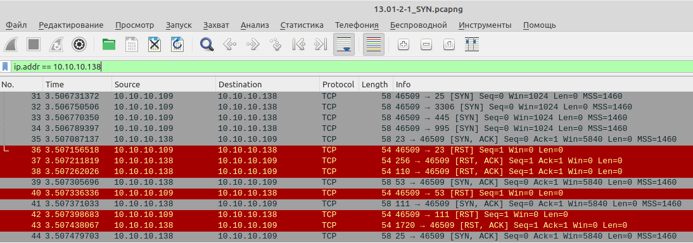
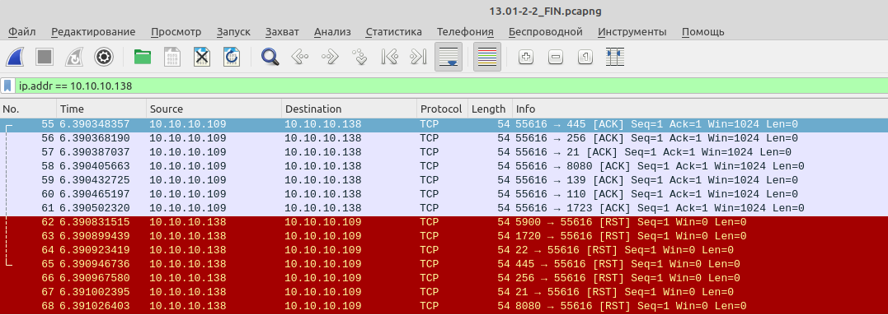
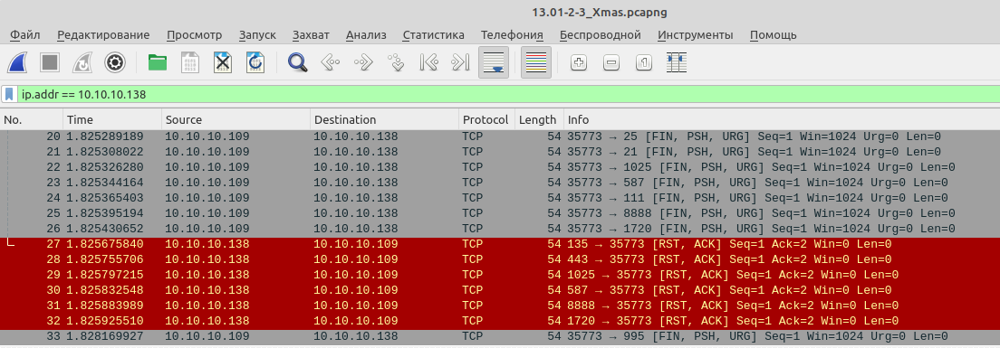
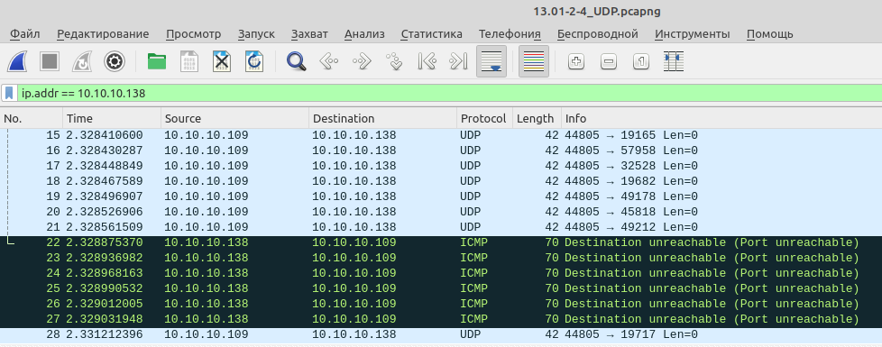

# 03.02. Атаки - Лебедев Д.С.
https://github.com/netology-code/ibnet-homeworks/tree/v2/09_attacks
### 1. Metasploitable
> Скачайте и установите на виртуальную машину Metasploitable: https://sourceforge.net/projects/metasploitable/  
> Просканируйте эту VM, используя nmap.  
> Попробуйте найти уязвимости, которым подвержена данная виртуальная машина.  
> Сами уязвимости можно поискать на сайте https://www.exploit-db.com/.  
> Для этого нужно в поиске ввести название сетевой службы, обнаруженной на атакуемой машине, и выбрать подходящие по версии уязвимости.
> 
> Ответьте на следующие вопросы:   
> 1. Какие сетевые службы в ней разрешены?
> 2. Какие уязвимости были вами обнаружены (список со ссылками - достаточно 3х уязвимостей)

*Ответ:*  

[Пример работы утилиты nmap](_att/020302/020302-01-01.log)

При сканировании (просмотр лога) обнаружены сетевые службы:

| PORT | STATE | SERVICE | VERSION |
| --- | --- | --- | --- |
|21/tcp | open | ftp | vsftpd 2.3.4 |
|22/tcp |  open | ssh | OpenSSH 4.7p1 Debian 8ubuntu1 (protocol 2.0) |
|23/tcp |  open | telnet | Linux telnetd
|25/tcp |  open | smtp | Postfix smtpd
|80/tcp |  open | http | Apache httpd 2.2.8 ((Ubuntu) DAV/2)
|111/tcp | open | rpcbind | 2 (RPC #100000)
|139/tcp | open | netbios-ssn | Samba smbd 3.X - 4.X (workgroup: WORKGROUP)
|445/tcp | open | netbios-ssn | Samba smbd 3.X - 4.X (workgroup: WORKGROUP)
|512/tcp | open | exec | netkit-rsh rexecd
|513/tcp | open | login |
|514/tcp | open | tcpwrapped |
|1099/tcp| open | java-rmi  | GNU Classpath grmiregistry
|1524/tcp | open  |bindshell  | Metasploitable root shell
|2049/tcp | open | nfs | 2-4 (RPC #100003)
|2121/tcp | open | ftp | ProFTPD 1.3.1
|3306/tcp | open | mysql | MySQL 5.0.51a-3ubuntu5
|5432/tcp | open |postgresql | PostgreSQL DB 8.3.0 - 8.3.7
|5900/tcp | open | vnc | VNC (protocol 3.3)
|6000/tcp | open | X11 | (access denied)
|6667/tcp | open | irc | UnrealIRCd
|8009/tcp | open | ajp13 | Apache Jserv (Protocol v1.3)
|8180/tcp | open | http | Apache Tomcat/Coyote JSP engine 1.1

Несколько найденных уязвимостей:
- vsftpd 2.3.4 - https://www.exploit-db.com/exploits/49757
- ProFTPD 1.3.1 - https://www.exploit-db.com/exploits/15449
- MySQL 5.0.51a-3ubuntu5 -  https://www.exploit-db.com/exploits/30020
- Apache Tomcat/Coyote JSP engine 1.1 - https://www.exploit-db.com/exploits/12343

### 2. SYN, FIN, Xmas, UDP
> Проведите сканирование Metasploitable в режимах SYN, FIN, Xmas, UDP, запишите сеансы сканирования в Wireshark.  
> Ответьте в свободной форме на следующие вопросы:  
> 1. Чем отличаются эти режимы сканирования с точки зрения сетевого трафика?
> 2. Как отвечает сервер?

*Ответ:*  

```sh
nmap -sS 10.10.10.138
nmap -sA 10.10.10.138
nmap -sX 10.10.10.138
nmap -sU 10.10.10.138
```

1. Режим SYN не завершает процесс установки TCP-соединения. Это наиболее быстрый вид сканирования в Nmap. SYN-пакеты отправляются к исследуемому порту и если приходит ответ с SYN-ACK - порт открыт. Если приходит RST-пакет - порт закрыт.  

  

2. FIN-сканирование отправляет TCP-пакет с установленным флагом FIN, который используется для завершения TCP-соединения. Если приходит ответ RST - порт закрыт. Отсутствие ответа означает открытый порт. Из-за времени ожидания, такой тип сканирования медленнее чем режим SYN.  

  

3. В режиме XMAS в TCP пакете отправляются сразу три флага FIN, URG и PSH. Если получен ответ RST - порт закрыт, отсутствие пакета - порт открыт.  

  

4. UDP-сканирование является самым медленным. В этом случае отправляются пустые UDP-пакеты на исследуемые порты. UDP-соединения в силу спецификации протокола не имеют механизма подтверждения установки соединения, состояние порта определяется либо по ответному ICMP-пакету с сообщением о недоступности, если ответа нет - предполагается, что порт открыт. При этом пакет может быть просто потерян.  

  
