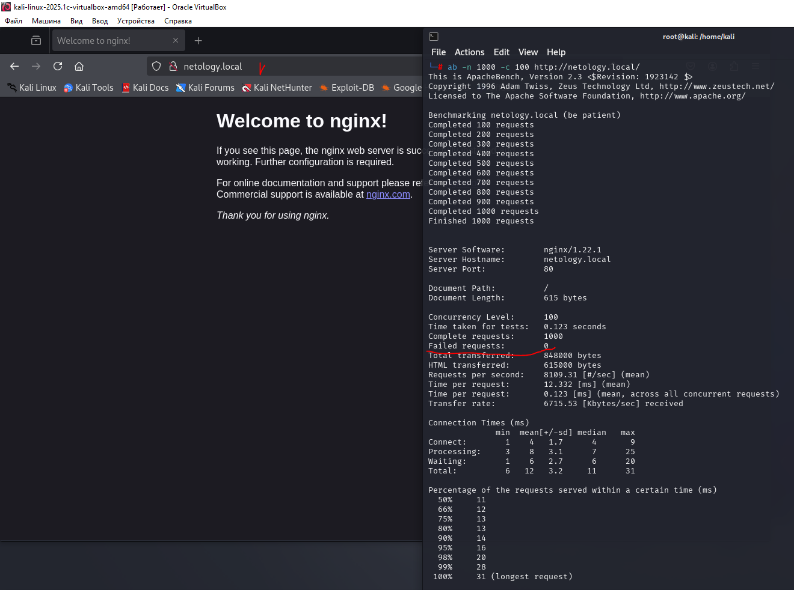
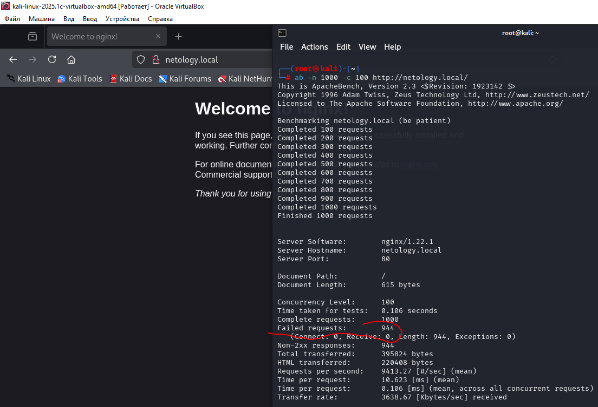
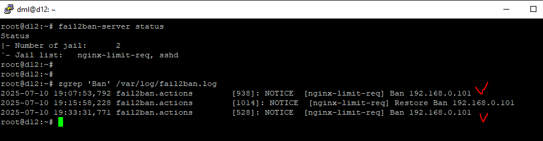

# 03.03. Организация безопасности сети - Лебедев Д.С.
https://github.com/netology-code/ibnet-homeworks/blob/v2/10-defence/README.md
### 1. Rate Limit
> ...
>Пришлите следующие скриншоты:
> 1. Скриншот с запросами ab до включения limit_req на nginx
> 2. Скриншот с запросами ab после включения limit_req на nginx
> 3. Скриншот с запросами ab после включения fail2ban (не обязательно)

*Выполнение задания:*  

1. Конфигурация nginx без `Rate Limit`:

  

2. Конфигурация nginx, настройка `Rate Limit`:

  

3. Настройка* `fail2ban`:



### 2. Suricata*
> ...
> Проведите с машины с Kali с помощью ab в трёх вариантах (последовательно):
> 1. 10_000 запросов по 100 одновременно
> 2. 10_000 запросов по 1000 одновременно
> 3. 10_000 запросов по 10 одновременно
> В качестве ответа пришлите описание реакции Suricata на подобное воздействие.

*Выполнение задания:*  

#### 1. 10000 запросов по 100:

`ab -n 10000 -c 100 http://netology.local/`

```sh
root@d12:~# tail /var/log/suricata/fast.log
07/10/2025-21:01:28.234344  [**] [1:2210045:2] SURICATA STREAM Packet with invalid ack [**] [Classification: Generic Protocol Command Decode] [Priority: 3] {TCP} 192.168.0.102:80 -> 192.168.0.101:43406
07/10/2025-21:01:28.243591  [**] [1:2210030:2] SURICATA STREAM FIN invalid ack [**] [Classification: Generic Protocol Command Decode] [Priority: 3] {TCP} 192.168.0.102:80 -> 192.168.0.101:43340
07/10/2025-21:01:28.243591  [**] [1:2210045:2] SURICATA STREAM Packet with invalid ack [**] [Classification: Generic Protocol Command Decode] [Priority: 3] {TCP} 192.168.0.102:80 -> 192.168.0.101:43340
07/10/2025-21:01:28.243931  [**] [1:2023668:4] ET INFO Unconfigured nginx Access [**] [Classification: Potentially Bad Traffic] [Priority: 2] {TCP} 192.168.0.102:80 -> 192.168.0.101:43330
07/10/2025-21:01:28.243977  [**] [1:2210029:2] SURICATA STREAM ESTABLISHED invalid ack [**] [Classification: Generic Protocol Command Decode] [Priority: 3] {TCP} 192.168.0.101:43340 -> 192.168.0.102:80
07/10/2025-21:01:28.243977  [**] [1:2210045:2] SURICATA STREAM Packet with invalid ack [**] [Classification: Generic Protocol Command Decode] [Priority: 3] {TCP} 192.168.0.101:43340 -> 192.168.0.102:80
07/10/2025-21:01:28.243981  [**] [1:2210030:2] SURICATA STREAM FIN invalid ack [**] [Classification: Generic Protocol Command Decode] [Priority: 3] {TCP} 192.168.0.101:43340 -> 192.168.0.102:80
07/10/2025-21:01:28.243981  [**] [1:2210045:2] SURICATA STREAM Packet with invalid ack [**] [Classification: Generic Protocol Command Decode] [Priority: 3] {TCP} 192.168.0.101:43340 -> 192.168.0.102:80
07/10/2025-21:01:28.244007  [**] [1:2210029:2] SURICATA STREAM ESTABLISHED invalid ack [**] [Classification: Generic Protocol Command Decode] [Priority: 3] {TCP} 192.168.0.102:80 -> 192.168.0.101:43340
07/10/2025-21:01:28.244007  [**] [1:2210045:2] SURICATA STREAM Packet with invalid ack [**] [Classification: Generic Protocol Command Decode] [Priority: 3] {TCP} 192.168.0.102:80 -> 192.168.0.101:43340
root@d12:~#
```


Реакция Suricata показывает, что интенсивное нагрузочное тестирование вызвало аномальное поведение TCP-стэка (высокая конкуренция за соединения), что интерпретируется как потенциально опасный трафик (Priority 2-3).  
Обнаружены невалидные TCP-ACK пакеты, некорректные FIN-флаги, ошибки в процессе установления ESTABLISHED-сессий, зафиксирован доступ к веб-серверу без специальной конфигурации.

#### 2. 10000 запросов по 1000:

`ab -n 10000 -c 1000 http://netology.local/`

```sh
root@d12:~# tail /var/log/suricata/fast.log
07/10/2025-21:03:03.460204  [**] [1:2210045:2] SURICATA STREAM Packet with invalid ack [**] [Classification: Generic Protocol Command Decode] [Priority: 3] {TCP} 192.168.0.102:80 -> 192.168.0.101:53838
07/10/2025-21:03:03.460474  [**] [1:2210029:2] SURICATA STREAM ESTABLISHED invalid ack [**] [Classification: Generic Protocol Command Decode] [Priority: 3] {TCP} 192.168.0.101:51860 -> 192.168.0.102:80
07/10/2025-21:03:03.460474  [**] [1:2210045:2] SURICATA STREAM Packet with invalid ack [**] [Classification: Generic Protocol Command Decode] [Priority: 3] {TCP} 192.168.0.101:51860 -> 192.168.0.102:80
07/10/2025-21:03:03.465086  [**] [1:2210030:2] SURICATA STREAM FIN invalid ack [**] [Classification: Generic Protocol Command Decode] [Priority: 3] {TCP} 192.168.0.102:80 -> 192.168.0.101:53838
07/10/2025-21:03:03.465086  [**] [1:2210045:2] SURICATA STREAM Packet with invalid ack [**] [Classification: Generic Protocol Command Decode] [Priority: 3] {TCP} 192.168.0.102:80 -> 192.168.0.101:53838
07/10/2025-21:03:03.465353  [**] [1:2210029:2] SURICATA STREAM ESTABLISHED invalid ack [**] [Classification: Generic Protocol Command Decode] [Priority: 3] {TCP} 192.168.0.101:53838 -> 192.168.0.102:80
07/10/2025-21:03:03.465353  [**] [1:2210045:2] SURICATA STREAM Packet with invalid ack [**] [Classification: Generic Protocol Command Decode] [Priority: 3] {TCP} 192.168.0.101:53838 -> 192.168.0.102:80
07/10/2025-21:03:07.387734  [**] [1:2221010:1] SURICATA HTTP unable to match response to request [**] [Classification: Generic Protocol Command Decode] [Priority: 3] {TCP} 192.168.0.102:80 -> 192.168.0.101:42036
07/10/2025-21:03:07.387734  [**] [1:2023668:4] ET INFO Unconfigured nginx Access [**] [Classification: Potentially Bad Traffic] [Priority: 2] {TCP} 192.168.0.102:80 -> 192.168.0.101:42036
07/10/2025-21:03:09.500641  [**] [1:2023668:4] ET INFO Unconfigured nginx Access [**] [Classification: Potentially Bad Traffic] [Priority: 2] {TCP} 192.168.0.102:80 -> 192.168.0.101:46522
root@d12:~#
```
  
Suricata интерпретирует нагрузочное тестирование как подозрительную активность (потенциально опасный трафик Priority 2-3) , так как оно вызывает:
- Нарушения TCP-стэка (из-за перегрузки и потери пакетов).
- Аномалии HTTP-трафика (несоответствие запросов и ответов).
- Доступ к веб-серверу без специальной конфигурации.

#### 3. 10000 запросов по 10:

`ab -n 10000 -c 10 http://netology.local/`

```sh
root@d12:~# tail /var/log/suricata/fast.log
07/10/2025-21:04:40.305487  [**] [1:2023668:4] ET INFO Unconfigured nginx Access [**] [Classification: Potentially Bad Traffic] [Priority: 2] {TCP} 192.168.0.102:80 -> 192.168.0.101:38190
07/10/2025-21:04:40.306415  [**] [1:2023668:4] ET INFO Unconfigured nginx Access [**] [Classification: Potentially Bad Traffic] [Priority: 2] {TCP} 192.168.0.102:80 -> 192.168.0.101:40776
07/10/2025-21:04:42.612288  [**] [1:2023668:4] ET INFO Unconfigured nginx Access [**] [Classification: Potentially Bad Traffic] [Priority: 2] {TCP} 192.168.0.102:80 -> 192.168.0.101:39576
07/10/2025-21:04:54.103992  [**] [1:2023668:4] ET INFO Unconfigured nginx Access [**] [Classification: Potentially Bad Traffic] [Priority: 2] {TCP} 192.168.0.102:80 -> 192.168.0.101:43164
07/10/2025-21:04:56.503468  [**] [1:2023668:4] ET INFO Unconfigured nginx Access [**] [Classification: Potentially Bad Traffic] [Priority: 2] {TCP} 192.168.0.102:80 -> 192.168.0.101:37400
07/10/2025-21:04:58.127133  [**] [1:2023668:4] ET INFO Unconfigured nginx Access [**] [Classification: Potentially Bad Traffic] [Priority: 2] {TCP} 192.168.0.102:80 -> 192.168.0.101:40468
07/10/2025-21:05:02.540653  [**] [1:2023668:4] ET INFO Unconfigured nginx Access [**] [Classification: Potentially Bad Traffic] [Priority: 2] {TCP} 192.168.0.102:80 -> 192.168.0.101:40342
07/10/2025-21:05:03.535123  [**] [1:2023668:4] ET INFO Unconfigured nginx Access [**] [Classification: Potentially Bad Traffic] [Priority: 2] {TCP} 192.168.0.102:80 -> 192.168.0.101:38178
07/10/2025-21:05:05.546411  [**] [1:2023668:4] ET INFO Unconfigured nginx Access [**] [Classification: Potentially Bad Traffic] [Priority: 2] {TCP} 192.168.0.102:80 -> 192.168.0.101:48982
07/10/2025-21:05:06.574278  [**] [1:2023668:4] ET INFO Unconfigured nginx Access [**] [Classification: Potentially Bad Traffic] [Priority: 2] {TCP} 192.168.0.102:80 -> 192.168.0.101:57432
root@d12:~#
```

Suricata зафиксировала доступ к неконфигурированному веб-серверу nginx (`ET INFO Unconfigured nginx Access`), но не обнаружила аномалий в TCP-стеке, в отличие от предыдущих тестов с высокой конкуренцией (`-c 100` и `-c 1000`). При низкой конкуренции (`-c 10`) соединения обрабатываются корректно, без нарушений протокола.

### 3. Suricata Rules*
> `ET INFO Unconfigured nginx Access`
> Правила, которые мы использовали в предыдущем ДЗ, располагаются в файле /var/lib/suricata/rules/suricata.rules.  
> Найдите, среди правил правило, которое отвечает за эту строку и кратко опишите:
> 1. На основании чего происходит срабатывание данного правила
> 2. Ваше предположение о том, на что оно направлено
> Ответ пришлите в свободной форме.

*Выполнение задания:*  

```sh
root@d12:~# grep "ET INFO Unconfigured nginx Access" /var/lib/suricata/rules/suricata.rules
alert http $EXTERNAL_NET any -> $HOME_NET any (msg:"ET INFO Unconfigured nginx Access"; flow:from_server,established; http.stat_code; content:"200"; file.data; content:"|3C|title|3E|Welcome to nginx|213C2F|title|3E|"; classtype:bad-unknown; sid:2023668; rev:4; metadata:attack_target Client_Endpoint, created_at 2016_12_19, deployment Perimeter, performance_impact Low, confidence High, signature_severity Informational, updated_at 2022_11_21;)
root@d12:~#
```

1. Правило срабатывает, когда запрос направлен к веб-серверу nginx, при этом сервер возвращает стандартную страницу nginx (`Welcome to nginx!`). Указывает на неконфигурированный веб-сервер.
2. Это информационное правило в данном примере сообщает о факте сканирования инфраструктуры (ищут стандартные страницы для атак).