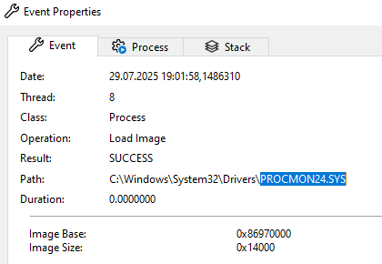
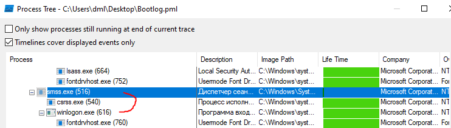

# 01.01. ОС Windows. Часть 1 - Лебедев Д.С.
https://github.com/netology-code/ibos-homeworks/tree/v2/01_win

### Задача Procmon

> **Легенда**
> 
> На лекции мы рассмотрели процесс загрузки ОС Windows. Ваша задача с помощью Process Explorer восстановить весь процесс загрузки (включая процедуру входа) на чистой ОС.
> 
> **Задача**
> 
> Скачайте установочный [ISO-файл от Microsoft](https://www.microsoft.com/en-us/evalcenter/evaluate-windows-10-enterprise).
> 
> Установите в виртуальную машину данную версию Windows. На экранах, где вас попросят ввести активационный код или учётную запись Microsoft, нажимайте пропуск.
> 
> Не устанавливайте никаких дополнений.
> 
> Скачайте в установленную Windows [Sysinternals Process Monitor](https://learn.microsoft.com/en-us/sysinternals/downloads/procmon):
> 
> **Результат**
> 
> В качестве результата пришлите ответы на следующие вопросы:
> 
> 1. Какой процесс отображается в логе первым? Какой у него PID?
> 2. Какой "драйвер" загружается первым? Что это за драйвер (ответьте своими словами)?
> 3. Какой PID у родительского процесса для smss.exe (не у самого smss.exe, а у того, кто его создал)?
> 4. Какой процесс является родительским для процесса winlogon.exe? Где расположен файл winlogon.exe?
> 5. Какой процесс является родительским для процесса lsass.exe?
> 6. Что будет если в таск менеджере (taskmgr.exe) завершить работу следующего процесса:
> 
>   
> 

**Выполнение задания**

1. Какой процесс отображается в логе первым? Какой у него PID?

```
Процесс System (PID = 4), ядро Windows (NT Kernel)
```

2. Какой "драйвер" загружается первым? Что это за драйвер (ответьте своими словами)?

```
PROCMON24.SYS. Драйвер procmon24.sys мониторит процессы при загрузке ОС.  
Если бы не запускался procmon, то первым бы был CLFS.SYS - драйвер для работы с системными логами.
```

  

3. Какой PID у родительского процесса для smss.exe (не у самого smss.exe, а у того, кто его создал)?

```
smss.exe (Session Manager Subsystem) создаётся процессом System (PID = 4)
```

4. Какой процесс является родительским для процесса winlogon.exe? Где расположен файл winlogon.exe?

```
winlogon.exe создаётся smss.exe. Файл winlogon.exe находится в C:\Windows\System32\
```



 5. Какой процесс является родительским для процесса lsass.exe?

```
lsass.exe (Local Security Authority Subsystem Service) создаётся wininit.exe
```


6. Что будет если в таск менеджере (taskmgr.exe) завершить работу процесса `Windows Logon Application (winlogon.exe)`

```
1. Отвалился сеанс пользователя, чёрный экран  
2. Автоматическая перезагрузка через несколько секунд. Возможен BSOD.
```

---
```
Отлично, верно, принимается!
```
