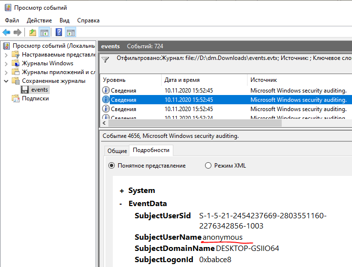
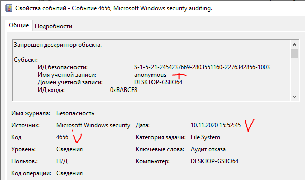
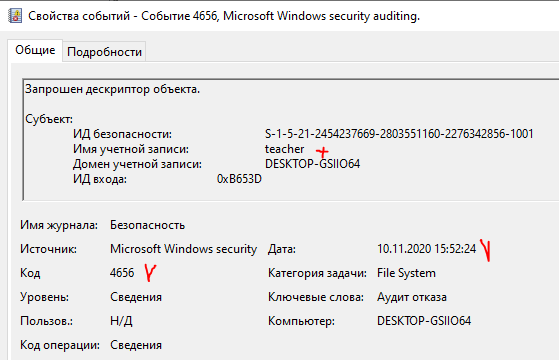

# 01.02. ОС Windows. Часть 2 - Лебедев Д.С.
https://github.com/netology-code/ibos-homeworks/blob/v2/02_win/README.md

### Задача Audit
> **Легенда**  
> На лекции мы рассмотрели работу с EventViewer'ом и журналом событий. В это ДЗ вам необходимо будет закрепить данные навыки и проанализировать готовый журнал событий.
> 
> **Задача**  
> Скачайте [выгрузку журнала событий](_att/040102/040102_events.evtx) и предоставьте ответы на следующие вопросы:
> 
> 1. Для каких пользователей (логины и SID'ы) зарегистрированы события типа `Audit Failure` (в русскоязычной Windows - `Аудит отказа`) по доступу к файлу `Share.txt`?  
> 2. Каковы ID событий (Event ID) и время, когда это было зафиксировано (в русскоязычной Windows `Код события`)?
> 3. С помощью каких процессов (приложений) была осуществлена попытка доступа (в русскоязычной Windows `Имя процесса`)?

**Выполнение задания**

 1. Для каких пользователей (логины и SID'ы) зарегистрированы события типа `Audit Failure` (в русскоязычной Windows - `Аудит отказа`) по доступу к файлу `Share.txt`? 

```
anonymous
teacher
```

  

2. Каковы ID событий (Event ID) и время, когда это было зафиксировано (в русскоязычной Windows `Код события`)?

```
anonymous
4656
10.11.2020 13:52:45

teacher
4656
10.11.2020 13:52:24
```

  

  

 3. С помощью каких процессов (приложений) была осуществлена попытка доступа (в русскоязычной Windows `Имя процесса`)?

```
C:\Windows\System32\notepad.exe
C:\Windows\explorer.exe
```

---
```
пользователи и процессы определены верно, принимается
```
