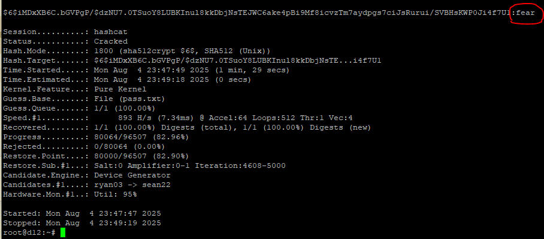

# 02.01. ОС Linux. Часть 1 - Лебедев Д.С.
https://github.com/netology-code/ibos-homeworks/blob/master/04_nix/README.md

### Задача /etc/shadow

> **Легенда**  
> 
> На лекции мы рассмотрели работу файла /etc/shadow. Подберите с помощью Hashcat пароль пользователя по хэшу из /etc/shadow
> 
> **Задача**  
> 
> У вас есть фрагмент записи из файла `/etc/shadow`: 
> 
> `hackme:$6$iMDxXB6C.bGVPgP/$dzNU7.0TSuoY8LUBKInul8kkDbjNsTEJWC6ake4pBi9Mf8icvzTm7aydpgs7ciJsRurui/SVBHsKWP0Ji4f7U1:....`
> 
> Подберите пароль к данной учётной записи.

**Выполнение задания**

Атака по словарю `pass.txt`:

```sh
hashcat -m 1800 -a 0 '$6$iMDxXB6C.bGVPgP/$dzNU7.0TSuoY8LUBKInul8kkDbjNsTEJWC6ake4pBi9Mf8icvzTm7aydpgs7ciJsRurui/SVBHsKWP0Ji4f7U1' pass.txt
```

Результат - `fear`



---
```
Отлично, принимается
```