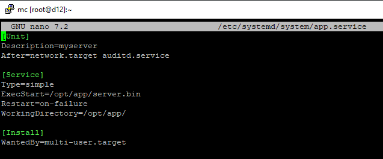

# 02.02. ОС Linux. Часть 2 - Лебедев Д.С.
https://github.com/netology-code/ibos-homeworks/tree/v2/03_nix

### Задача SystemCtl & JournalCtl

> **Легенда**
> 
> На лекции мы рассмотрели работу с Systemd и Journald. В это ДЗ вам необходимо будет закрепить данные навыки, зарегистрировав предлагаемый вам сервер в качестве сервиса Systemd и проанализировав его логи с помощью JournalCtl.
> 
> **Задача**
> 
> Скачайте:  
> - [Исполняемый файл сервера](_att/040202/server.bin)
> - [Сертификат](_att/040202/certificate.pem) и [приватный ключ](_att/040202/key.pem)
> 
> Настройте запуск сервера (используйте виртуальную машину с ОС Ubuntu) при старте системы с рабочим каталогом `/opt/app` (сертификаты должны располагаться в нём же).
> 
> С помощью `journalctl` отследите, лог приложения (не менее 2х минут) и пришлите:
> 
> 1. Скриншот, либо содержимое файла `app.service`
> 2. Ответы на вопросы:
> i. На каком IP и порту запускается сервис  
> ii. Кто (IP и порт) шлёт запросы на этот сервис и на какой путь  
> iii. Какие ответы (формат) получает клиент из п.ii получает в ответ на свои запросы  
> iv. Какой ответ (HTTP статус код) получите вы, если пошлёте из браузера запрос на этот же адрес (сертификат самоподписанный, поэтому вам необходимо принять его)

**Выполнение задания**

Файл `app.service`

  

Работающий сервис:

  

Лог работы:


1. На каком IP и порту запускается сервис

```
Сервис запускается на:
- IP: 0.0.0.0 (слушает все интерфейсы)
- Порт: 9999
```

2. Кто (IP и порт) шлёт запросы на этот сервис и на какой путь

```
Клиенты:
- IP: 127.0.0.1 (локальный хост)
- Порты клиентов: Диапазон 33286–60104 (например, 48372, 50094, 34510 и т.д.)
- Путь запроса: /api/token
- User-Agent: tracker-service
```

3. Какие ответы (формат) получает клиент из п.2 получает в ответ на свои запросы

```
- Формат ответа: JSON
- {"ID":"<уникальный_идентификатор>", "status":"ok"}
```

4. Какой ответ (HTTP статус код) получите вы, если пошлёте из браузера запрос на этот же адрес (сертификат самоподписанный, поэтому вам необходимо принять его)

Сервер вернул JSON-ответ: 


---
```
Всё верно, принято
```