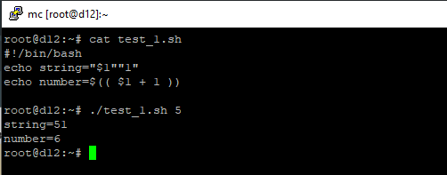
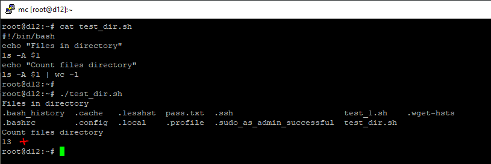
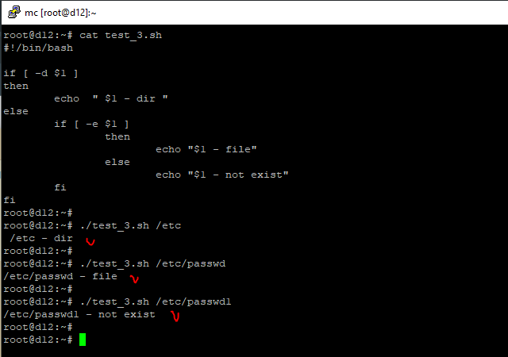
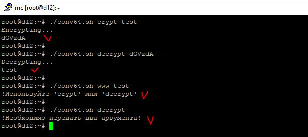

# 03.01. Использование командных оболочек. Часть 1 - Лебедев Д.С.
https://github.com/netology-code/ibos-homeworks/tree/v2/05_shell
### Задание 1
> Напишите два скрипта, каждый из которых принимает один параметр и:
> 
> - первый - прибавляет к параметру единицу как строку.
> ```sh
> Например:
> user@user:~$ ./test_1.sh 5
> 51
> ```
> 
> - второй - прибавляет к параметру единицу как число.
> ```
> Например:
> user@user:~$ ./test_2.sh 5
> 6
> ```

**Выполнение задания**

```sh
#!/bin/bash
echo string="$1""1"
echo number=$(( $1 + 1 ))
```

  
### Задание 2
> Напишите скрипт, который выводит содержимое каталога и подсчитывает в нём количество файлов.
> 
> ```sh
> Например:
> user@user:~$ ./test_dir.sh
> admin_scripts
> ...
> Videos Total: 22
> ```

**Выполнение задания**

```sh
#!/bin/bash
echo "Files in directory"
ls -A $1
echo "Count files directory"
ls -A $1 | wc -l
```

  

### Задание 3
> Напишите скрипт, который принимает один параметр и определяет, какой объект передан этим параметром (файл, каталог или не существующий).
> 
> ```sh
> Например:
> user@user:~$ ./test.sh /etc
> /etc - dir
> user@user:~$ ./test.sh /etc/passwd
> /etc/passwd - file
> user@user:~$ ./test.sh /etc/passwd1
> /etc/passwd1 - not exist
> ```

**Выполнение задания**

```sh
#!/bin/bash

if [ -d $1 ]
then
        echo  " $1 - dir "
else
        if [ -e $1 ]
                then
                        echo "$1 - file"
                else
                        echo "$1 - not exist"
        fi
fi
```

  

#### Задание 4* (необязательное)
> **Легенда**
> Пользователи в нашей компании начали пересылать друг другу некие "секретные" сообщения. Т.к. доступа к средствам криптографии у них нет, для "шифрования" они используют преобразование строк в формат Base64.
> 
> **Задача**
> Написать скрипт для Bash, который:
> 
> 1. принимает на входе два аргумента. Первый - режим преобразования, второй - строка;
> 2. если первый параметр равен crypt - преобразует второй параметр в строку Base64;
> 3. если первый параметр равен decrypt - преобразует второй параметр в текст;
> 4. если первый параметр равен любой другой строке - выйти из скрипта с ненулевым кодом возврата и сообщить об этом пользователю;
> 5. если количество параметров скрипта не равно двум - выйти из скрипта с ненулевым кодом возврата выдать сообщение пользователю и завершить работу.
> 
> ```sh
> Пример работы:
> $ ./script.sh crypt test
> Encrypting...
> dGVzdAo=
> $ ./script.sh decrypt dGVzdAo=
> Decrypting...
> test
> ```
> 
> Важно: если вы работаете на Windows, вам достаточно Cygwin (не обязательно делать ДЗ в виртуалке).

**Выполнение задания**

```sh
#!/bin/bash

# Проверка количества аргументов
if [ "$#" -ne 2 ]; then
    echo "!Необходимо передать два аргумента!" >&2
    exit 1
fi

mode="$1"
input_string="$2"

case "$mode" in
    crypt)
        # Преобразование в Base64
        echo "Encrypting..."
        echo -n "$input_string" | base64
        ;;
    decrypt)
        # Преобразование из Base64
        echo "Decrypting..."
        echo -n "$input_string" | base64 --decode 2>/dev/null
        if [ $? -ne 0 ]; then
            echo "!Некорректный Base64" >&2
            exit 1
        fi
        echo ;;
    *)
        echo "!Используйте 'crypt' или 'decrypt'" >&2
        exit 1
        ;;
esac

exit 0
```

  

---
