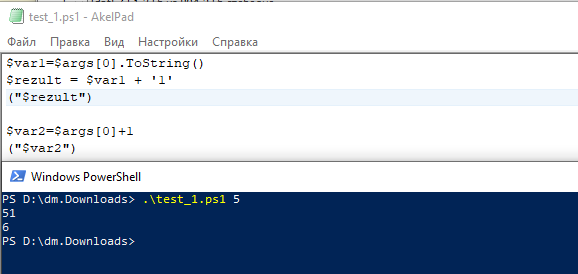
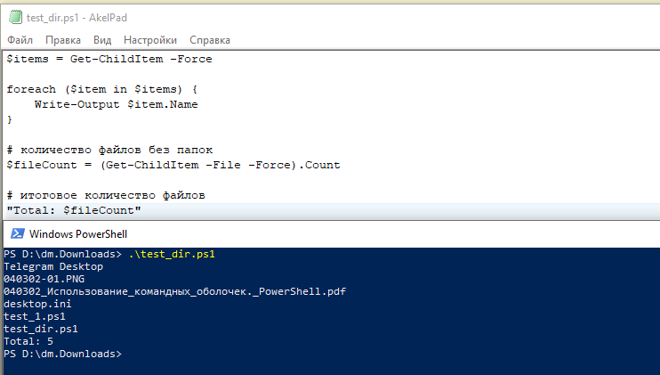
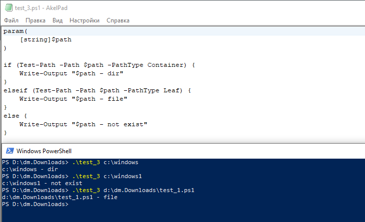
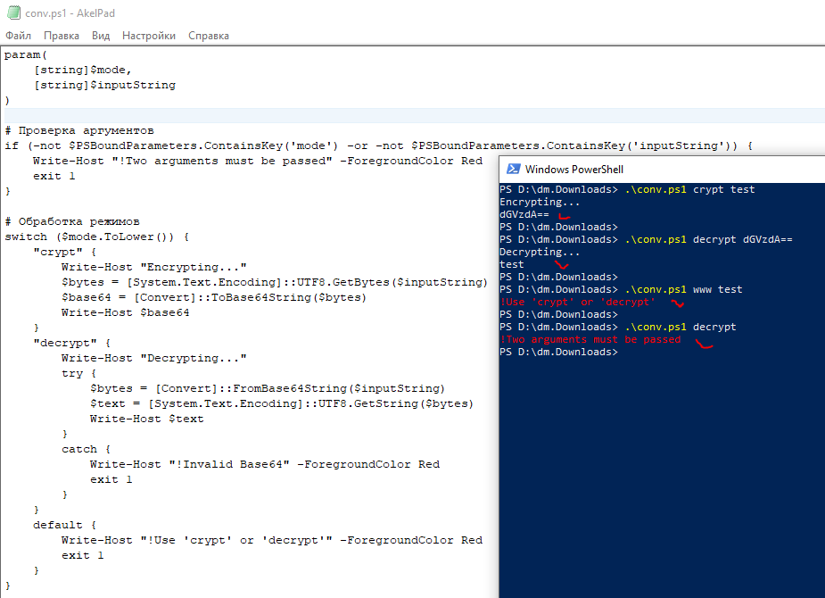

# 03.02. Использование командных оболочек. Часть 2 - Лебедев Д.С.
https://github.com/netology-code/ibos-homeworks/tree/v2/06_shell
### Задание 1
> Напишите два скрипта, каждый из которых принимает один параметр и:
> 
> - первый - прибавляет к параметру единицу как строку.
> 
> ```sh
> Например:
> ./test_1.ps1 5
> 51
> ```
> 
> - второй - прибавляет к параметру единицу как число.
> 
> ```sh
> Например:
> ./test_2.ps1 5
> 6
> ```

**Выполнение задания**

```sh
$var1=$args[0].ToString()
$rezult = $var1 + '1'
("$rezult")

$var2=$args[0]+1
("$var2")
```

  

### Задание 2
> Напишите скрипт, который выводит содержимое каталога и подсчитывает в нём количество файлов.
> 
> ```sh
> Например:
> ./test_dir.ps1
> admin_scripts
> ...
> Videos
> Total: 22
> ```

**Выполнение задания**

```sh
$items = Get-ChildItem -Force

foreach ($item in $items) {
    Write-Output $item.Name
}

$fileCount = (Get-ChildItem -File -Force).Count

"Total: $fileCount"
```

  

### Задание 3
> Напишите скрипт, который принимает один параметр и определяет, какой объект передан этим параметром (файл, каталог или не существующий).
> 
> ```
> Например:
> ./test.ps1 c:\windows
> c:\windows - dir
> ./test.ps1 c:\pagefile.sys
> c:\pagefile.sys - file
> user@user:~$./test.ps1 c:\windows1
> c:\windows1 - not exist
> ```

**Выполнение задания**

```sh
param(
    [string]$path
)

if (Test-Path -Path $path -PathType Container) {
    Write-Output "$path - dir"
}
elseif (Test-Path -Path $path -PathType Leaf) {
    Write-Output "$path - file"
}
else {
    Write-Output "$path - not exist"
}
```

  

### Задание 4*
> **Легенда**
> Пользователи в нашей компании начали пересылать друг другу некие "секретные" сообщения. Т.к. доступа к средствам криптографии у них нет, для "шифрования" они используют преобразование строк в формат Base64.
> 
> **Задача**
> Написать скрипт, который:
> 1. принимает на входе два аргумента. Первый - режим преобразования, второй - строка;
> 2. если первый параметр равен crypt - преобразует второй параметр в строку Base64;
> 3. если первый параметр равен decrypt - преобразует второй параметр в текст;
> 4. если первый параметр равен любой другой строке - выйти из скрипта с ненулевым кодом возврата и сообщить об этом пользователю;
> 5. если количество параметров скрипта не равно двум - выйти из скрипта с ненулевым кодом возврата выдать сообщение пользователю и завершить работу.
> 
> ```
> Пример работы:
> $ ./script.ps1 crypt test
> Encrypting...
> dGVzdAo=
> $ ./script.ps1 decrypt dGVzdAo=
> Decrypting...
> test
> ```

**Выполнение задания**

```sh
param(
    [string]$mode,
    [string]$inputString
)

# Проверка аргументов
if (-not $PSBoundParameters.ContainsKey('mode') -or -not $PSBoundParameters.ContainsKey('inputString')) {
    Write-Host "!Two arguments must be passed" -ForegroundColor Red
    exit 1
}

# Обработка режимов
switch ($mode.ToLower()) {
    "crypt" {
        Write-Host "Encrypting..."
        $bytes = [System.Text.Encoding]::UTF8.GetBytes($inputString)
        $base64 = [Convert]::ToBase64String($bytes)
        Write-Host $base64
    }
    "decrypt" {
        Write-Host "Decrypting..."
        try {
            $bytes = [Convert]::FromBase64String($inputString)
            $text = [System.Text.Encoding]::UTF8.GetString($bytes)
            Write-Host $text
        }
        catch {
            Write-Host "!Invalid Base64" -ForegroundColor Red
            exit 1
        }
    }
    default {
        Write-Host "!Use 'crypt' or 'decrypt'" -ForegroundColor Red
        exit 1
    }
}
```



---
