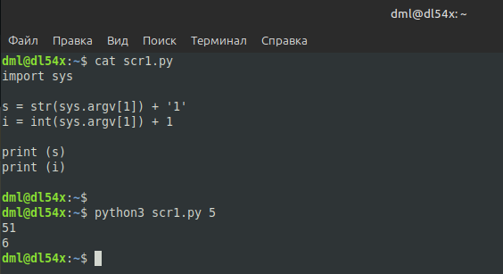
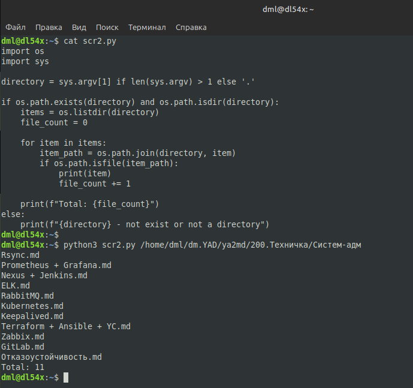
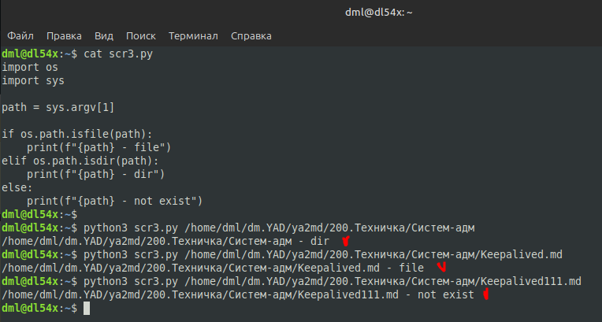
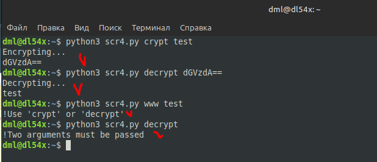

# 03.03. Язык Python. Основы - Лебедев Д.С.
https://github.com/netology-code/ibos-homeworks/tree/v2/07_python1
### Задание 1
> Напишите два скрипта, каждый из которых принимает один параметр и:
> - первый - прибавляет к параметру единицу как строку.
> - второй - прибавляет к параметру единицу как число.

**Выполнение задания**

```python
import sys

s = str(sys.argv[1]) + '1'
i = int(sys.argv[1]) + 1

print (s)
print (i)
```

  

### Задание 2
> Напишите скрипт, который выводит содержимое каталога и подсчитывает в нём количество файлов.

**Выполнение задания**

```python
import os
import sys

directory = sys.argv[1] if len(sys.argv) > 1 else '.'

if os.path.exists(directory) and os.path.isdir(directory):
    items = os.listdir(directory)
    file_count = 0
    
    for item in items:
        item_path = os.path.join(directory, item)
        if os.path.isfile(item_path):
            print(item)
            file_count += 1
         
    print(f"Total: {file_count}")
else:
    print(f"{directory} - not exist or not a directory")
```

  

### Задание 3
> Напишите скрипт, который принимает один параметр и определяет, какой объект передан этим параметром (файл, каталог или не существующий).

**Выполнение задания**

```python
import os
import sys

path = sys.argv[1]

if os.path.isfile(path):
    print(f"{path} - file")
elif os.path.isdir(path):
    print(f"{path} - dir")
else:
    print(f"{path} - not exist")
```

  

### Задание 4*
> **Легенда**  
> Пользователи в нашей компании начали пересылать друг другу некие "секретные" сообщения. Т.к. доступа к средствам криптографии у них нет, для "шифрования" они используют преобразование строк в формат Base64.  
> **Задача**  
> Написать скрипт, который:
> 1. принимает на входе два аргумента. Первый - режим преобразования, второй - строка;
> 2. если первый параметр равен crypt - преобразует второй параметр в строку Base64;
> 3. если первый параметр равен decrypt - преобразует второй параметр в текст;
> 4. если первый параметр равен любой другой строке - выйти из скрипта с ненулевым кодом возврата и сообщить об этом пользователю;
> 5. если количество параметров скрипта не равно двум - выйти из скрипта с ненулевым кодом возврата выдать сообщение пользователю и завершить работу.

**Выполнение задания**

```python
import sys
import base64

def main():
    # Проверяем количество аргументов
    if len(sys.argv) != 3:
        print("!Two arguments must be passed")
        sys.exit(1)
    
    mode = sys.argv[1]
    text = sys.argv[2]
    
    # Обрабатываем режимы работы
    if mode == 'crypt':
        print("Encrypting...")
        try:
            # Преобразуем строку в байты и кодируем в Base64
            text_bytes = text.encode('ascii')
            base64_bytes = base64.b64encode(text_bytes)
            base64_text = base64_bytes.decode('ascii')
            print(base64_text)
        except Exception as e:
            print(f"!Invalid Base64")
            sys.exit(1)

    elif mode == 'decrypt':
        print("Decrypting...")
        try:
            # Декодируем из Base64 и преобразуем в строку
            base64_bytes = text.encode('ascii')
            text_bytes = base64.b64decode(base64_bytes)
            decoded_text = text_bytes.decode('ascii')
            print(decoded_text)
        except Exception as e:
            print(f"!Invalid Base64")
            sys.exit(1)

    else:
        print("!Use 'crypt' or 'decrypt'")
        sys.exit(1)

if __name__ == "__main__":
    main()
```

  

---
```
скрипты написаны верно, принимается!
```