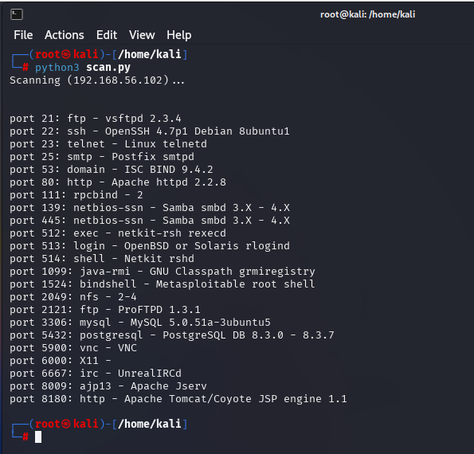
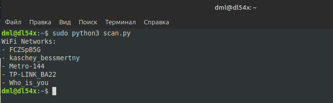

# 03.04. Язык Python в информационной безопасности - Лебедев Д.С.
https://github.com/netology-code/ibos-homeworks/tree/v2/08_python2
### Задание 1
> Просканируйте с помошью Python ВМ Metasploitable. Определите установленные службы (нужно вывести название и версию службы, номер порта.)

**Выполнение задания**

```python
import nmap3
from pprint import pprint

target = "192.168.56.102"
nmap = nmap3.Nmap()

print(f"Scanning ({target})...")

results = nmap.nmap_version_detection(target)

host_info = results.get(target, {})

print("\n")

if 'ports' in host_info:
    for port_info in host_info['ports']:
        port = port_info['portid']
        service_info = port_info.get('service', {})
        service_name = service_info.get('name', 'unknown')
        product = service_info.get('product', '')
        version = service_info.get('version', '')

        version_display = f"{product} {version}".strip()
        print(f"port {port}: {service_name} - {version_display}")
```

  

### Задание 2*
> Попробуйте повторить сканирование Wi-Fi, приведенное в лекции.

**Выполнение задания**

```python
import pywifi
import time

wifi = pywifi.PyWiFi()
iface = wifi.interfaces()[0]

iface.scan()
time.sleep(2)

networks = iface.scan_results()

print("WiFi Networks:")

for net in networks:
    if net.ssid:
        print(f"- {net.ssid}")
```

  

---
```
Всё верно, зачет!
```