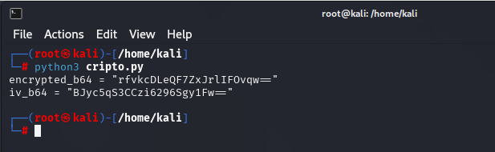
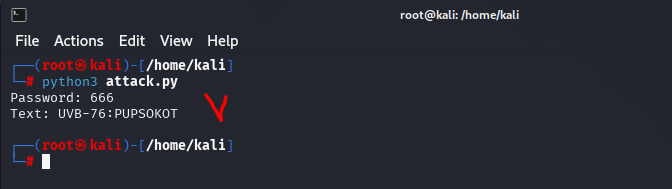

# 03.05. Язык Python. Криптография - Лебедев Д.С.
https://github.com/netology-code/ibos-homeworks/tree/v2/09_python3
### Задание 1
> Реализуйте атаку грубой силой на текст, зашифрованный AES. В качестве пароля возьмите трёхзначное число. Примечание: исрользуйте `pycryptodome`

**Выполнение задания**

1. Шифрование текста с помощью AES с трёхзначным цифровым паролем:

```python
from Crypto.Cipher import AES
from Crypto.Util.Padding import pad
from Crypto.Random import get_random_bytes
import base64

text = "UVB-76:PUPSOKOT"
password = "666"
key = password.encode().ljust(16, b'\0')[:16]
iv = get_random_bytes(16)

cipher = AES.new(key, AES.MODE_CBC, iv)
encrypted_data = cipher.encrypt(pad(text.encode(), AES.block_size))

encrypted_b64 = base64.b64encode(encrypted_data).decode()
iv_b64 = base64.b64encode(iv).decode()

print('encrypted_b64 = "' + encrypted_b64 + '"')
print('iv_b64 = "' + iv_b64 + '"')
```

  

2. Атака грубой силой (brute force):

```python
from Crypto.Cipher import AES
from Crypto.Util.Padding import unpad
import base64

encrypted_b64 = "rfvkcDLeQF7ZxJrlIFOvqw=="
iv_b64 = "BJyc5qS3CCzi6296Sgy1Fw=="

encrypted_data = base64.b64decode(encrypted_b64)
iv = base64.b64decode(iv_b64)

for password in range(1000):
    password_str = f"{password:03d}"
    key = password_str.encode().ljust(16, b'\0')[:16]
    
    try:
        cipher = AES.new(key, AES.MODE_CBC, iv)
        decrypted = cipher.decrypt(encrypted_data)
        unpadded_data = unpad(decrypted, AES.block_size)
        text = unpadded_data.decode()
        
        if any(char.isalpha() for char in text):
            print(f"Password: {password_str}")
            print(f"Text: {text}")
            break
    except:
        continue
else:
    print("Pass not found")
```

  

---
