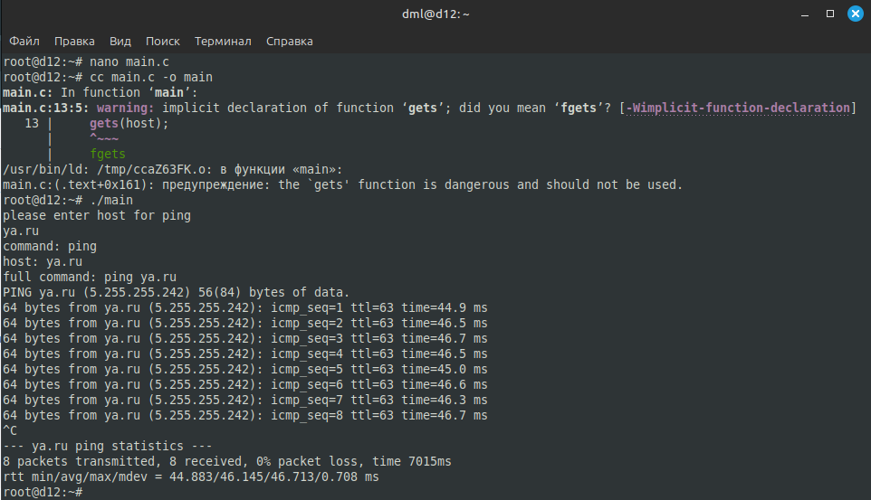
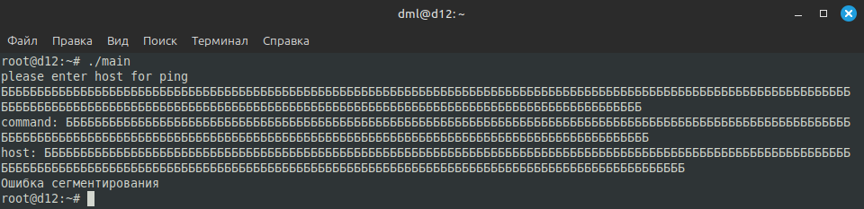
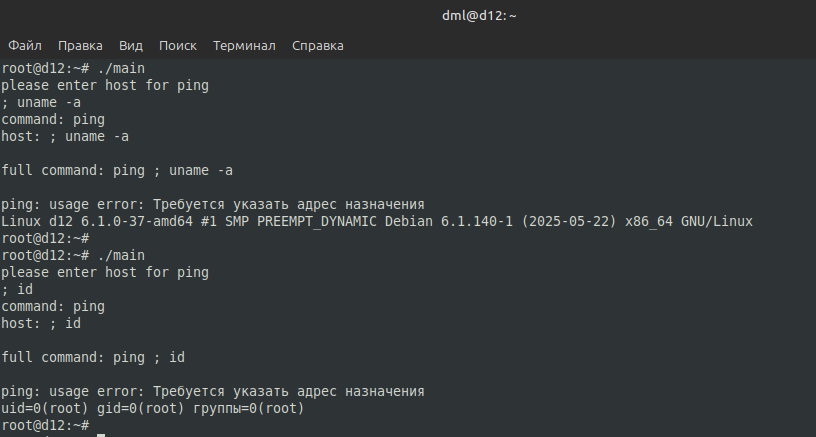
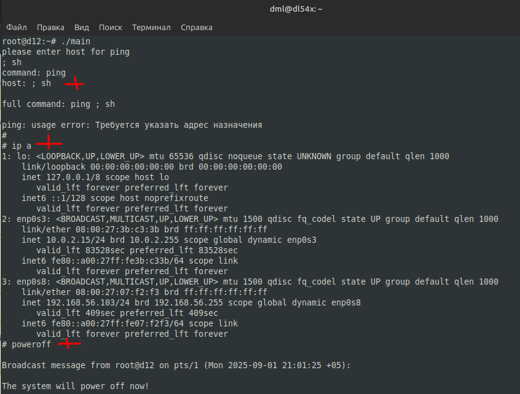

# 04.01. Язык C и программные уязвимости - Лебедев Д.С.
https://github.com/netology-code/ibos-homeworks/blob/v2/10_c/README.md
### Задание 1
> *Легенда*
> 
> У вас есть следующий код:
> 
> ```c
> #include <stdio.h>
> #include <string.h>
> #include <stdlib.h>
> 
> int main() {
>     /* выделяем буфер из 255 символов + \0 для хранения команды */
>     char command[256] = {'p', 'i', 'n', 'g', ' ', '\0'};
>     /* буфер для хранения хоста, который нужно пропинговать */
>     char host[16];
> 
>     printf("please enter host for ping\n");
>     /* получаем от пользователя имя хоста - нужно ввести в консоли, например, ya.ru и нажать Enter */
>     gets(host);
> 
>     /* отладочный вывод - печатаем команду */
>     printf("command: %s\n", command);
>     /* отладочный вывод - печатаем хост */
>     printf("host: %s\n", host);
> 
>     /* добавляем к команде хост, при этом \0 в команде заменяется на первый символ из host */
>     strcat(command, host);
> 
>     /* отладочный вывод - печатаем полную команду */
>     printf("full command: %s\n", command);
> 
>     /* выполняем команду */
>     system(command);
> 
>     return 0;
> }
> ```
> 
> *Задача*
> 
> Установите необходимые зависимости (`apt update && apt install gcc`) и скомпилируйте данную программу (`cc main.c -o main`) - не обращайте внимание на предупреждения, если они будут.
> 
> *Далее:* 
> 
> 1. Запустите её (`./main`)
> 2. Введите адрес хоста, который необходимо пропинговать и убедитесь, что пинг работает
> 3. Завершите работу приложения с помощью сочетания клавиш `Ctrl + C`
> 
> Творческая часть: попробуйте подобрать данные так, чтобы приложение "упало" (вы получили сообщение `segmentation fault` или другое, свидетельствующее об ошибке)
> 
> Результаты: В ответах укажите ввод, приводящий к падению приложения.

**Выполнение задания**

Компиляция программы и проверка работоспособности:

  

Аварийное завершение работы приложения путем ввода длинной строки с мусорными данными. Переполнение буфера host в 16 байт (15 символов + \0) приводит к повреждению стека, что вызывает `segmentation fault`

  

### Задание 2
> *Легенда*
> 
> Программисты прислали вам якобы "исправленный" вариант программы ping:
> 
> ```c
> #include <stdio.h>
> #include <string.h>
> #include <stdlib.h>
> 
> int main() {
>     /* выделяем буфер из 24 символов для хранения команды */
>     char command[24] = "ping ";
>     /* буфер для хранения хоста, который нужно пропинговать */
>     char host[16];
> 
>     printf("please enter host for ping\n");
>     /* получаем от пользователя имя хоста */
>     /* нужно ввести в консоли, например, ya.ru и нажать Enter */
>     fgets(host, sizeof(host), stdin);
> 
>     /* отладочный вывод - печатаем команду */
>     printf("command: %s\n", command);
>     /* отладочный вывод - печатаем хост */
>     printf("host: %s\n", host);
> 
>     /* добавляем к команде хост, при этом \0 в команде заменяется на первый символ из host */
>     strcat(command, host);
> 
>     /* отладочный вывод - печатаем полную команду */
>     printf("full command: %s\n", command);
> 
>     /* выполняем команду */
>     system(command);
> 
>     return 0;
> }
> ```
> 
> *Задача*
> 
> Проведите повторный анализ и посмотрите: 
> 1. Можно ли реализовать падение приложения? 
> 2. Можно ли выполнить произвольную команду (если да, то как)? 
> 3. Если ответ на п.2 - да, то можно ли получить shell (т.е. запустить sh и bash и продолжить работу с интерпретатором команд в интерактивном режиме)?
> 
> Результаты: Заполните ответы на вопросы из задания.

**Выполнение задания**

1. Все попытки вызвать падение приложения (переполнение буфера, использование немедленного завершения, обращения к невалидной памяти, вызов невалидного адреса, деления на 0 и т.д.) успеха не имели. Программа защищена от простых атак на падение, устранено переполнение буфера.
2. Уязвимость выполнения произвольных команд существует и позволяет выполнять любые команды с правами пользователя, запустившего программу, например:



3. Есть возможность получить доступ к shell. После получения shell можно выполнять любые команды, включая чтение/запись файлов, установку программ, изменение конфигураций



---
