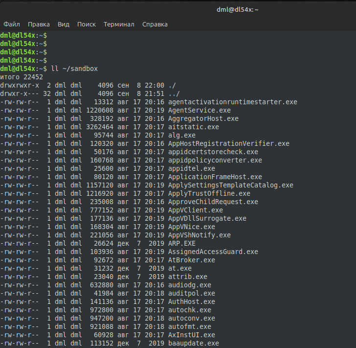
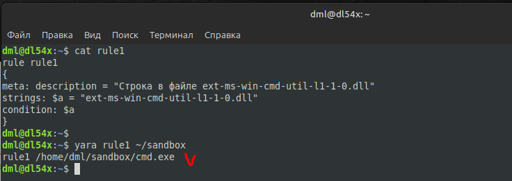
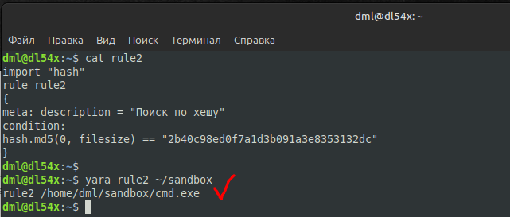
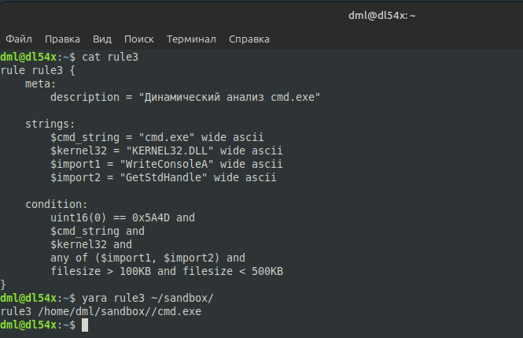

# 04.02. Статистический и динамический анализ - Лебедев Д.С.
https://github.com/netology-code/ibos-homeworks/tree/v2/11_sd
### Задание 1
> Создайте три правила `Yara` для определения файла `cmd.exe`. В итоге у вас должны получится три отдельных файла, по которым должен определяться только файл `cmd.exe`.

**Выполнение задания**

Среди множества файлов из `system32 windows` ищем файл `cmd.exe`

  

1. Правило 1 - ищем файл по строке, которая предполагается в этом файле:

  

2. Правило 2 - Ищем файл по его хешу:

  

3. Правило 3 - пример синтаксиса yara для динамического анализа. Проводится комбинированная проверка статических признаков (сигнатуры, строки) и динамических характеристик (импорты, размер) для точного определения `cmd.exe`.

- PE-формат - проверка заголовка "MZ" (0x5A4D)
- Строка идентификации - наличие строки "cmd.exe" в ASCII/Unicode
- Импорты kernel32 - наличие библиотеки KERNEL32.DLL
- Характерные функции - хотя бы одна из: WriteConsoleA, GetStdHandle
- Размер файла - от 100KB до 500KB (типично для cmd.exe)



---
```
правила написаны верно, принимается!
```