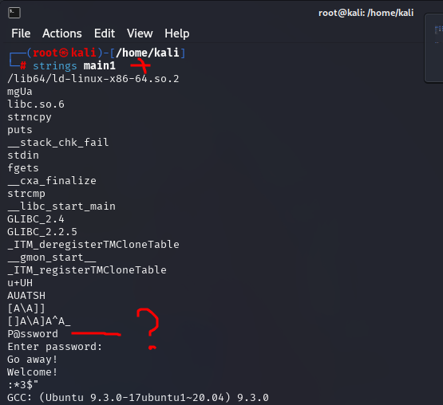
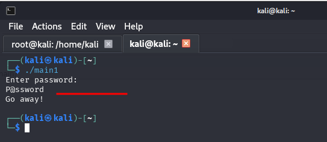
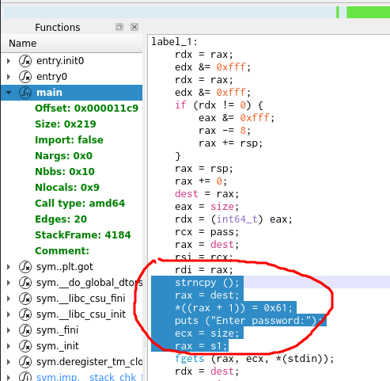
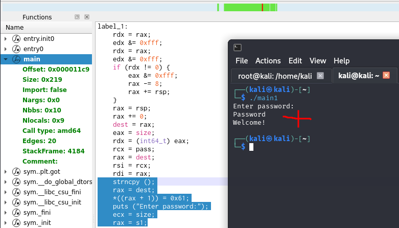

# 04.03. Реверс-инженеринг - Лебедев Д.С.
https://github.com/netology-code/ibos-homeworks/tree/v2/12_reverse
### Задание 1
> Чем отличается декомпиляция от дизассемблирования?  
> Напишите ответ в свободной форме.

**Выполнение задания**

Главное отличие - в уровне абстракции и в том, что получается на выходе.

Дисассемблирование - преобразование машинного кода обратно в текст на языке ассемблера (набор команд вроде MOV, JMP, CALL, ADD, работающих с регистрами и памятью).

Декомпиляция - попытка восстановления исходного кода высокого уровня из машинного кода. На выходе приблизительный код на языке высокого уровня, таком как C, C++, C#, Java, Python и т.д.

Можно сказать, что дизассемблирование - это перевод с машинного языка на низкоуровневый, а декомпиляция - это попытка осмысления и интерпретации этого низкоуровневого кода в нечто, понятное человеку.

### Задание 2*
> Найдите пароль, который требует программа main1. (При вводе правильного пароля будет вывед текст "Welcome!")

**Выполнение задания**

Команда `strings` показала, что в бинарнике `main1` есть строка `P@ssword` - это очень вероятный кандидат в пароли.

  

Но при проверке оказалось, что логика программы немного сложнее.



Анализируем код функции `main` в Cutter:

 

Эталонный пароль - `P@ssword`.

Сразу после копирования программа изменяет второй символ эталонного пароля на `0x61` (в ASCII это символ "a")

Это означает, что эталонный пароль после копирования из pass становится не `P@ssword`, а `Password` с измененным вторым символом.

Проверка:

  

---
```
все верно, принимается
```