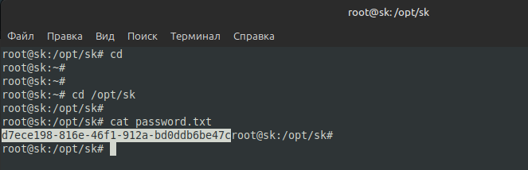
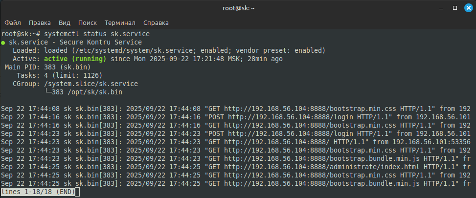
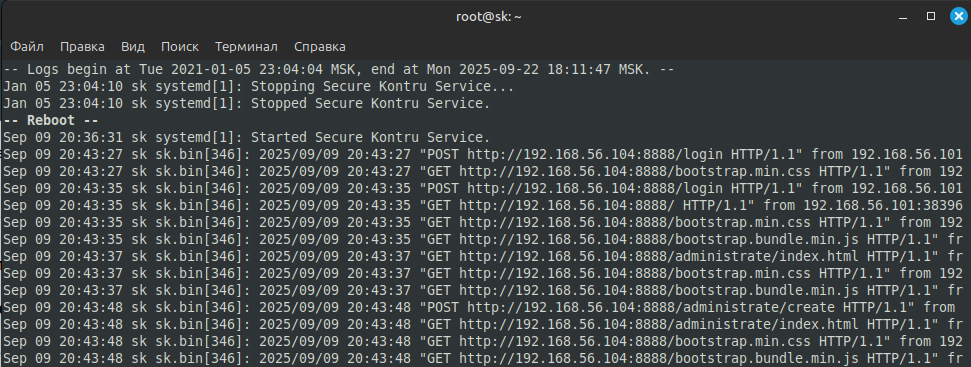
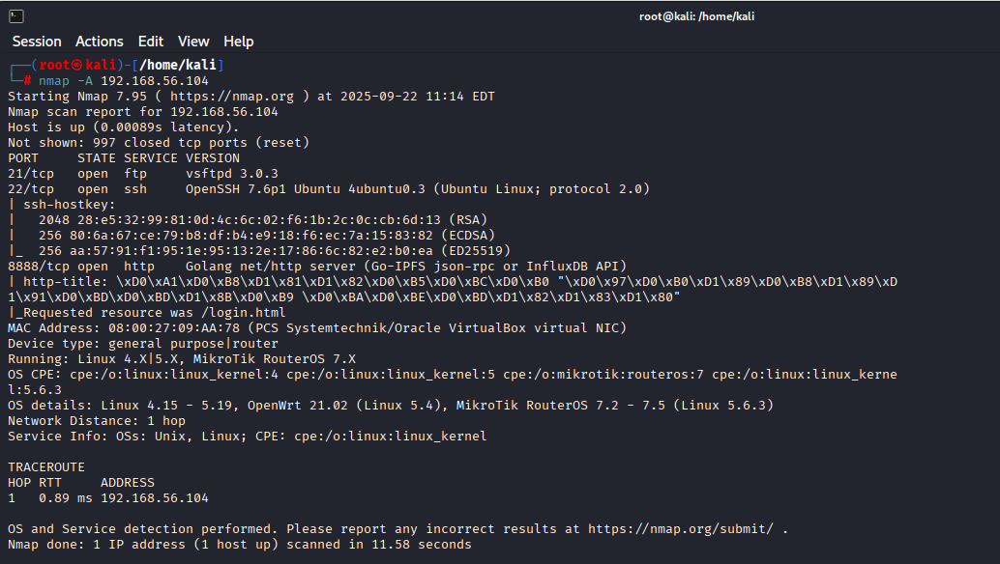
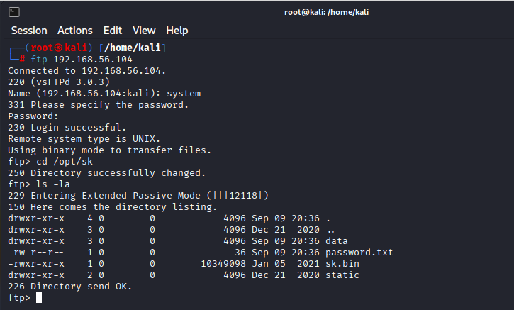
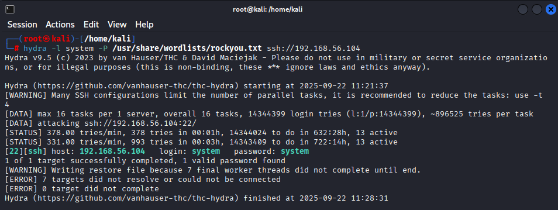
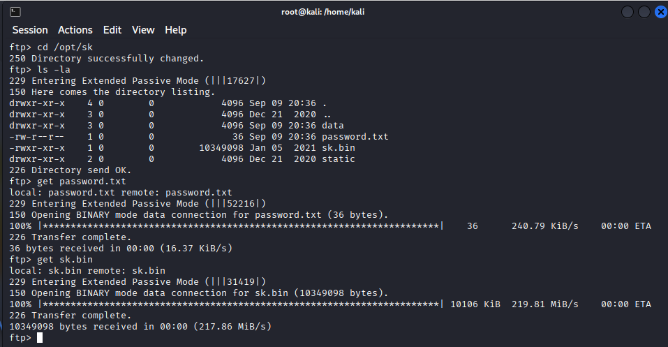

# Итоговая работа по модулю "Защищённый контур" (Профессия Специалист по информационной безопасности) - Лебедев Д.С.

https://github.com/netology-code/sib-secure-kontur-diploma
### Легенда
Компания Х использует корпоративное сетевое приложение "Защищённый контур", позволяющее "безопасно" обмениваться корпоративной информацией (в том числе хранить персональные данные клиентов и информацию, отнесённую к коммерческой тайне). Вам предстоит проанализировать само приложение на уязвимости, а также настройки ОС на серверах, где это приложение функционирует.

Компания разработчик поставляет уже настроенный сервер в виде [OVA](https://drive.google.com/file/d/1YMAQjcHKimoWVMCAr7G7-ZgNk1cvBaFU/view?usp=sharing) (md5 = 5935192d257a003b85584a84dec83367), который (по их заверениям) вполне безопасен и может использоваться "из коробки" (т.е. достаточно импортировать в среду виртуализации и можно запускать в боевой среде).

По информации, полученной от разработчика, цитата: "приложение содержит механизмы безопасности и может использоваться при построении ИСПД до 4 УЗ включительно и систем, обрабатывающих коммерческую тайну".

Документация на приложение разработчиком не предоставлена, поскольку, цитата: "интерфейс интуитивно понятный, обучающих материалов для пользователей не требуется".

Исходные коды так же не предоставлены.

Вас, как специалиста, попросили выполнить анализ данного приложения с точки зрения его реальной защищённости.
### Техническая информация
Цитата:

```
Логин/пароль пользователя в ОС OVA - system/system (после первого запуска необходимо сменить пароль).

Все файлы приложения располагаются в каталоге /opt/sk

Приложение предназначено для работы в ОС Linux x86_64

Приложение настроено в качестве сервиса systemd - sk.service

Приложение запускается на порту 8888 и использует протокол HTTP для своей работы, взаимодействие с приложением осуществляется через веб-интерфейс (посредством веб-браузера с хоста)

При импорте настроек виртуального образа в гипервизор, отличный от Virtual Box, может потребоваться дополнительная настройка сетевого интерфейса виртуального образа с помощью утилиты ip

При первом старте в приложении регистрируется пользователь с логином admin, пароль генерируется автоматически и записывается в файл /opt/sk/password.txt
```

### Задача
Подготовьте отчёт о:

1. Найденных о несоответствиях системы требованиям нормативных документов*
2. Найденных "слабостях" (которые могут привести к уязвимостям) и предложение по необходимым мерам для их устранения (если такие меры возможно принять).

Формат отчёта - свободный, но обязательно должен включать указанные выше два пункта.

Примечание*: в части документов нужно:

1. ПДн: реализация мер по обеспечению безопасности в части ИАФ, УПД
2. КТ: "разрешение или запрет доступа к информации, составляющей коммерческую тайну" посредством механизмов разграничения доступа, встроенных в приложение (механизмы ОС и сторонних сервисов рассматривать не нужно)

Важно: вы можете использовать любые техники из пройденных на предыдущих курсах: от сканирования портов, подбора паролей, анализа бинарных (исполняемых) файлов до попыток "уронить" приложение, выполнить произвольный код и т.д.

Важно: если в части документации нужно рассматривать только само приложение, то в части поиска слабостей вы можете рассматривать и окружение приложения (ОС и сервисы).

*Подсказка 1*  
Попробуйте пройтись по [CWE TOP 25 2020](https://cwe.mitre.org/top25/archive/2020/2020_cwe_top25.html), не обращая внимания на то, что мы ещё не проходили (SQL, CSRF, XML и т.д.).

*Подсказка 2*  
Перечень мер защиты, которые необходимо реализовать приведён в [21 приказе ФСТЭК России](https://fstec.ru/dokumenty/vse-dokumenty/prikazy/prikaz-fstek-rossii-ot-18-fevralya-2013-g-n-21)

### Критерии сдачи
1. Подготовлен отчёт
2. Найдено не менее 2х слабостей системы, ведущих к реальным уязвимостям, которые вы проэксплуатировали (т.е. нужно: слабость -> уязвимость -> описание процесса эксплуатации -> полученный результат).

----
## 1. Отчет о несоответствиях системы требованиям нормативных документов
### 1.1. Несоответствия требованиям по защите персональных данных (ПДн)
Система заявлена для работы с ИСПД до 4 УЗ включительно. Выявлены следующие несоответствия нормативным требованиям приказа №21 ФСТЭК России:
- <u>ИАФ.1. Идентификация и аутентификация пользователей, являющихся работниками оператора</u>. Использование простого пароля, отсутствует многофакторная аутентификация, хранение пароля в открытом виде. **Вывод - не соответствует**.
- <u>ИАФ.3. Управление идентификаторами, в том числе создание, присвоение, уничтожение идентификаторов.</u> Не реализован процесс регулярной смены идентификаторов. **Вывод - не соответствует**.
- <u>ИАФ.4. Управление средствами аутентификации, в том числе хранение, выдача, инициализация, блокирование средств аутентификации и принятие мер в случае утраты и (или) компрометации средств аутентификации.</u> Хранение паролей в открытом виде, использование одинаковых учетных данных для разных сервисов (FTP, SSH, приложение). **Вывод - не соответствует**.
- <u>ИАФ.5. Защита обратной связи при вводе аутентификационной информации.</u> Отсутствие защиты от перехвата аутентификационных данных (HTTP вместо HTTPS). **Вывод - не соответствует**.
- <u>УПД.1. Управление (заведение, активация, блокирование и уничтожение) учетными записями пользователей, в том числе внешних пользователей.</u> Отсутствие регламента управления учетными записями. **Вывод - не соответствует**.
- <u>УПД.5. Назначение минимально необходимых прав и привилегий.</u> Превышение необходимых привилегий (запуск от root), FTP-сервис имеет доступ ко всей файловой системе. **Вывод - не соответствует**.
- УПД.6. Ограничение неуспешных попыток входа в информационную систему (доступа к информационной системе). Отсутствие механизма блокировки при множественных неуспешных попытках аутентификации. **Вывод - не соответствует**.
- <u>УПД.10. Блокирование сеанса доступа после времени бездействия</u>. Не реализовано автоматическое завершение сеансов при бездействии. **Вывод - не соответствует**.
- <u>УПД.13. Реализация защищенного удаленного доступа.</u> Использование HTTP вместо HTTPS для передачи персональных данных, отсутствие шифрования каналов связи. **Вывод - не соответствует**.

Вывод: Система не соответствует требованиям для ИСПДн 4-го уровня защищённости.
### 1.2. Несоответствия требованиям по защите коммерческой тайны (КТ)
- Федеральный закон №98-ФЗ "О коммерческой тайне" однозначно требует соблюдение мер по охране конфиденциальности информации. Данное требование категорически не соблюдается, ввиду использования HTTP вместо HTTPS.
- Отсутствие учёта лиц, получивших доступ. Не ведется журнал доступа к коммерческой тайне, нет разграничения прав доступа к информации КТ.

Вывод:  Система "Защищённый контур" не соответствует требованиям Федерального закона №98-ФЗ и ее использование для обработки коммерческой тайны создает серьезные юридические риски для организации.

### 1.3. Заключение по документации
> По информации, полученной от разработчика, цитата: "приложение содержит механизмы безопасности и может использоваться при построении ИСПД до 4 УЗ включительно и систем, обрабатывающих коммерческую тайну".

Заявление разработчика не соответствует действительности.

> Документация на приложение разработчиком не предоставлена, поскольку, цитата: "интерфейс интуитивно понятный, обучающих материалов для пользователей не требуется". Исходные коды так же не предоставлены.

Отсутствие документации является критическим нарушением требований нормативных документов. Система не может быть допущена к эксплуатации для обработки ПДн и коммерческой тайны без полного комплекта документации.

Заявление разработчика об "интуитивно понятном интерфейсе" не соответствует требованиям регуляторов и представляет собой попытку уйти от ответственности за обеспечение безопасности информации.

**Общий вывод:** Система "Защищённый контур" в текущем состоянии не готова к промышленной эксплуатации и требует существенной доработки как технической части, так и документационного сопровождения.

## 2. Найденные уязвимости и меры по их устранению
### 2.1. Уязвимость №1: Небезопасное хранение паролей

  

- Уязвимость: CWE-256: Plaintext Storage of a Password
- Описание: Пароль администратора хранится в открытом виде в файле `/opt/sk/password.txt`
- Результат: Получен полный доступ к веб-интерфейсу приложения с правами администратора без необходимости взлома или подбора пароля.
- Меры по устранению: хранить пароли только в хэшированном виде, реализовать механизм "соли" для каждого пароля

### 2.2. Уязвимость №2: Небезопасные настройки ОС

  

- Уязвимость: CWE-250: Execution with Unnecessary Privileges
- Описание: Приложение работает от имени root пользователя
- Результат: Полный контроль над сервером с максимальными привилегиями
- Меры по устранению: создать отдельного непривилегированного пользователя для запуска приложения, реализовать принцип минимальных привилегий

### 2.3. Уязвимость №3: Раскрытие технической информации через детальное логирование

  

- Уязвимость: CWE-532: Insertion of Sensitive Information into Log File
- Описание: Приложение ведет детальные логи, в которые записывает всю входящую HTTP-информацию, включая заголовки. Это раскрывает внутреннюю структуру сети (IP-адреса) и может привести к утечке чувствительных данных
- Результат: Утечка внутренней IP-адресации (192.168.56.104 - сервер, 192.168.56.101 - клиент)
- Меры по устранению: настроить логирование, реализовать санитизацию логов, обеспечить безопасное хранение логов

### 2.4. Уязвимость №4: Наличие небезопасных сетевых сервисов

  

- Уязвимость: CWE-16: Configuration
- Описание: На сервере обнаружены дополнительные сетевые сервисы, не связанные с основным функционалом приложения
	- FTP (port 21): vsftpd 3.0.3
	- SSH (port 22): OpenSSH 7.6p1
- Результат: Наличие дополнительных сервисов увеличивает поверхность атаки. Устаревшие версии vsftpd и OpenSSH могут содержать известные уязвимости
- Меры по устранению: отключить все неиспользуемые сервисы (FTP), обновить OpenSSH до актуальной версии, настроить firewall для запрета доступа ко всем портам, кроме необходимых (8888), реализовать ограничение доступа по SSH только с определённых IP-адресов.

### 2.5. Уязвимость №5: Раскрытие информации через HTTP-заголовки

- Уязвимость: CWE-200: Exposure of Sensitive Information to an Unauthorized Actor
- Описание: HTTP-сервер раскрывает информацию об используемой технологии: `Golang net/http server`
- Результат: Сокращение времени на анализ системы и более целенаправленная атака.
- Меры по устранению: настроить веб-сервер на скрытие или изменение заголовков Server, использовать reverse proxy (nginx, apache) для сокрытия реальной реализации

### 2.6. Уязвимость №6: Неправильная кодировка HTTP-заголовков

- Уязвимость: CWE-176: Improper Handling of Unicode Encoding
- Описание: Заголовок http-title содержит некорректно отображаемые Unicode-символы:

```
\xD0\xA1\xD0\xB8\xD1\x81\xD1\x82\xD0\xB5\xD0\xBC\xD0\xB0 "\xD0\x97\xD0\xB0\xD1\x89\xD0\xB8\xD1\x89\xD1\x91\xD0\xBD\xD0\xBD\xD1\x8B\xD0\xB9 \xD0\xBA\xD0\xBE\xD0\xBD\xD1\x82\xD1\x83\xD1\x80"
```

- Результат: Это может указывать на проблемы с обработкой кодировки в приложении, что потенциально может привести к уязвимостям типа Unicode Injection.

### 2.7. Критическая уязвимость №7: Использование одинаковых учётных данных для разных сервисов

  

- Уязвимость: CWE-798: Use of Hard-coded Credentials
- Описание: Учётные данные операционной системы (system/system) используются для доступа к FTP-серверу
- Результат: успешный вход в систему через FTP, доступ ко всей файловой системе сервера, возможность загрузки/скачивания любых файлов, альтернативный вектор атаки помимо SSH
- Меры по устранению: немедленно отключить FTP-сервер, внедрить разделение учётных данных: разные пароли для разных сервисов, запрет использования системных учётных данных для сетевых сервисов

---

**Пример атаки**: подбор пароля



**Пример атаки**: скачивается файл `password.txt`, файл `sk.bin` для последующего анализа

 

---

**ФИНАЛЬНЫЙ ВЫВОД:**

Система полностью скомпрометирована. Наличие доступа через FTP с системными учётными данными делает все другие меры безопасности неэффективными.

Рекомендация: Немедленно вывести систему из эксплуатации. Система не должна использоваться ни для обработки ПДн, ни для коммерческой тайны до полного пересмотра архитектуры безопасности и устранения всех выявленных уязвимостей.