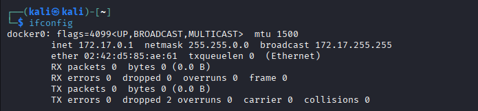
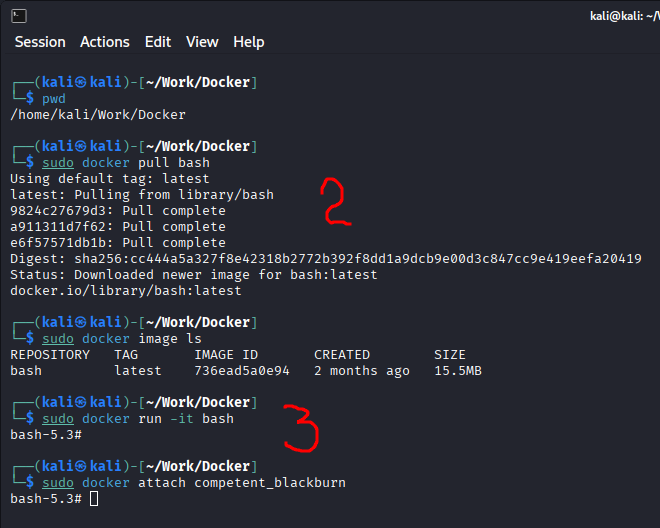
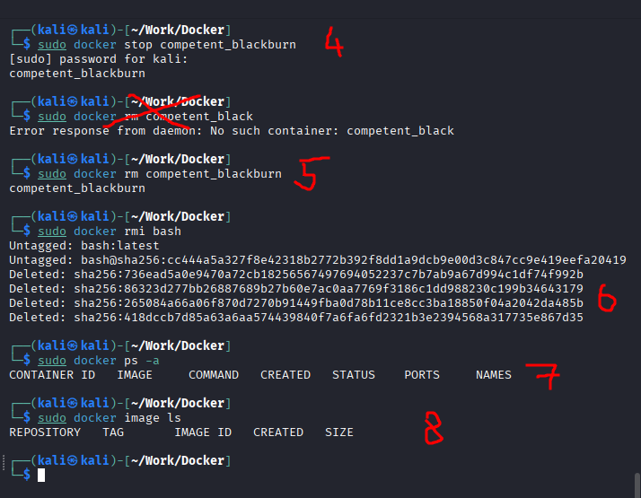
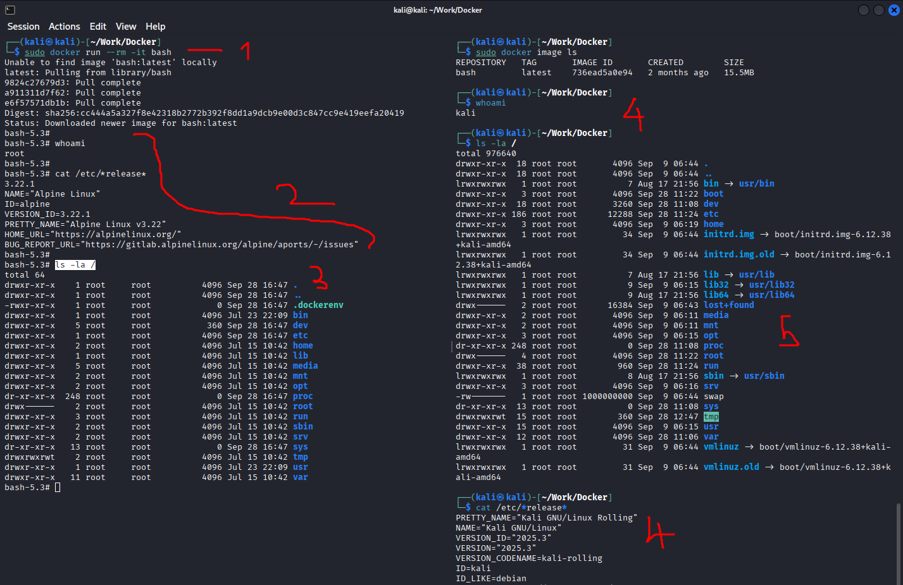
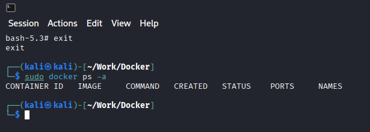
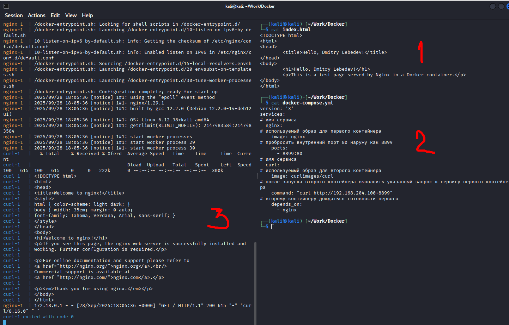
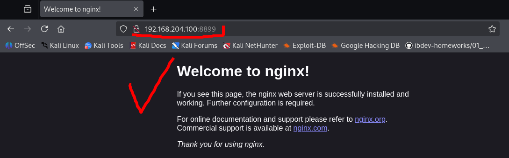
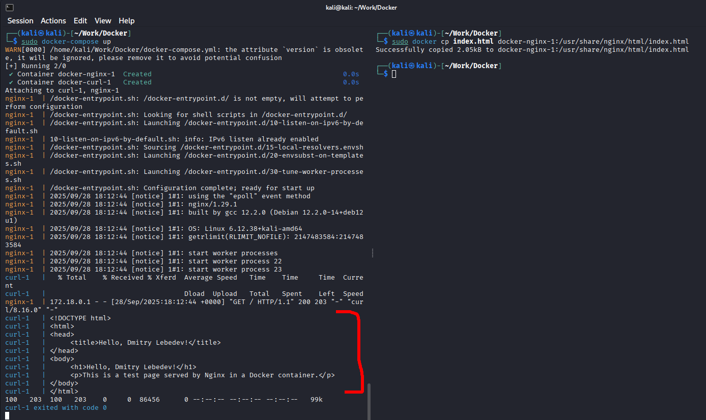
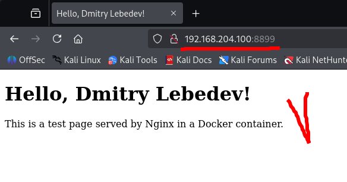
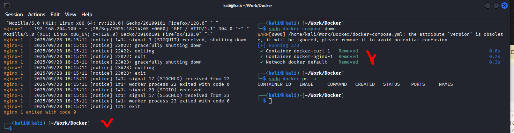

# 05.01. Контейнеризация (Docker) - Лебедев Д.С.
https://github.com/netology-code/ibdev-homeworks/tree/master/01_docker_new
### Задание 1. Образы и контейнеры Docker

> **Описание задания**
> 
> Необходимо установить базовые компоненты Docker. Выполните загрузку готового образа из общедоступного репозитория, запустите контейнер на основе загруженного образа, реализуйсте базовые операции с контейнерами и образами.
> 
> Выполните задание, руководствуясь подробной [инструкцией](https://github.com/netology-code/ibdev-homeworks/blob/master/01_docker_new/task/docker.md).
> 
> **Результат выполненного задания**
> 
> В качестве результата работы вам необходимо предоставить отчёт, включающий следующие скриншоты с вашими текстовыми комментариями:
> 
> - скриншот вывода результатов команды `ifconfig` (на Kali Linux) или `ip a` (на Ubuntu);
> - скриншот вывода результатов команды `sudo docker pull bash`;
> - скриншот вывода результатов команды `sudo docker run -it bash`;
> - скриншот вывода результатов команды `sudo docker stop names`;
> - скриншот вывода результатов команды `sudo docker rm names`;
> - скриншот вывода результатов команды `sudo docker rmi repository`;
> - скриншот вывода результатов команды `sudo docker ps -a`;
> - скриншот вывода результатов команды `sudo docker image ls`.

**Выполнение задания**

1. Проверка корректности установки `docker` (наличие сетевого интерфейса):



2. Загрузка образа `bash`, проверка его наличия и запуск контейнера на базе образа:

  

3. Останов контейнера, удаление неактивного контейнера, удаление образа, проверка корректности удаления:

  

### Задание 2. Bash в Docker

> **Описание задания**
> 
> Необходимо выполнить работу с контейнером Docker в интерактивном режиме и предоставить объективные доказательства присутствия в контейнере.
> 
> Выполните задание, руководствуясь подробной [инструкцией](https://github.com/netology-code/ibdev-homeworks/blob/master/01_docker_new/task/bash.md).
> 
> **Результат выполненного задания**
> 
> В качестве результата работы вам необходимо предоставить отчёт, включающий следующие скриншоты с вашими текстовыми комментариями:
> 
> - скриншот вывода результатов команды `sudo docker run –rm -it bash`;
> - скриншот вывода результатов команды `whoami` и `cat /etc/*release*` (в контейнере);
> - скриншот вывода результатов команды `ls -la /` (в контейнере);
> - скриншот вывода результатов команды `whoami` и `cat /etc/*release*` (в основной системе);
> - скриншот вывода результатов команды `ls -la /` (в основной системе).

**Выполнение задания**

В результате выполнения задания произведен запуск контейнера с опцией автоматического удаления контейнера после завершения его работы. Для проверки интерактивности работы контейнера в нем выполнены команды.



После выхода из контейнера проверена опция автоматического удаления:

  

### Задание 3. Dockerfile

> **Описание задания**
> 
> Вы запустили контейнер на основе готового образа из общедоступного репозитория Docker HUB и вручную выполнили отдельные команды для решения простых задач. Далее необходимо подготовить образ, который будет содержать заложенные директивы. Они будут автоматически выполнены при запуске контейнера. Директивы прописываются в специальном конфигурационном файле Dockerfile.
> 
> В этом задании вы:
> 
> - подготовите файл скрипта с командами, которые планируется автоматически выполнить в контейнере bash;
> - подготовите конфигурационный файл Dockerfile с директивами для сборки преднастроенного образа;
> - выполните сборку образа, который будет включать преднастроенный сценарий для контейнера;
> - запустите контейнер на основе преднастроенного образа и получите результаты выполнения команд после автоматического запуска скрипта;
> - запустите вручную этот скрипт в командной оболочке основной системы Kali Linux;
> - сравните полученные результаты из контейнера и основной системы.
> 
> Выполните задание, руководствуясь подробной [инструкцией](https://github.com/netology-code/ibdev-homeworks/blob/master/01_docker_new/task/dockerfile.md).
> 
> **Результат выполненного задания**
> 
> В качестве результата работы вам необходимо предоставить отчёт, включающий следующие скриншоты с вашими текстовыми комментариями:
> 
> - скриншот вывода содержимого файла скрипта `cat my_bash_1.sh` (необходимо указывать назначенное вами имя скрипта);
> - скриншот вывода содержимого файла Dockerfile `cat Dockerfile`;
> - скриншот результатов сборки образа `sudo docker build -t image_bash_1 .` (необходимо указывать назначенное вами имя образа);
> - скриншот результатов запуска контейнера `sudo docker run –rm image_bash_1` (необходимо указывать назначенное вами имя образа);
> - скриншот результатов запуска скрипта в основной системе `./my_bash_1.sh` (необходимо указывать назначенное вами имя скрипта).
> 
> **Важно**: вы можете доработать скрипт и Dockerfile, но на предоставленных скриншотах обязательно должны присутствовать: характерные отличительные признаки контейнера и основной системы, ваше Ф.И.О., дата и время.

**Выполнение задания**

В результате выполнения задания собран образ контейнера с использованием конфига Dockerfile. В данном конфиге содержатся директивы, выполняемые при запуске контейнера, в т.ч. запуск скрипта `my_bash_1.sh`. Показаны различия выполнения данного скрипта в контейнере и в основной системе.


### Задание 4. Docker-compose

> **Описание задания**
> 
> Необходимо реализовать запуск подготовленной связки контейнеров с использованием конфигурационного файла docker-compose.yml.
> 
> До сих пор вы взаимодействовали с одиночным контейнером, как обособленным элементов для решения своих задач. Теперь вам предстоит поработать с более сложной технологией контейнеризации - запуском подготовленной связки контейнеров (не менее двух). Это отдельные программные сервисы, которые взаимодействуют между собой в рамках единой задачи.
> 
> В этом задании вы:
> 
> - загрузите из общедоступного репозитория Docker HUB два готовых образа;
> - подготовите два файла, необходимые для реализации проекта: index.html и docker-compose.yml;
> - запустите связку из двух контейнеров;
> - отработайте базовые команды для управления связкой контейнеров;
> - замените в одном из контейнеров исходный файл HTML своим подготовленным экземпляром;
> - проведёте анализ полученных результатов.
> 
> Выполните задание, руководствуясь подробной [инструкцией](https://github.com/netology-code/ibdev-homeworks/blob/master/01_docker_new/task/dockercompose.md).
> 
> **Результат выполненного задания**
> 
> В качестве результата работы вам необходимо предоставить отчёт, включающий следующие скриншоты с вашими текстовыми комментариями:
> 
> - скриншот вывода содержимого подготовленного вами файла `index.html`, содержащий ваше Ф.И.О.;
> - скриншот вывода содержимого подготовленного вами файла `docker-compose.yml`;
> - скриншот результатов запуска подготовленной вами связки контейнеров;
> - скриншот первоначальной титульной страницы Nginx при подключении браузером к контейнеру;
> - скриншот запуска связки контейнеров после замены файла `index.html` в контейнере, содержащий ваше Ф.И.О.;
> - скриншот вашего варианта титульной страницы Nginx при подключении браузером к контейнеру, содержащий ваше Ф.И.О.;
> - скриншот вывода результатов команды остановки связки контейнеров.
> 
> **Важно**: вы можете подготовить свой вариант титульной страницы в формате HTML, но он обязательно должен содержать ваше Ф.И.О., а также добавить дополнительные директивы в конфигурационный файл `docker-compose.yml` и дополнительные сервисы, взаимодействующие с Nginx.

**Выполнение задания**

Подготовка файлов `index.html`, `docker-compose.yml`, запуск контейнеров

  

Дефолтная страница запущенного сервера:

  

Замена файла страницы сервера, запуск контейнеров, проверка браузером:

  

  

Остановка контейнеров, проверка их отсутствия:

  

---
```

```