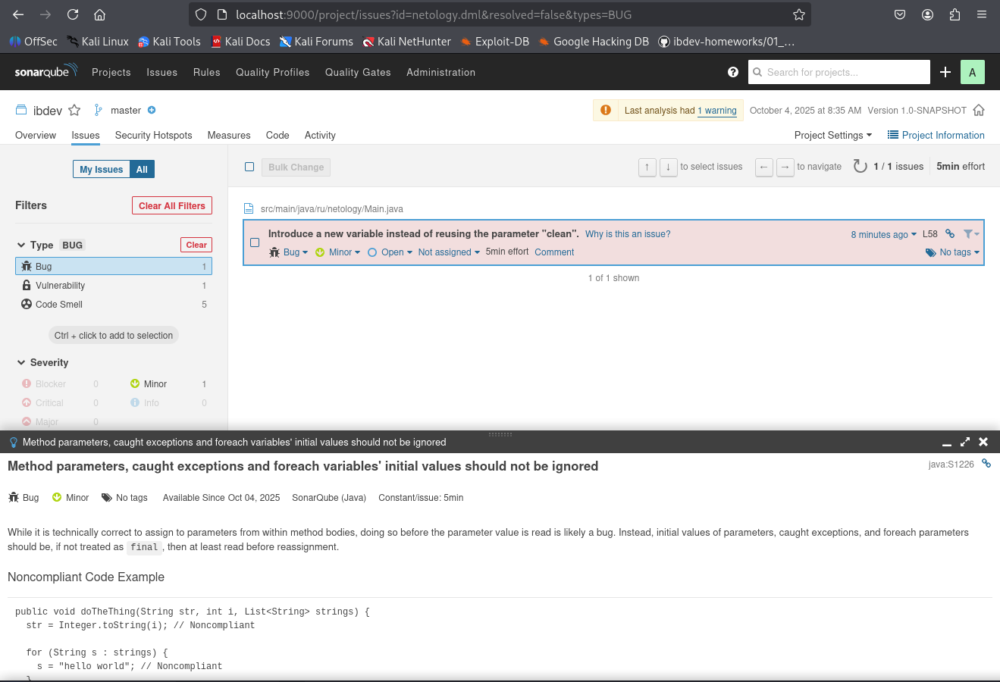
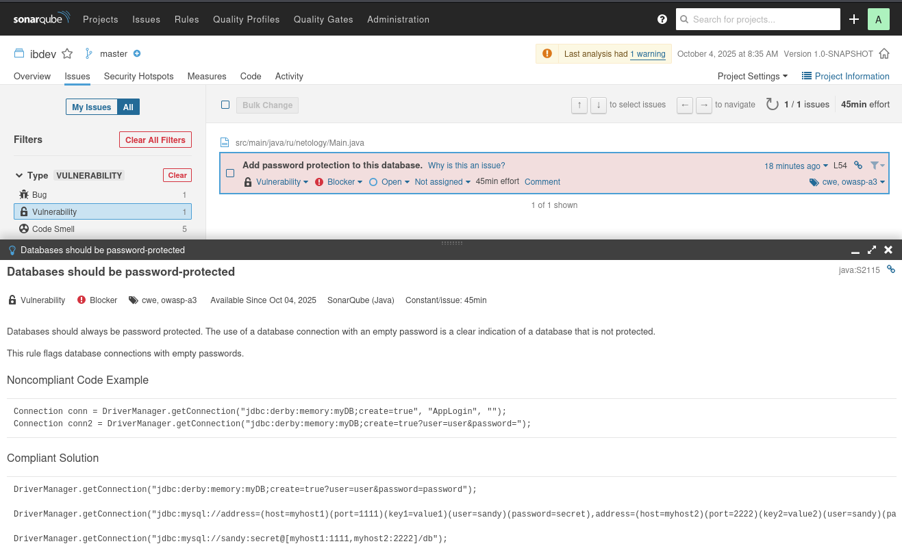
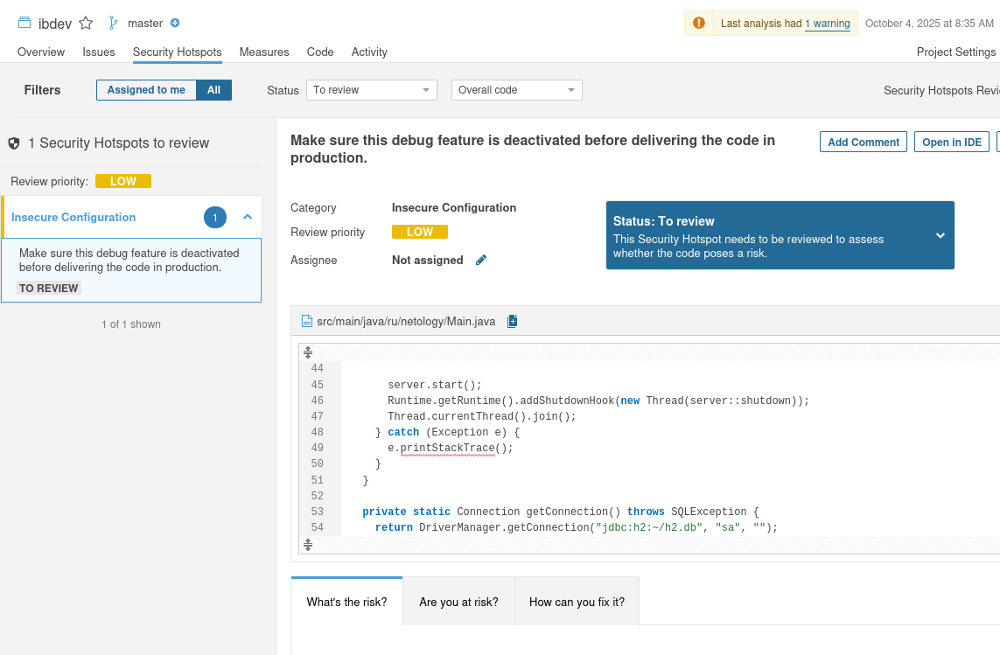
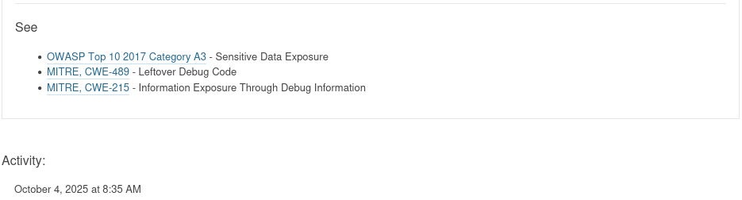
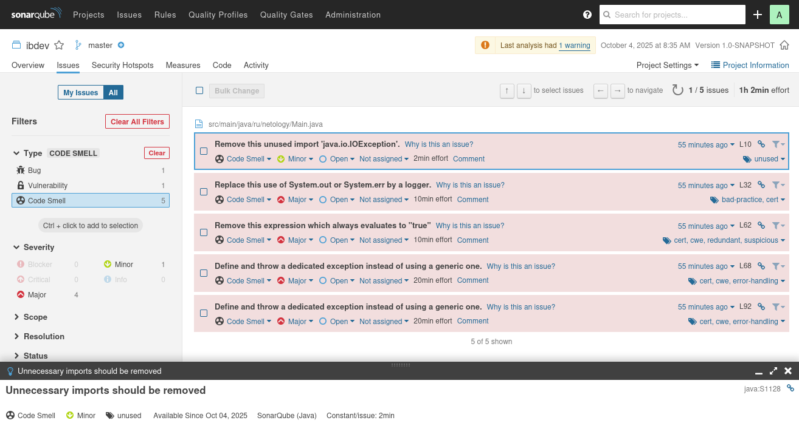

# 05.02. Популярные языки, системы сборки, управления зависимостями - Лебедев Д.С.
https://github.com/netology-code/ibdev-homeworks/tree/master/02_dev

[Домашнее задание](_att/050102/050102_ibdev-homeworks02.pdf)
### Задание SonarQube
> На лекции мы с вами говорили, что исходный код приложения - это источник потенциальных уязвимостей.
> 
> Конечно же, исходный код приложения можно проверить и глазами, но при современных объёмах кода - это достаточно трудоемкая задача.
> 
> Поэтому существуют специальные инструменты, которые позволяют анализировать качество кода, в том числе пытаются найти в нём уязвимости.
> 
> С одним из подобных инструментов (SonarQube) мы познакомимся в этом ДЗ, альтернативы рассмотрим на одной из следующих лекций.
> 
> Важно: вам не нужно учить Java и детально разбираться в коде. Ваши задачи:
> - Получить базовый опыт работы с инструментом.
> - Проанализировать предупреждения, баги и уязвимости.
>  ...
> **Результаты выполнения**
> 
> Отправьте в личном кабинете студента ответы на следующие вопросы:
> 1. Какие баги были выявлены: количество, описание, почему SonarQube их считает багами? См. ссылку `Why is this an issue?`.
> 2. Какие уязвимости были выявлены: количество, категории, описание, почему SonarQube их считает уязвимостями?
> 3. Какие Security Hotspots были выявлены: количество, категории, приоритет, описание, почему SonarQube их считает Security HotSpot'ами?
> 4. К каким CWE идёт отсылка для Security Hotspots из п. 2? См. вкладку `How can you fix it?` в нижней части страницы.
> 5. Какие запахи кода были выявлены: количество, описание, почему SonarQube их считает запахами кода? См. ссылку `Why is this an issue?`.

**Выполнение задания**
#### 1. Баги



Игнорирование начальных значений параметров методов и переменных foreach. Количество не указано точно, но правило применяется ко всем случаям в коде.

Описание проблемы:
- Переприсваивание значений параметрам методов до их использования
- Переприсваивание переменным в цикле foreach до их использования

Почему SonarQube считает это багом:
- Потеря исходных данных
- Путаница в коде
- Нарушение принципов чистого кода
- Ошибки в логике
#### 2. Уязвимости



Выявлена 1 уязвимость с уровнем серьезности Blocker. Базы данных должны быть защищены паролем

Категории:
- CWE-521 - Weak Password Requirements (Слабые требования к паролям)
- OWASP A3 - Sensitive Data Exposure (Раскрытие конфиденциальных данных)

Уровень серьезности: Blocker (Критический)

Описание проблемы: Использование подключения к базе данных с пустым паролем или без пароля.

Почему SonarQube считает это уязвимостью:
- Незащищенный доступ к данным
- Раскрытие конфиденциальной информации
- Нарушение целостности данных
- Нарушение законодательства: Противоречит требованиям защиты данных (GDPR, PCI DSS и др.)
#### 3. Security Hotspots



SonarQube выявил один Security Hotspot с низким приоритетом проверки. Категория - Insecure Configuration (Небезопасная конфигурация). Статус - To review (Требует проверки).

Почему SonarQube считает это Security Hotspot
- Утечка конфиденциальной информации:
- printStackTrace() выводит полную трассировку стека в System.Err
- Может раскрыть пути файлов, имена классов, внутреннюю структуру приложения
- Потенциально может содержать чувствительные данные о системе
#### 4. CWE для Security Hotspots



CWE-489 - Leftover Debug Code - Наличие отладочного кода в продакшн-среде
CWE-215 - Information Exposure Through Debug Information - Раскрытие информации через отладочные сообщения

#### 5. Запахи кода

  

SonarQube выявил 4 типа запахов кода, они не являются критическими ошибками или уязвимостями, но:
- Снижают качество кода
- Усложняют поддержку
- Могут маскировать реальные проблемы

1. Unnecessary imports should be removed, уровень: Minor

Почему это запах кода:
- Снижает читаемость кода
- Может вызывать путаницу у разработчиков
- Противоречит принципам чистого кода
- Классы из пакета java.lang и файлы из того же пакета импортируются неявно

2. Standard outputs should not be used directly to log anything, уровень: Major

Почему это запах кода:
- Невозможно обеспечить единый формат логов
- Нет гарантии записи логов
- Потенциальная утечка чувствительных данных
- Нарушает требования к логированию (CERT ERR02-J)

3. Boolean expressions should not be gratuitous, уровень: Major

Почему это запах кода:
- Избыточные выражения не меняют логику условия
- Может быть признаком ошибки в логике программы
- Усложняет чтение и понимание кода
- Связано с CWE-571 (выражение всегда true) и CWE-570 (выражение всегда false)

4. Generic exceptions should never be thrown, уровень: Major

Почему это запах кода:
- Предотвращает правильную обработку исключений
- Не позволяет различать системные и прикладные ошибки
- Нарушает принципы обработки ошибок (CERT ERR07-J)
- Связано с CWE-397 (объявление throws для generic исключений)

---
```

```