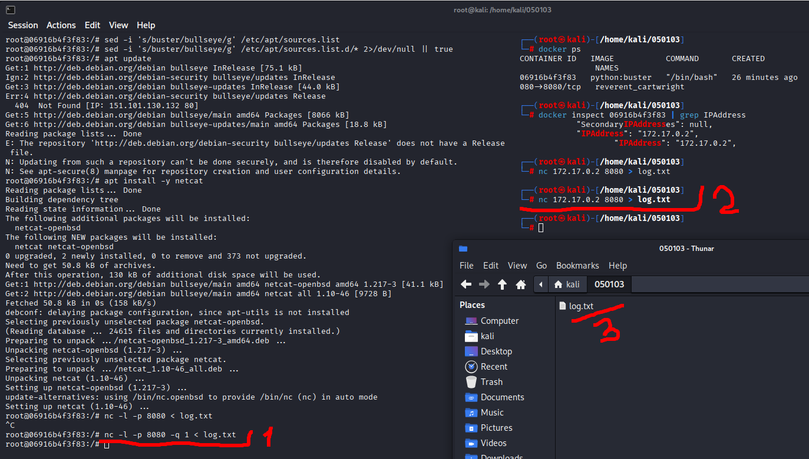

# 05.01.03. Системы контроля версий и CI/CD - Лебедев Д.С.
https://github.com/netology-code/ibdev-homeworks/tree/master/03_cicd

[Домашнее задание](_att/050103/050103_Домашнее%20задание%20к%20занятию%201.3.%20Системы%20контроля%20версий%20и%20CICD.pdf)
### Задание truffleHog

> Есть замечательный инструмент, который называется [truffleHog](https://github.com/dxa4481/truffleHog). Он умеет искать по всей истории вашего проекта «секреты». Конечно же, если ваш проект использует git.
> 
> В этой лабораторной работе мы попробуем его в использовании на более-менее реалистичном примере, чтобы вы увидели, что не всё так гладко и достаточно часто бывает много ложных срабатываний, которые приходится «разгребать». Если вы просто отдадите «простыню» логов разработчикам, чтобы они сами разбирались - ничего хорошего из этого не выйдет.
> 
> **Порядок выполнения**
> 
> Для truffleHog нужен Python, устанавливается он с помощью Pip - системы управления пакетами для Python.
> 
> Вы можете проделать всё с помощью VM, но мы предлагаем рассмотреть возможность использования Docker Container' в качестве «одноразовой машины».
> 
> **Результаты выполнения**
> 
> Отправьте в личном кабинете студента найденные вами секреты с описанием того, чтобы это могло быть по вашему мнению.
> 
> **Дополнительно**
> 
> Можете дополнительно ознакомиться со сравнением коммерческого сервиса [GitGuardian c truffleHog](https://www.gitguardian.com/gitguardian-vs-trufflehog-alternatives).

**Выполнение задания**

  

Анализируя вывод truffleHog, найдено несколько типов секретов в репозитории:

Найденные секреты:
1. Приватные RSA ключи - Файлы `service/keys/private.key` (в нескольких коммитах) содержит полный RSA приватный ключ с закрытой экспонентой
2. Публичные RSA ключи - Файлы `service/keys/public.key` это публичная часть RSA ключа
3. Симметричные ключи - Файлы `service/keys/symmetric.key` это Base64-encoded симметричный ключ (предположительно AES или подобный)
4. Хэши паролей - Файлы `service/docker-entrypoint-initdb.d/01_data.sql` (в удаленном коммите) содержит bcrypt хэши паролей для пользователей 'admin' и 'user'

#### Дополнительно - как можно обойтись без Python с помощью `nc`

- Обновить репозитории в контейнере
- Скачать netcat
- Передать нужный файл из контейнера на хост



### Задание BFG Repo-Cleaner

> Для удаления «чувствительных данных» существуют специальные инструменты. [Самые простые](https://docs.github.com/en/github/authenticating-to-github/removing-sensitive-data-from-a-repository):
> 
> 1. BFG Repo-Cleaner.
> 2. Встроенная в `git` команда `filter-branch`.
> 
> **Порядок выполнения**
> 
> Разработчики уверяют, что вычистили все найденные вами в предыдущем задании секреты из истории с помощью BFG Repo-Cleaner. Убедитесь, так ли это.
> 
> Для этого используйте следующий репозиторий: [https://github.com/netology-code/ib-secrets-fixed.git](https://github.com/netology-code/ib-secrets-fixed.git).
> 
> **Результаты выполнения**
> 
> Отправьте в личном кабинете студента общее заключение в свободной форме о выполнении разработчиками задачи по вычистке репозитория.

**Выполнение задания**

Анализируем лог, полученный командой
```sh
trufflehog https://github.com/netology-code/ib-secrets-fixed.git | tee -a log_new.txt
```

**Вывод:**

Частично выполнено. Разработчики предприняли усилия по очистке репозитория с помощью BFG Repo-Cleaner, однако задача выполнена не полностью.

Успешно удалены критические секреты:
- Приватные RSA ключи (`private.key`)
- Публичные RSA ключи (`public.key`) 
- Симметричные ключи шифрования (`symmetric.key`)
- Вся папка `service/keys/` с ключевыми материалами

Недоработки:
- Хэши паролей в файле `service/docker-entrypoint-initdb.d/01_data.sql`
- Тестовые учетные записи с bcrypt хэшами для пользователей 'admin' и 'user'

---
Логи для анализа: [log.txt](_att/050103/050103_log.txt), [log_new.txt](_att/050103/050103_log_new.txt)

---
```
Всё верно, принято
```