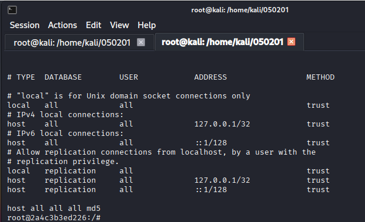
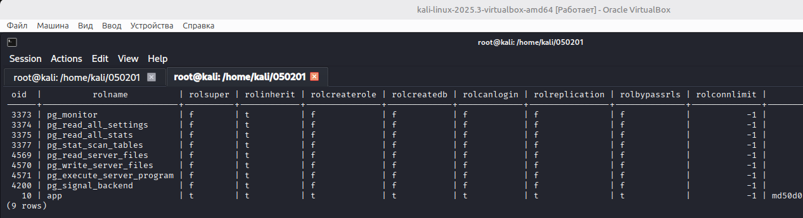
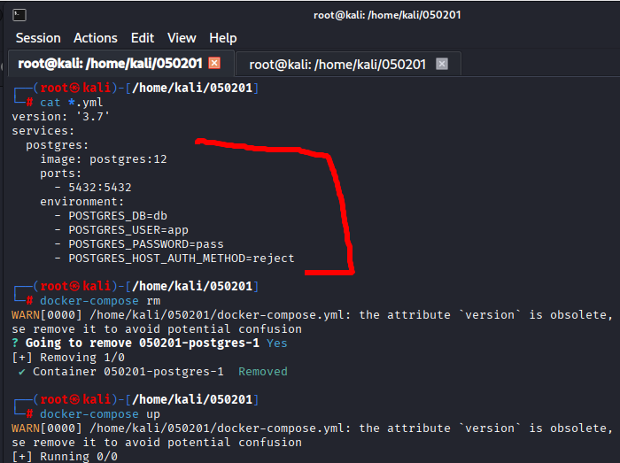
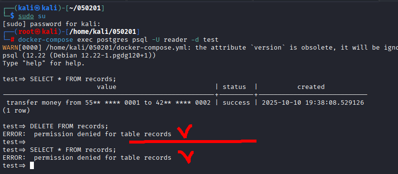

# 05.02.01. Cистемы хранения данных (СУБД) - Лебедев Д.С.
https://github.com/netology-code/ibdev-homeworks/tree/master/04_dbms

[Домашнее задание (pdf)](_att/050201/050201_Домашнее%20задание%20к%20занятию%20«2.1.%20Системы%20хранения%20данных%20(СУБД)».pdf)
### Задание «PostgreSQL Authentication»
> Вы посмотрите, как настроена по умолчанию аутентификация в Docker образе PostgreSQL v12.
> ...
> 
> **Результаты выполнения задания**
> 
> Пришлите ответы на вопросы.

**Выполнение задания**

1. Какие методы аутентификации используются для подключения по TCP/IP с адресов 127.0.0.1/32 и ::1/128?

  

Для этих адресов используется метод аутентификации trust. Это означает, что подключения с localhost (IPv4 и IPv6) разрешены без пароля для всех пользователей и всех баз данных.

2. Какие методы аутентификации используются для подключения по TCP/IP со всех остальных адресов, кроме указанных в предыдущем пункте по протоколу?

Подключения с других адресов не разрешены, так как в конфигурации отсутствуют правила для других сетей. PostgreSQL будет отклонять любые подключения, не соответствующие указанным правилам.

3. Верно ли утверждение: пароль роли `app` хранится в виде `функция_хеширования password` (пароль хранится в поле `rolpassword`)? Если не верно, то приведите описание алгоритма, который используется для хранения хеша.

  

Утверждение неверно. Пароль роли `app` хранится не в виде `функция_хеширования password`, а используется формат md5-хеша.

Алгоритм хранения: формат: md5<хеш>, MD5(username + password)

4. Какое значение имеют поля `rolsuper`, `rolcreaterole`, `rolcreatedb`, `rolbypassrls` с указанием назначения данных столбцов? `t` будет означать «да», `f` — «нет». См. [https://postgrespro.ru/docs/postgresql/12/catalog-pg-authid](https://postgrespro.ru/docs/postgresql/12/catalog-pg-authid).

- `rolsuper` -t- Роль имеет права суперпользователя (может обходить все проверки доступа)
- `rolcreaterole` -t- Роль может создавать другие роли
- `rolcreatedb` -t- Роль может создавать базы данных
- `rolbypassrls` -t- Роль может обходить политики RLS (Row Level Security)

5. Почему значения полей `rolcanlogin` и `rolpassword` для роли `app` не изменились, и вы по-прежнему можете подключиться с помощью `psql` без указания пароля, хотя в `pg_hba.conf` для `host all all all` указано `reject`?



Это происходит из-за порядка проверки правил в `pg_hba.conf`.  

Подключение с localhost соответствует правилу trust, которое разрешает подключение без аутентификации, игнорирует поле `rolpassword` и значение `rolcanlogin`, не требует пароля, независимо от того, установлен он или нет.

Правило `reject` для `host all all all` не применяется, потому что PostgreSQL проверяет правила `pg_hba.conf` сверху вниз.

### Задание «CIS PostgreSQL Benchmarks»
> Изучите [CIS Benchmarks](https://www.cisecurity.org/cis-benchmarks/) на СУБД PostgreSQL v12, а именно `Ensure login via "host" TCP/IP Socket is configured correctly`.
> 
> Пришлите ответы на вопросы.

**Выполнение задания**

1. Какие методы **не рекомендуется** использовать для удалённых подключений?
- trust - разрешает подключение без аутентификации
- password - передача пароля в открытом виде
- ident - зависит от аутентификации ОС, небезопасно для удалённых подключений
- peer - работает только для локальных подключений
- md5 - считается устаревшим и менее безопасным

2. Какие методы **рекомендуется** использовать для удалённых подключений?
- cert - аутентификация по SSL-сертификатам
- gss - с использованием Kerberos
- sspi - для Windows-сред
- ldap - интеграция с LDAP-сервером
- radius - аутентификация через RADIUS-сервер
- pam - с использованием PAM (Pluggable Authentication Modules)

### Задание «PostgreSQL ПРД»
> Вы изучите механизмы управления пользователями и ПРД, реализованные в СУБД PostgreSQL.
> 
> **Результаты выполнения задания**
> 
> Отправьте сообщение, которое отображается вместо `???` в результате выполнения запросов с недостаточными правами доступа: `ERROR: ???`.

**Выполнение задания**

  

Ошибка "permission denied for table records" означает, что у текущего пользователя PostgreSQL недостаточно прав для выполнения операции с таблицей records.

---
```
Всё верно, принято
```