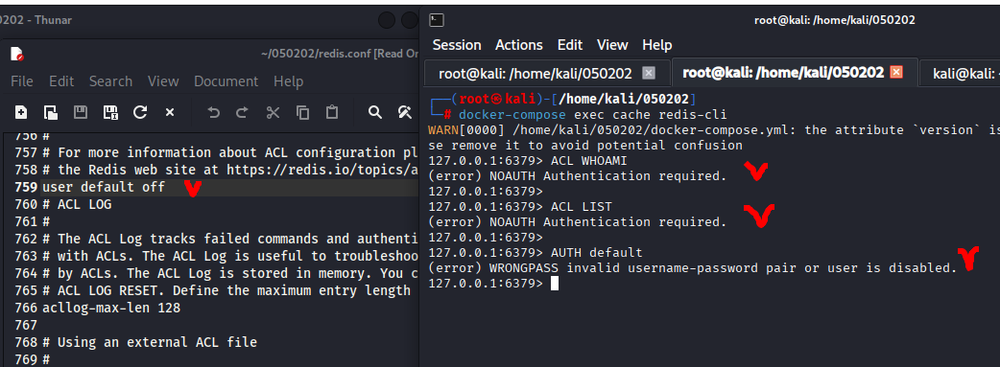
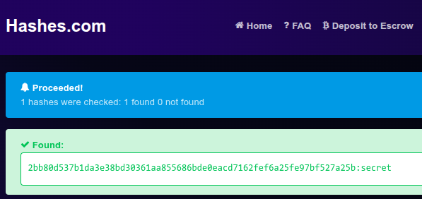
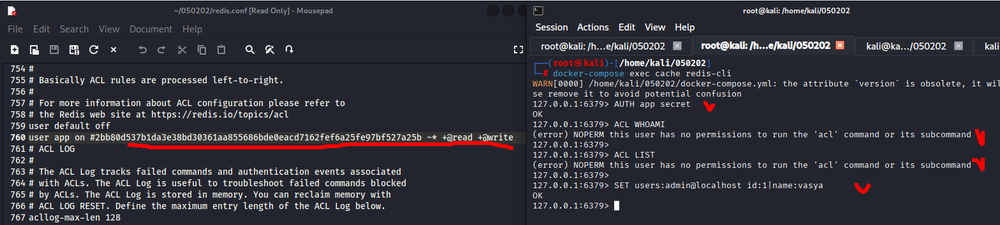
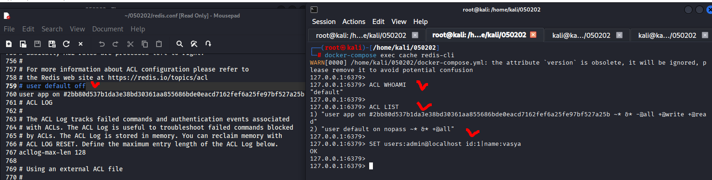
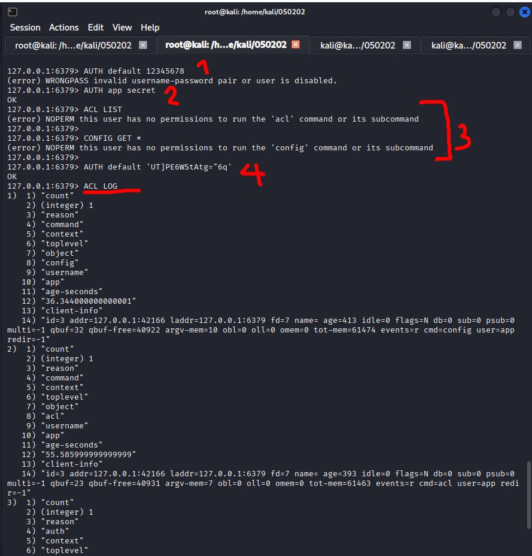
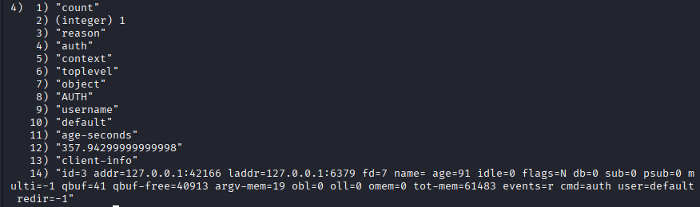
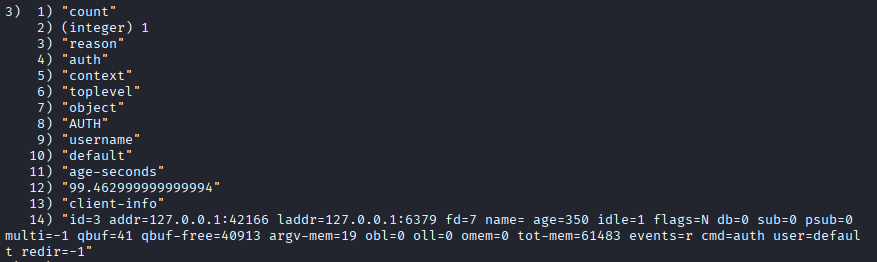
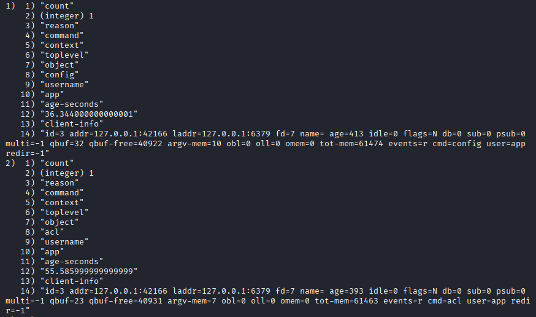

# 05.02.02. Системы хранения данных (кэши, очереди, файловая система) - Лебедев Д.С.
https://github.com/netology-code/ibdev-homeworks/tree/master/05_storage

[Задание .pdf](_att/050202/050202_Домашнее%20задание%20к%20занятию%20Системы%20хранения%20данных%20-%20кеши,%20очереди,%20файловая%20система».pdf)
### Задание «Redis ACL»
2. Отключение `default`

  

3. Добавление пользователя `app`

  

  

Пароль secret правильный.

Ошибка `NOPERM` означает, что пользователь `app` не имеет прав на выполнение команды ACL. У пользователя есть только права `+@read` `+@write`, но нет прав на административные команды.

4. Включение пользователя `default`

 

Пользователь `default` активирован, проверены права и успешно выполнена операция записи в Redis.
### Задание «Redis ACL LOGS»*

Генерация хэша для пароля default
```sh
┌──(kali㉿kali)-[~/050202]
└─$ echo -n 'UT]PE6WStAtg="6q' | sha256sum
218ca86aadf3f9ff9f8deb7cb172cfe93fc580b165a2b81177733bbbc916ab49  -
```

Правка файла redis.conf
```
user default on #218ca86aadf3f9ff9f8deb7cb172cfe93fc580b165a2b81177733bbbc916ab49 ~* &* +@all
user app on #2bb80d537b1da3e38bd30361aa855686bde0eacd7162fef6a25fe97bf527a25b ~* &* -@all +@read +@write
```

Выполнение задания:



1. Попытка входа с неверным паролем - запись №4
- В логе не отображается, была ли аутентификация успешной - только факт попытки

  

2. Успешная аутентификация пользователя `default` - запись №3

  

3. Попытки доступа к запрещённой команде - записи №1 и №2

  

Вывод: Лог безопасности корректно фиксирует все попытки нарушения политики доступа, что подтверждает правильность настройки прав пользователей в Redis

---
