# 06.01.02. СЗИ от несанкционированного доступа - Лебедев Д.С.
https://github.com/netology-code/ibszi-homeworks/blob/main/02/readme.md

[Задание .pdf](_att/060101/060101_Домашнее%20задание%20к%20занятию%20«СЗИ%20от%20несанкционированного%20доступа».pdf)
### Задание 1. Установка Secret Net Studio

  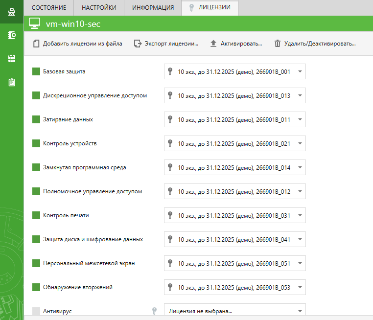

### Задание 2. Настройка параметров входа в систему

1. «Максимальный период неактивности до блокировки экрана» - 5 минут,
2. «Количество неудачных попыток аутентификации» - 3 попытки,
3. «Время блокировки при достижении количества неудачных попыток аутентификации» - 5 минут,

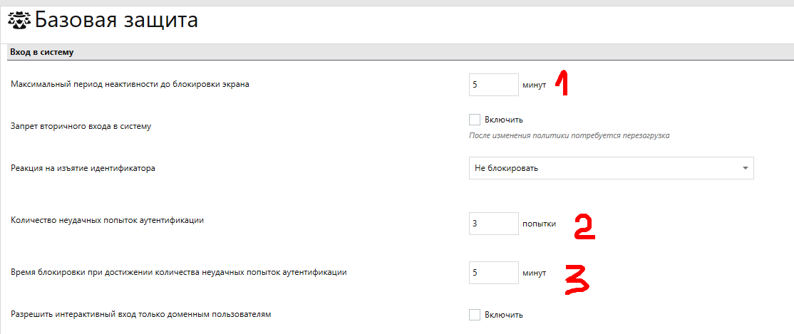  

4. «Парольная политика» - минимальная длина 8 символов, срок действия не более 180 дней, с ограничением на содержание символов.

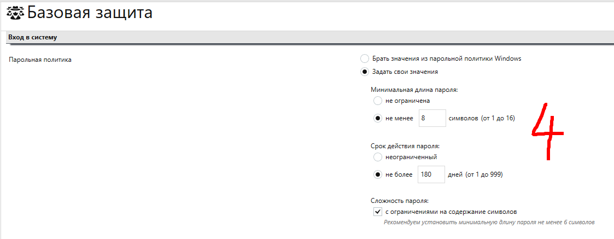  

### Задание 3. Настройка полномочного управления доступом

1. Задайте названия уровней конфиденциальности: общедоступно, коммерческая тайна.

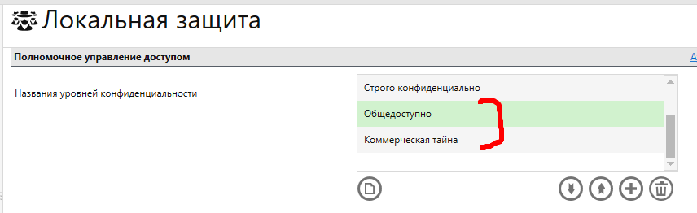   

2. Создайте двух пользователей с параметрами:
	- `ivanov` - уровень допуска «общедоступно», доверять парольной аутентификации Windows при следующем входе в систему,
	- `petrov` - уровень допуска «коммерческая тайна», печать конфиденциальных документов, вывод конфиденциальной информации, доверять парольной аутентификации Windows при следующем входе в систему.

 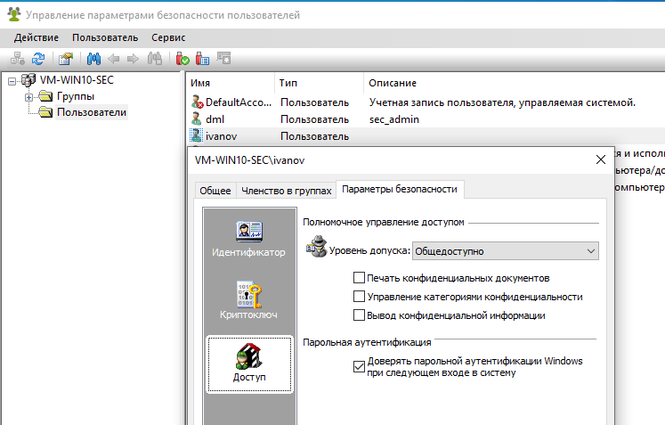  

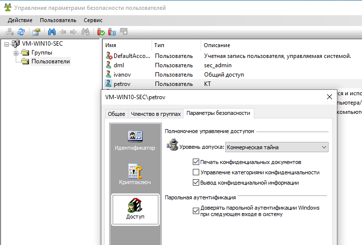  

3. Создайте на диске C папку «КТ». В этой папке создайте документ Word с содержанием «Коммерческая тайна».

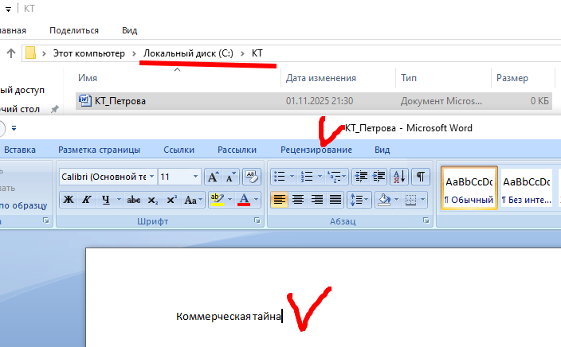   

4. Сделайте настройку полномочного управления доступом, чтобы пользователь `ivanov` не мог открыть конфиденциальный документ с коммерческой тайной.

  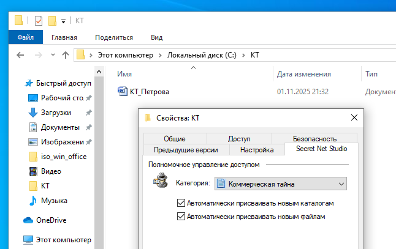  

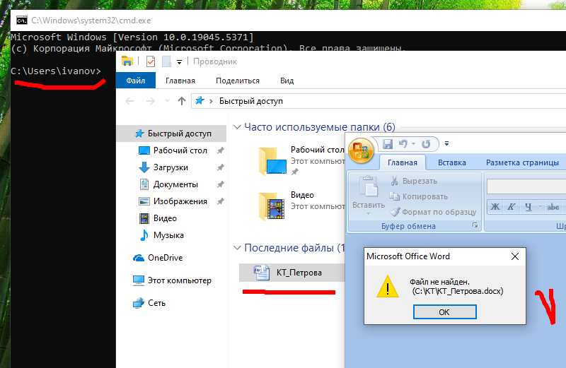  

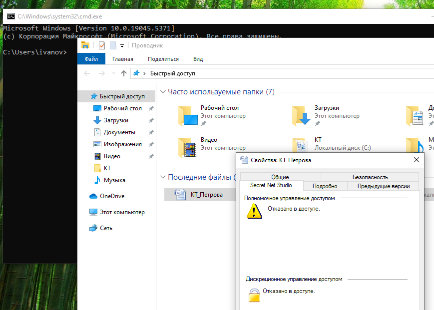  

### Задание 4. Настройка контроля устройств

1. Запретите использование:
	- сменных дисков,
	- оптических дисков,
	- сетевых плат и модемов,
	- bluetooth-адаптеров,
	- сотовых телефонов (смартфонов, КПК),
	- устройств PCMCIA,
	- устройств IEEE1394,
	- устройств Secure Digital.

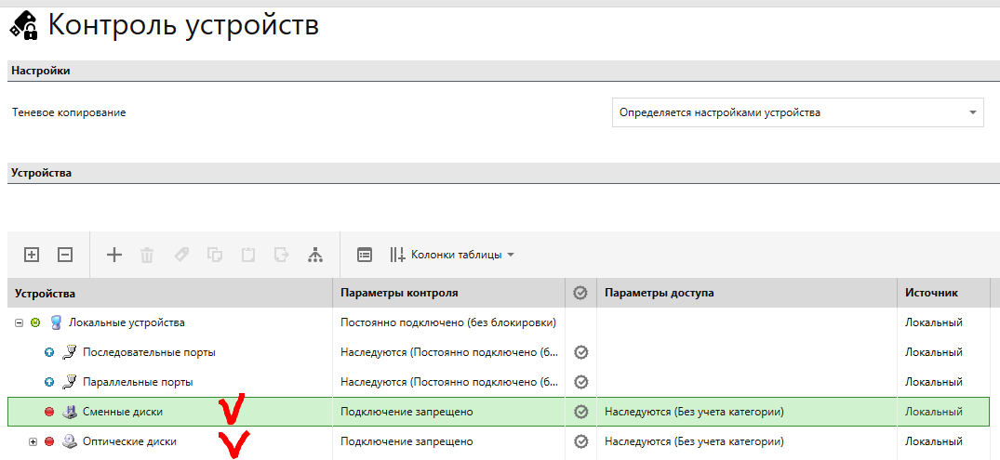  

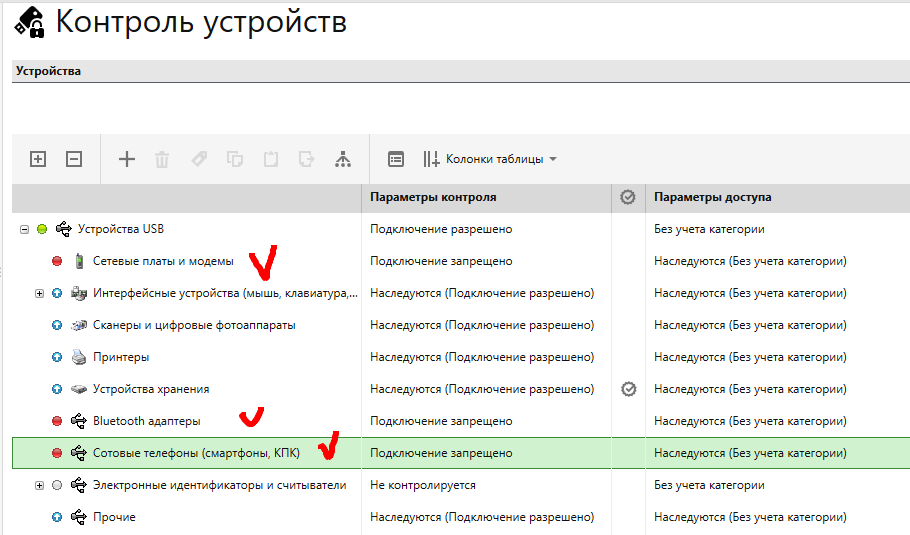  

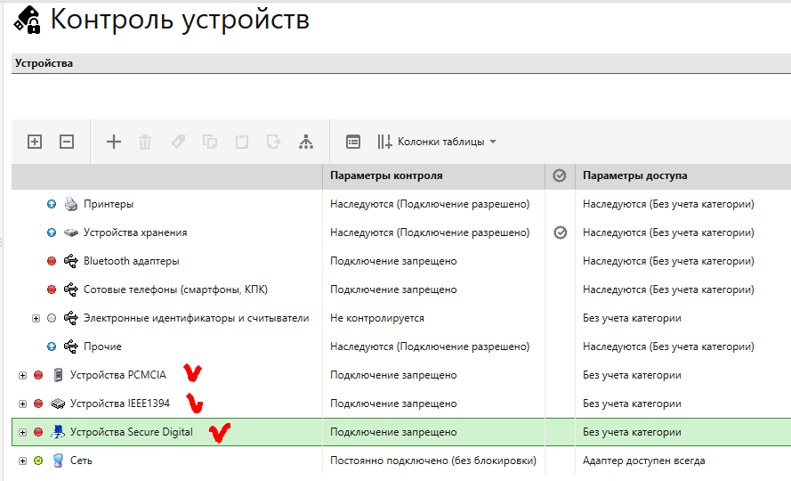  

2. Для «Устройств хранения» запретите запись пользователю petrov.

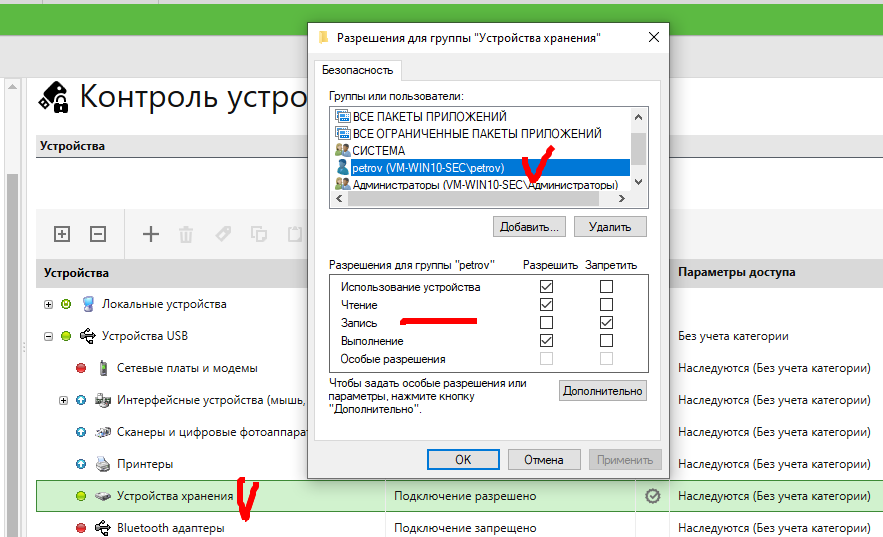

---
```
Отлично, настроено верно, принимается.
```