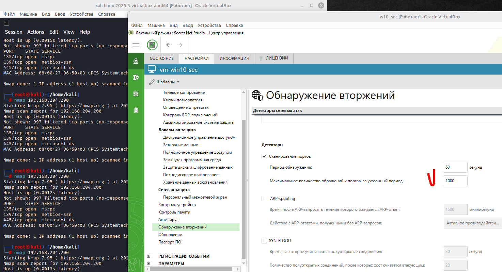
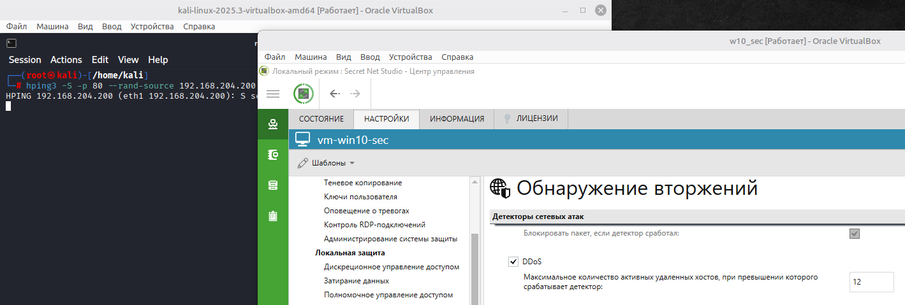
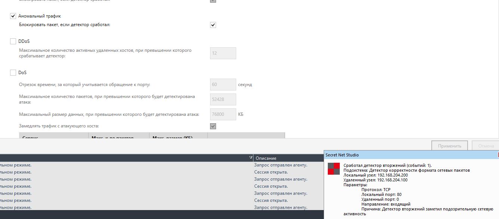

# 06.01.03. IDS/IPS - Лебедев Д.С.
https://github.com/netology-code/ibszi-homeworks/tree/main/03

[Задание .pdf](_att/060103/060103_Домашнее%20задание%20к%20занятию%20«IDS-IPS».pdf)
### Задание 1. Сканирование портов
>Для сканирования портов используйте Kali Linux, а именно – команду `sudo nmap <ip-адрес компьютера руководителя>`. При сканировании выполните следующие действия.
> 
> 1. В настройках «Обнаружение вторжений» в разделе «Детекторы» включите «Сканирование портов».
> 2. Период обнаружения оставьте без изменений - 60 секунд.
> 3. Подберите оптимальное значение «Максимальное количество обращений к портам за указанный период», при котором происходит предотвращение вторжения. Используйте шаг в 50. Например, при значении «100» СЗИ предотвращает вторжение, а уже при «150» - не срабатывает.
> 
> В качестве ответа пришлите значение, при котором начинает срабатывать IDS/IPS Secret Net Studio.

**Ответ:**

В моем случае порог срабатывания лежит между 950 и 1000 обращений к портам. При 950 - срабатывает, при 1000 уже нет

  

### Задание 2. DDoS
> Для DDoS-атаки используйте Kali Linux, а именно – команду `sudo hping3 -S -p 80 --rand-source <ip-адрес компьютера руководителя>`. Эта команда имитирует отправку SYN-пакетов на 80 порт с нескольких хостов. Выполните следующие действия.
> 
> 1. В настройках «Обнаружение вторжений» в разделе «Детекторы» выключите «Сканирование портов» и включите «DDoS».
> 2. Подберите оптимальное значение «Максимальное количество активных удаленных хостов, при превышении которого срабатывает детектор», при котором происходит предотвращение вторжения. Используйте шаг в 2. Например, при значении «30» СЗИ предотвращает вторжение, а при «32» – не срабатывает.
> 
> В качестве ответа пришлите значение, при котором начинает срабатывать IDS/IPS Secret Net Studio.

**Ответ:**

В моем случае оптимальное значение параметра "максимальное количество активных удаленных хостов" - 10. При значении "10" СЗИ предотвращает вторжение, а при "12" – не срабатывает.

  

### Задание 3. Аномальный трафик*
> 1. В настройках «Обнаружение вторжений» в разделе «Детекторы» выключите «DDoS» и включите «Аномальный трафик».
> 2. Самостоятельно изучите информацию о возможностях инструмента `hping3` и подберите команду, при которой сработает IDS/IPS Secret Net Studio.
> 
> В качестве ответа пришлите команду, при которой срабатывает IDS/IPS Secret Net Studio.

**Ответ:**

Для примера, один из видов аномальной сетевой активности - это SYN-флуд.

Это тип DDoS-атаки на уровне транспортного протокола:
- Атакующий отправляет множество TCP-SYN запросов
- Сервер резервирует ресурсы для каждого соединения и отправляет SYN-ACK
- Атакующий не завершает handshake (не отправляет ACK)
- Ресурсы сервера исчерпываются, легитимные клиенты не могут подключиться

Команда атаки:

```sh
hping3 -S -p 80 --flood 192.168.204.200
```

В результате фиксируется аномальный трафик:

