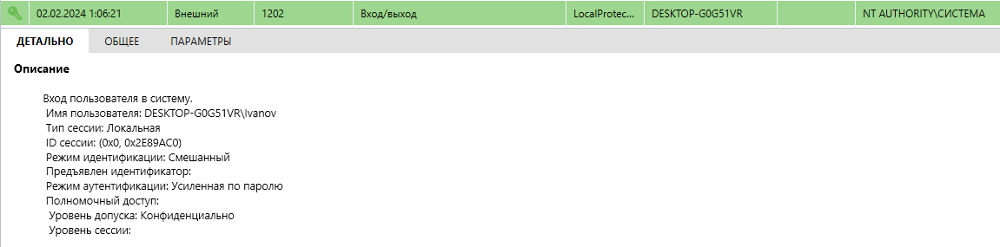
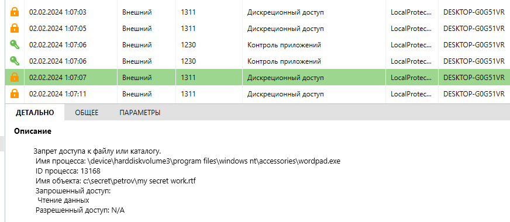
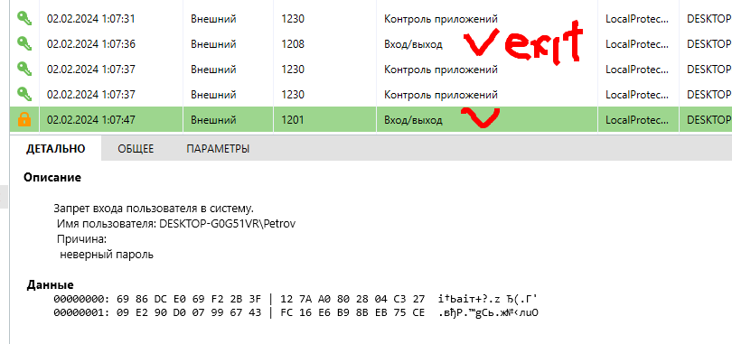
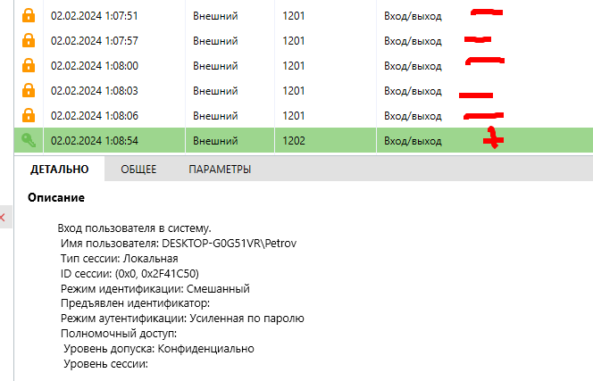
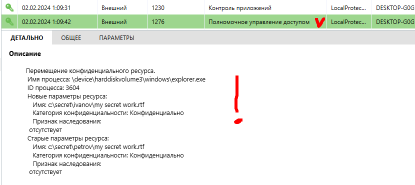

# 06.01.04. SIEM - Лебедев Д.С.
https://github.com/netology-code/ibszi-homeworks/tree/main/04
### Инструкция к заданию
> #### Описание задачи
> 
> Вы работаете специалистом по ИБ в научно-исследовательском институте.
> 
> К руководству НИИ обратился научный сотрудник Петров и пожаловался, что старший научный сотрудник Иванов похитил у него рационализаторское предложение. Рационализаторское предложение было готово к распечатке и хранилось в папке на компьютере Петрова - `C:\Secret\Petrov`.
> 
> Иванов всё отрицает и говорит, что это рационализаторское предложение сделал он сам на своём компьютере в своей папке - `C:\Secret\Ivanov`.
> 
> В ходе предварительного расследования установлено, что Иванов мог украсть файл 1 февраля 2024 года, когда Петров не вышел на работу по причине болезни. Иванов и Петров работают в одном кабинете, других сотрудников в этом кабинете нет. Иванов и Петров работают за одним компьютером под личными учётными записями Petrov и Ivanov.
> 
> По камерам наблюдения установлено, что 1 февраля 2024 года в кабинете находился только Иванов. Никто из других сотрудников в этот день в кабинет не заходил. Также Петров рассказал, что примерно месяц назад сообщил Иванову пароль от своей учётной записи. Тогда ему срочно понадобилось распечатать отчёт, который находился в папке Петрова. Иванов подтвердил, что Петров когда-то говорил пароль, но заявил, что давно забыл его.
> 
> Руководство поставило вам задачу разобраться в ситуации, проанализировав журнал SIEM компьютера.
> 
> #### Задание
> 
> Проанализируйте журнал SIEM и восстановите картину инцидента.
> 
> Ответьте на следующие вопросы.
> 
> 1. Работал ли за компьютером Иванов в день инцидента?
> 2. Пытался ли Иванов скопировать какие-то файлы из личной папки Петрова? Если да, то какие?
> 3. Пытался ли Иванов войти в учётную запись Петрова?
> 4. Если пытался, то удалось ли ему это сделать?
> 5. И главный вопрос - действительно ли Иванов украл рационализаторское предложение?
> 
> Расскажите про инцидент своими словами, приложив скриншоты, подтверждающие вашу теорию.

**Ответ:**

#### 1. Работал ли за компьютером Иванов в день инцидента?

**Да.** Лог начинается с события успешного входа пользователя `DESKTOP-G0G51VR\Ivanov`. Это прямо указывает на то, что Иванов начал рабочую сессию в день инцидента.

  
#### 2. Пытался ли Иванов скопировать какие-то файлы из личной папки Петрова? Если да, то какие?

**Да.** Из лога видно, что процесс `wordpad.exe` (блокнот WordPad) и `explorer.exe` (Проводник Windows) многократно пытались получить доступ к файлу `c:\secret\petrov\my secret work.rtf`. Все попытки доступа были запрещены системой (`Разрешенный доступ: N/A`). Это указывает на то, что пользователь, работающий в сессии Иванова, пытался открыть этот файл, но не имел на него прав.

  
#### 3. Пытался ли Иванов войти в учётную запись Петрова?

**Да.** В логе зафиксирована целая серия из шести неудачных попыток входа под учетной записью `DESKTOP-G0G51VR\Petrov` с причиной "неверный пароль". Это свидетельствует о попытке подбора пароля.

  
#### 4. Если пытался, то удалось ли ему это сделать?

**Да.** После серии неудачных попыток следует событие успешного входа в систему под учетной записью `DESKTOP-G0G51VR\Petrov`. Это означает, что Иванов в итоге ввел правильный пароль и получил доступ к системе как Петров.

  
#### 5. И главный вопрос - действительно ли Иванов украл рационализаторское предложение?

**Да, однозначно.** Самое важное событие в логе - "Перемещение конфиденциального ресурса". Оно произошло во время активной сессии пользователя `Petrov` (которым на самом деле был Иванов). Файл `c:\secret\petrov\my secret work.rtf` был перемещен в `c:\secret\ivanov\my secret work.rtf`. Это не копирование, а именно перемещение, что является актом кражи.

  

### Восстановление картины инцидента

1. **Начало операции.** 1 февраля 2024 года Иванов начал работу за компьютером под своей учетной записью (`Ivanov`).
    
2. **Разведка.** Он попытался получить доступ к файлу `C:\Secret\Petrov\My Secret Work.rtf` с помощью Проводника и WordPad. Однако система защиты запретила ему чтение файла, так как у учетной записи `Ivanov` не было прав доступа к папке `Petrov`.
    
3. **Подбор учетных данных.** Понимая, что доступ к файлу возможен только из-под учетной записи владельца, Иванов начал пытаться войти в систему как `Petrov`. Он совершил 6 неудачных попыток входа, что говорит о том, что он либо ошибался, либо пытался угадать пароль, который, по его словам, "забыл".
    
4. **Успешный несанкционированный доступ.** На 7-й попытке Иванов ввел верный пароль (который Петров сообщал ему месяц назад) и успешно вошел в систему под учетной записью `Petrov`.
    
5. **Кража файла.** Находясь в сессии `Petrov`, у которого были все права на файл, Иванов с помощью Проводника переместил целевой файл `My Secret Work.rtf` из папки `C:\Secret\Petrov\` в свою личную папку `C:\Secret\Ivanov\`. 
    
6. **Завершение сессии.** После выполнения операции Иванов вышел из учетной записи `Petrov`, а затем завершил и свою собственную сессию.
#### Вывод
Анализ лога событий однозначно показывает, что Иванов украл файл с рационализаторским предложением Петрова. Он воспользовался знанием пароля, вошел в учетную запись Петрова, и переместил конфиденциальный файл из папки Петрова в свою собственную.

---
