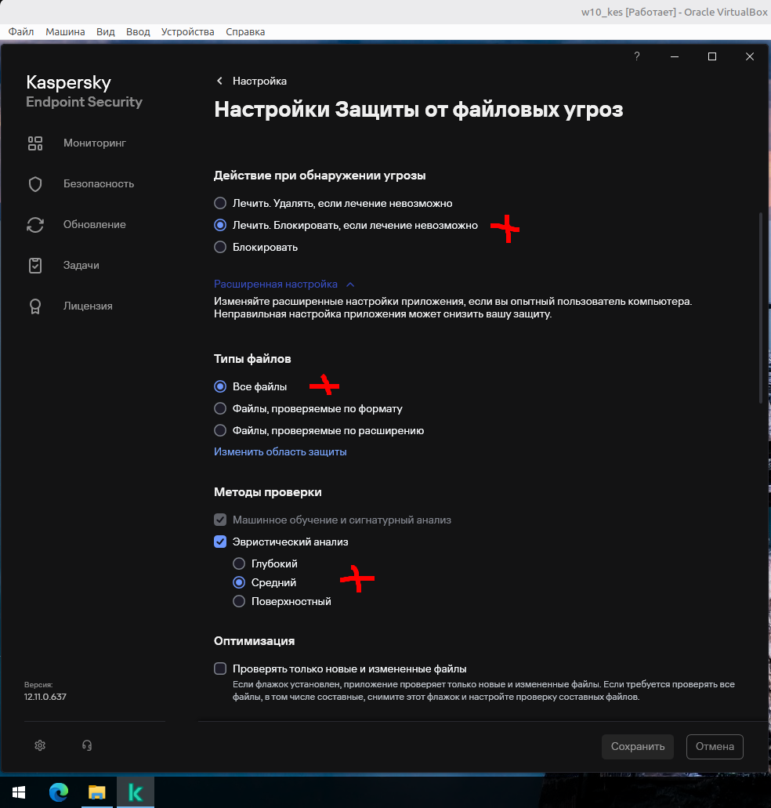
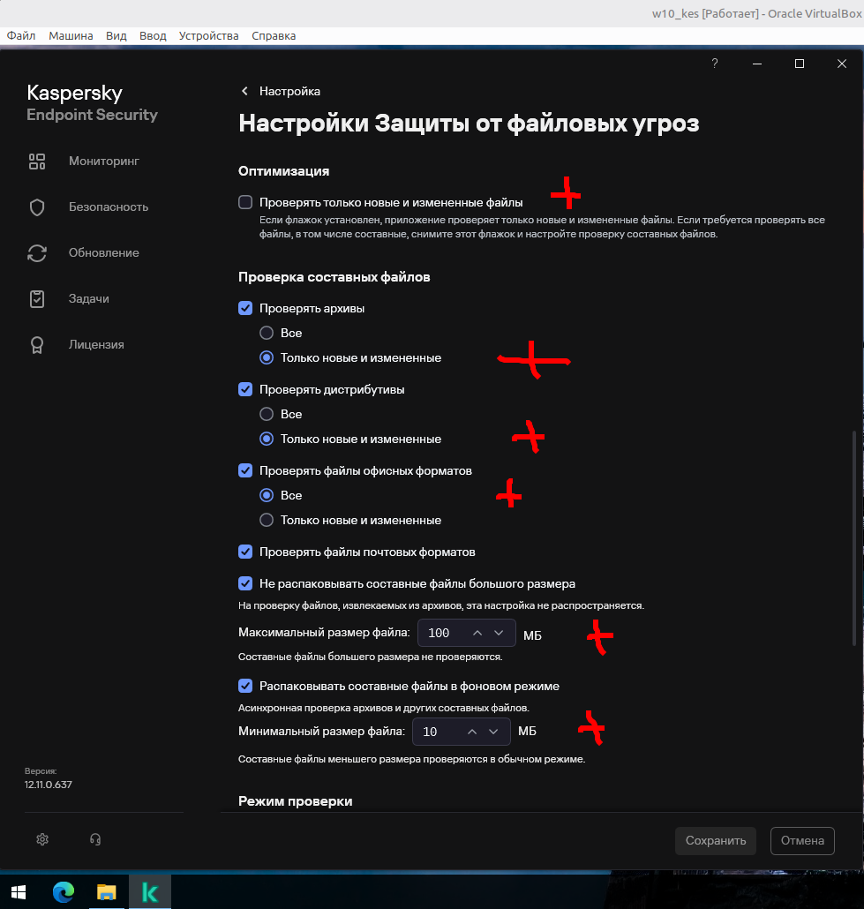
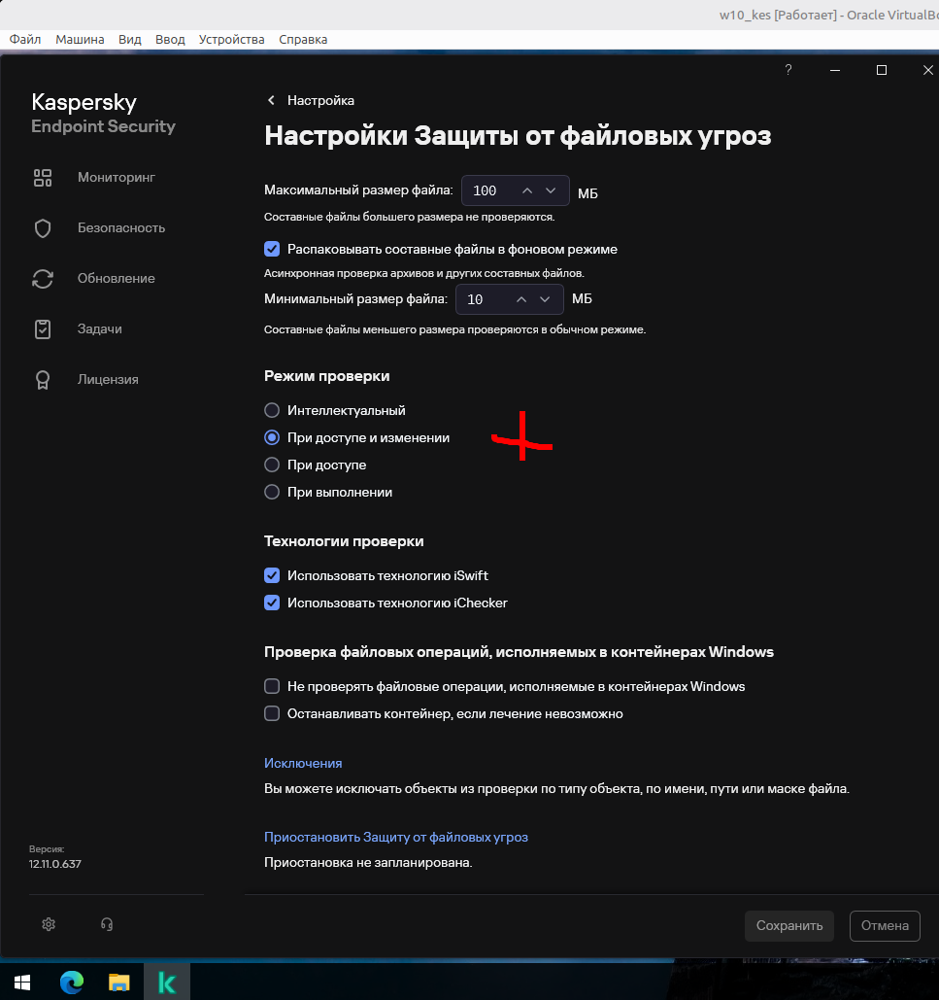
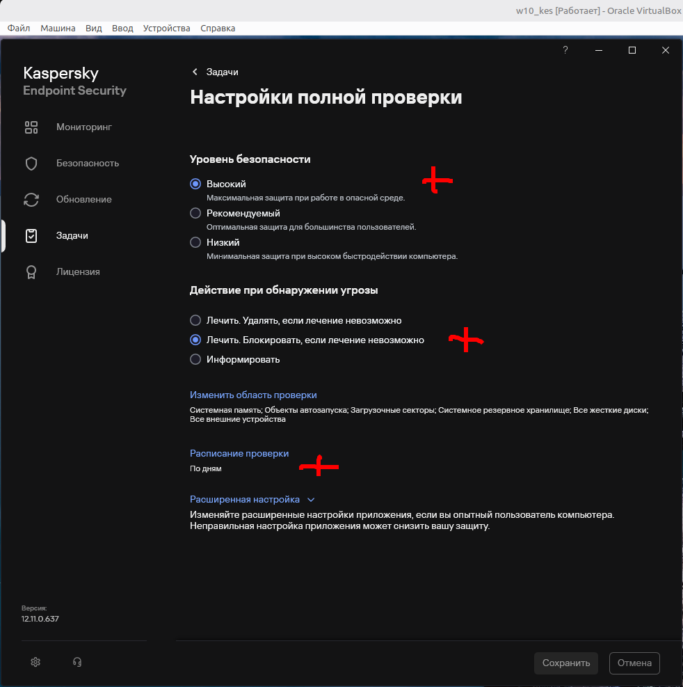
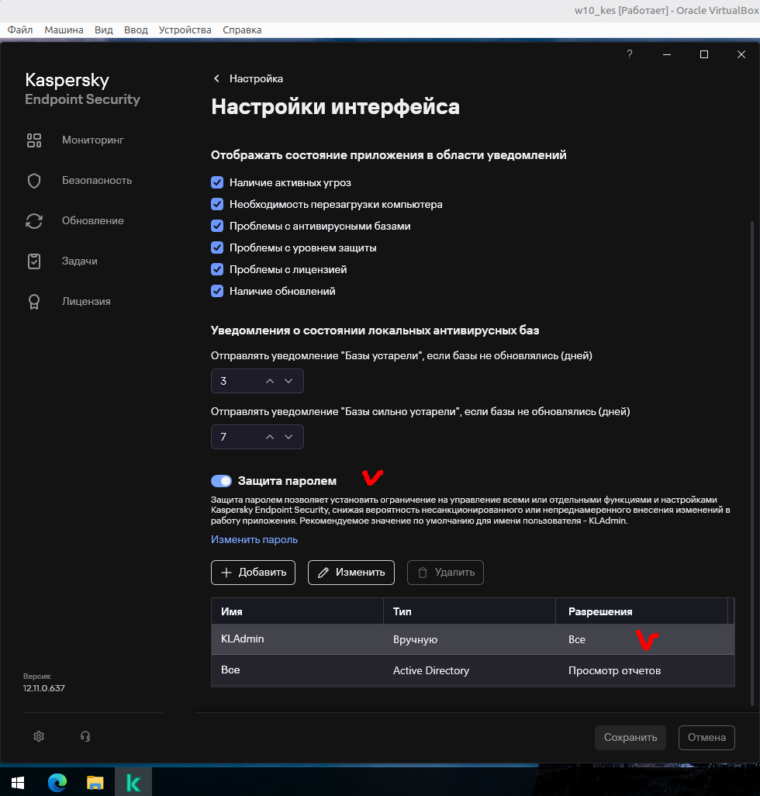
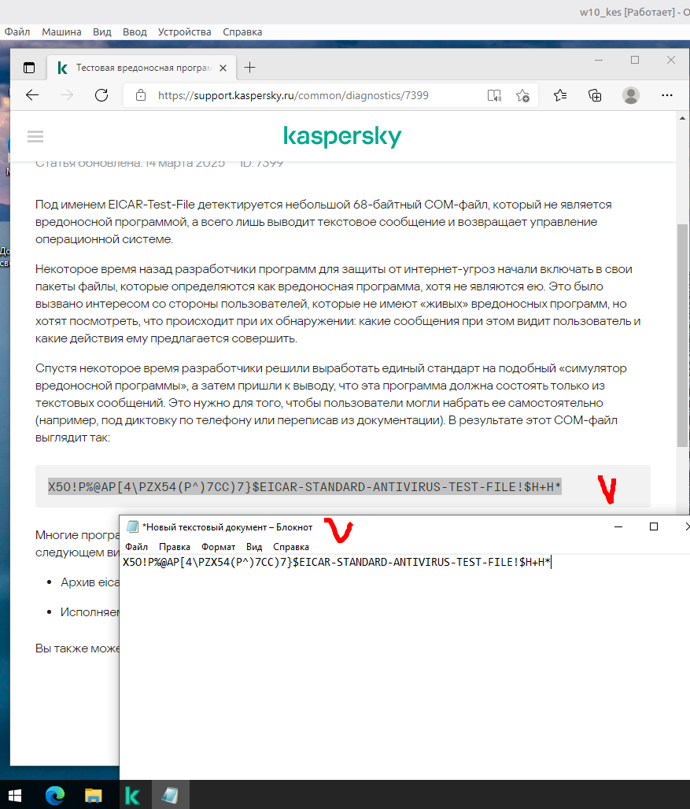
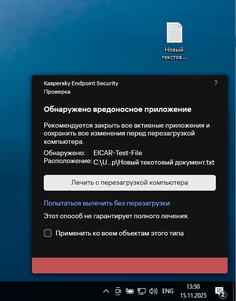

# 06.01.05. Средства антивирусной защиты - Лебедев Д.С.
https://github.com/netology-code/ibszi-homeworks/blob/main/05/README.md

[Задание .pdf](_att/060105/060105_дз.pdf)
### Описание задачи
> Вы являетесь специалистом по ИБ в компании. Руководство компании приняло решение внедрить САВЗ — Kaspersky Endpoint Security. Перед вами поставлена задача по установке и настройке САВЗ.
> 
> Для того, чтобы выполнить эту задачу, вам необходимо выполнить следующие шаги.
> 
> 1. Скачать и установить Kaspersky Endpoint Security.
> 2. Настроить реакцию САВЗ на обнаруженные вредоносные программы.
> 3. Установить пароль на доступ к настройкам.
> 4. Проверить работоспособность САВЗ с использованием тестового вируса.

**Выполнение задания**
#### Задание 2. Настройка реакции Kaspersky Endpoint Security на обнаруженные вредоносные программы

Выполненные настройки в соответствии с заданием:

  

  

  

#### Задание 3. Настройка периодичности полной проверки компьютера

Выполненные настройки в соответствии с заданием:

  

  

#### Задание 4. Установка пароля на доступ к настройкам

Выполненные настройки в соответствии с заданием:

  

#### Задание 5. Проверка функционирования Kaspersky Endpoint Security

Обнаружение тестового вируса:

  

  

---
