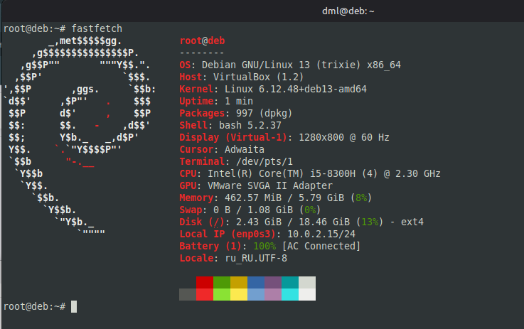
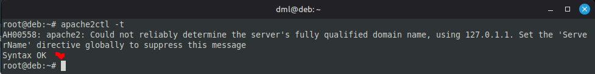
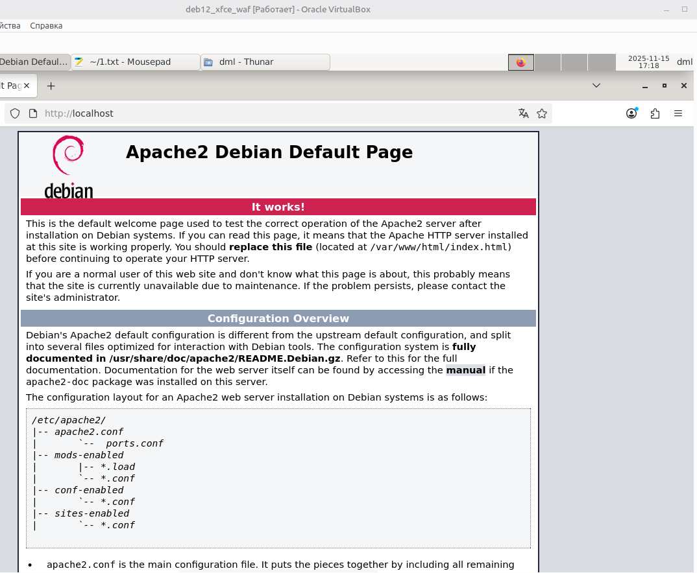
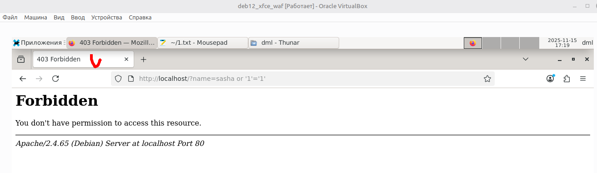

# 06.01.06. Web Application Firewall - Лебедев Д.С.
https://github.com/netology-code/ibszi-homeworks/blob/main/06/README.md

[Задание .pdf](_att/060106/060106_дз.pdf)
### Описание задачи
> Вы работаете в службе ИБ. Руководство поставило задачу установить и настроить программный WAF OWASP ModeSecurity.

**Выполнение задания**

В качестве ОС используется Debian 12 xfce

  

Тест конфигурации веб-сервера:

  

Тест работы веб-сервера в обычном режиме:

  

Тест веб-сервера при имитации SQL-инъекции:

  

---
