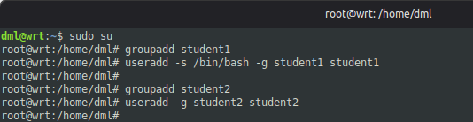
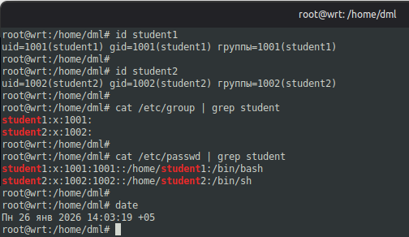
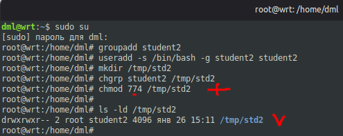
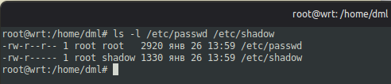

# 09.01.01. Linux Hardening
https://github.com/netology-code/ibdef-homeworks/tree/master/01_linux
### Задание 1
> - Создайте пользователя `student1` с оболочкой `bash`, входящего в группу `student1`.
> - Создайте пользователя `student2`, входящего в группу `student2`.
> 
> *Дайте ответ в виде снимков экрана.*

**Ответ:**

  

  
### Задание 2
> - Создайте в общем каталоге, например, `/tmp`, директорию.
> - Назначьте для неё полный доступ со стороны группы `student2` и доступ на чтение всем остальным.
> 
> *Дайте ответ в виде снимков экрана.*

**Ответ:**


#### Доработка:

У группы `student2` получился не полный доступ (должно быть `rwx`).

```sh
chmod 774 /tmp/std2
```


### Задание 3
> - Определите, какой режим доступа установлен для файлов `/etc/passwd` и `/etc/shadow`.
> - Объясните, зачем понадобилось именно два файла.
> 
> *Дайте ответ в виде снимков экрана.*

**Ответ:**



<u>Права доступа:</u>

`/etc/passwd: -rw-r--r--` (644)
- Владелец (root): rw- (чтение и запись)
- Группа (root): r-- (только чтение)
- Остальные: r-- (только чтение)

`/etc/shadow: -rw-r-----` (640)
- Владелец (root): rw- (чтение и запись)
- Группа (shadow): r-- (только чтение)
- Остальные: нет доступа (---)

<u>Разделение на 2 файла:</u>

- Соответствует современным стандартам безопасности (FHS);
- Функциональное разделение - в `/etc/passwd` хранится общедоступная информация (имена пользователей, UID/GID и т.д.), в `/etc/shadow` - защищённая информация (хэши паролей);
- Совместимость со старыми программами.
### Задание 4*
> Изучите информацию о SELinux из открытых источников.
> 
> Ответьте на вопросы:
> - Что из того, что предлагает SELinux, может быть реализовано в стандартном Linux?
> - Можно ли установить SELinux поверх существующей ОС Linux?
> 
> *Дайте ответ в свободной форме.*

**Ответ:**

1. **Что из того, что предлагает SELinux, может быть реализовано в стандартном Linux?**

В стандартном Linux (без SELinux) можно реализовать часть функций через:
- Стандартные права rwx (DAC);
- Разделение привилегий root;
- AppArmor (альтернативная система мандатного контроля);
- Изоляция процессов.

Без SELinux в стандартном Linux недоступны функции:
- Принудительного контроля доступа;
- Централизованного управления политиками безопасности;
- Изоляции на уровне процессов и данных через метки безопасности.

2. **Можно ли установить SELinux поверх существующей ОС Linux?**

Можно, но:
- Ядро должно поддерживать SELinux;
- Дистрибутив должен поддерживать SELinux;
- Перемаркировка файловой системы - необходимо пометить все файлы контекстами безопасности (restorecon, fixfiles);
- Нельзя одновременно использовать SELinux и AppArmor.

---
```
Доработка: у группы student2 получился не полный доступ (должно быть rwx).
```
