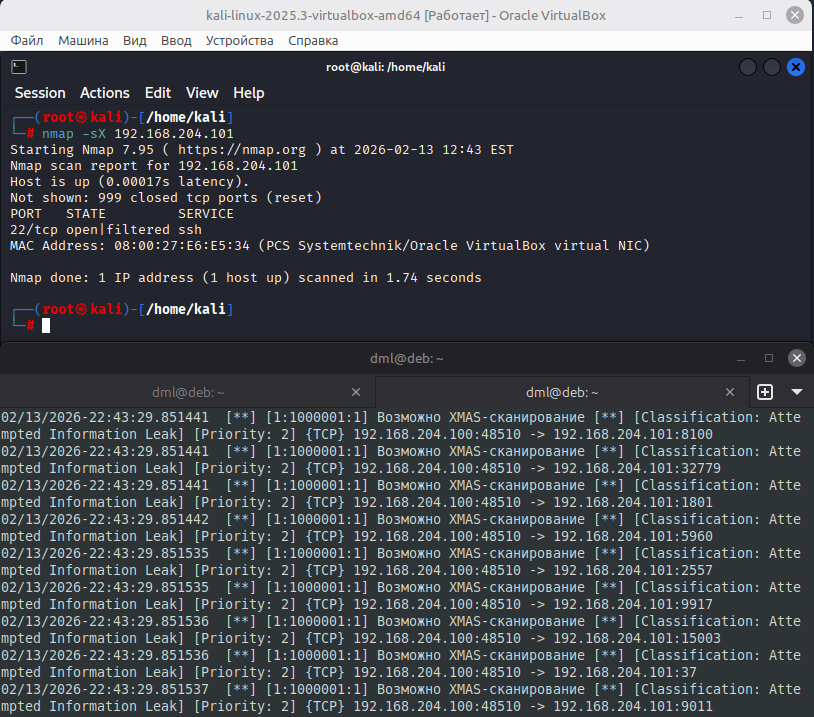
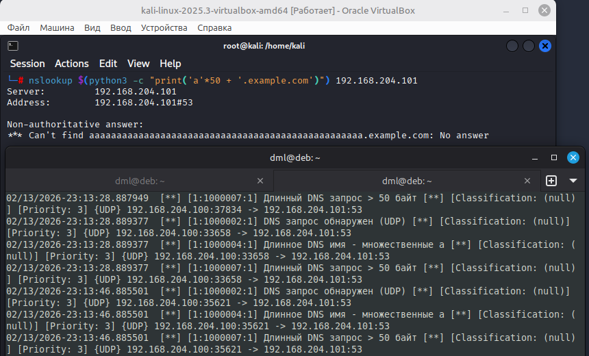
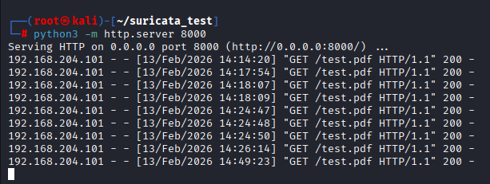
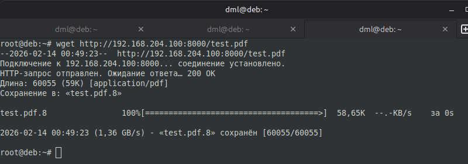
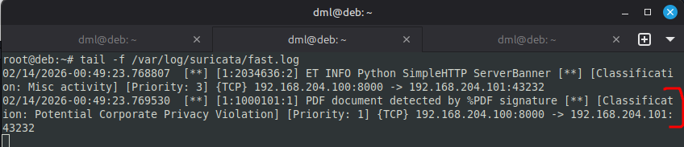

# 09.03.01. Мониторинг событий безопасности (Suricata)
https://github.com/netology-code/ibdef-homeworks/tree/master/05_ids
### Задание 1
> Напишите правило для детектирования Xmas-сканирования.
> 
> *Дайте ответ в свободной форме.*

**Ответ:**

<u>Правило имеет вид:</u>

```yaml
# Xmas-сканирование
alert tcp any any -> any any (msg:"Возможно XMAS-сканирование"; flags: FPU, 12; classtype:attempted-recon; sid:1000001; rev:1;)
```

где:

- **alert tcp** - действие и протокол.
- **any any -> any any** - трафик от любого источника к любому назначению
- **msg:"Возможно XMAS-сканирование"** - сообщение, которое будет записано в лог.
- **flags: FPU, 12;** - ключевая часть правила. Оно сработает, если в пакете установлены флаги **FIN, PSH и URG**. Значение 12 указывает проверять только эти три флага (маска), игнорируя состояние других
- **classtype:attempted-recon;** - классификация события (попытка разведки)
- **sid:1000001;** - уникальный идентификатор правила.

Срабатывание на `nmap` из kali:

  


### Задание 2
> Напишите правило для детектирования стороннего трафика, передающегося службой DNS.
> 
> *Дайте ответ в свободной форме.*

**Ответ:**

Поднимаем DNS сервер `bind`, запрашиваем его `nslookup`

<u>Правило, детектирующее длинное DNS имя, со строкой с множеством "a":</u>

```yaml
# Длинные DNS имена - обнаруживаем по множеству символов 'a'
alert udp any any -> any 53 (msg:"Длинное DNS имя - множественные a"; content:"aaaaaaaa"; depth:50; nocase; sid:1000004; rev:1;)
```

  

### Задание 3*
> Напишите правило для детектирования файлов или документов в сетевом трафике.
> 
> _Дайте ответ в свободной форме._

В сети поднимаем `http` сервер, обращаемся к нему для получения определенного документа.

<u>Правило, детектирующее загрузку PDF документов (по сигнатуре):</u>

```yaml
# PDF по сигнатуре %PDF
alert http any any -> any any (msg:"PDF document detected by %PDF signature"; file_data; content:"%PDF"; within:4; classtype:policy-violation; sid:1000101; rev:1;)
```

Работа `http` - сервера:

  

Качаем файл PDF:

  

Срабатывает правило:

  

Так же есть запись о работе встроенного правила из набора `Emerging Threats` (ET), которое обнаруживает баннер `Python SimpleHTTP` сервера в сетевом трафике.

---
