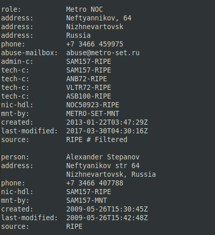
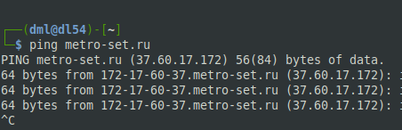
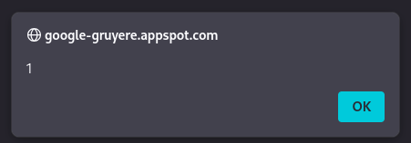
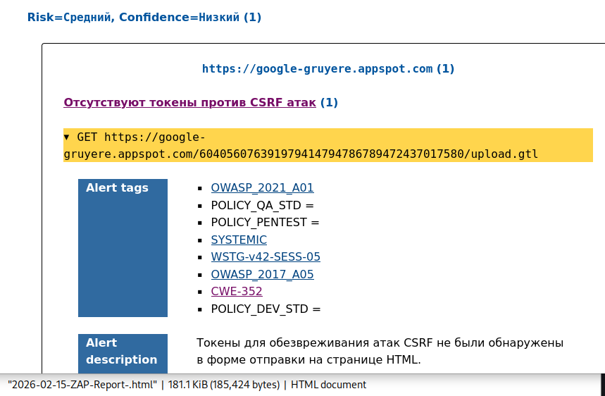
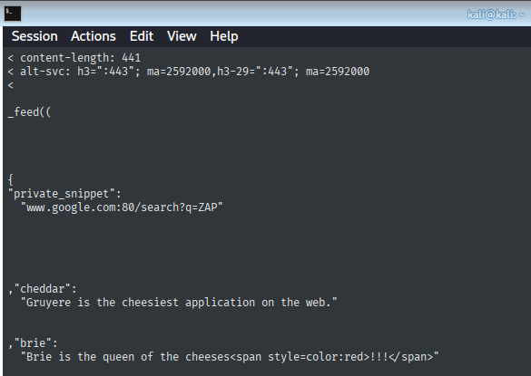
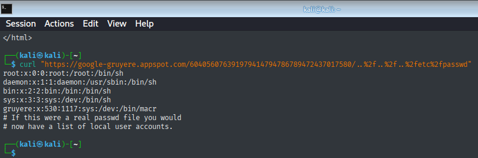
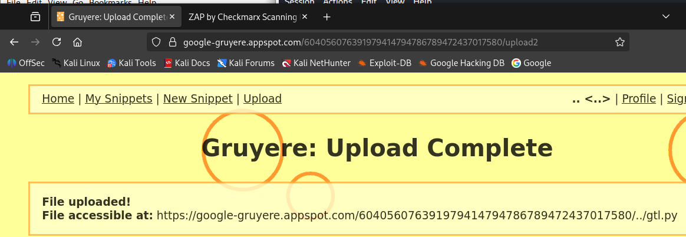
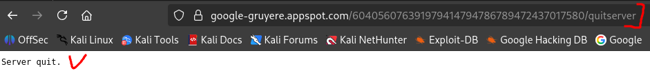
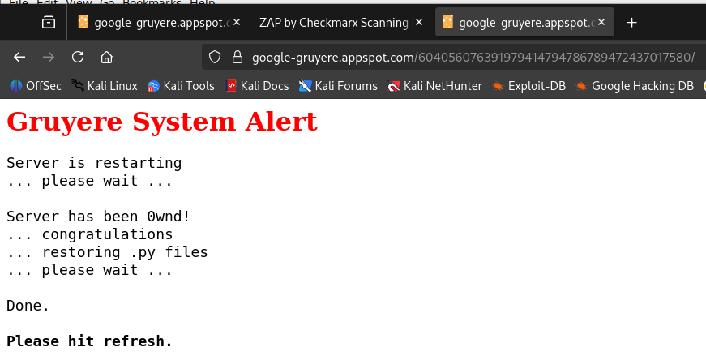

# 09.03.02. Penetration Testing. Часть 1.
https://github.com/netology-code/ibdef-homeworks/tree/master/06_pentest
### Задание 1
> Используйте инструменты OSINT и найдите информацию о любом сервисе, которым пользуйтесь каждый день.
> 
> Рекомендуем искать:
> 
> - расположение дата-центров;
> - почтовые сервера;
> - чаты;
> - файлы в открытом доступе;
> - адреса офисов;
> - ресурсы, где можно найти сотрудников компании и т. д.
> 
> Напишите отчёт о найденной информации, которая могла бы быть использована для пентеста.

**Ответ:**

---
## OSINT-отчет: Объект ООО «Метросеть» (metro-set.ru)

**Цель:** Комплексный сбор и анализ общедоступной информации об инфраструктуре, активах и персонале компании для планирования этапов пентеста.
### 1. Общие сведения и юридический адрес

**Полное наименование**: Общество с ограниченной ответственностью «Метросеть»

**Юридический адрес (офис)**: 628606, Ханты-Мансийский Автономный Округ - Югра, г. Нижневартовск, ул. 60 Лет Октября, зд. 4/П, стр. 8, этаж 3, помещ. 321.

Главный официальный адрес компании. Может использоваться для:
- Физической разведки
- Социальной инженерии
- Поиска сотрудников
### 2. Расположение дата-центров и техническая инфраструктура

Анализ IP-адресов и сетевой инфраструктуры позволяет определить ключевые технические узлы.
- Автономная система (AS): [AS50923 (METRO-SET-AS)](https://2ip.ru/as/50923/). Это указывает на то, что «Метросеть» является самостоятельным оператором связи с собственными IP-диапазонами.
- DNS-инфраструктура: NS3.METRO-SET.RU** (178.208.224.18) - один из официальных DNS-серверов компании.

**Технические узлы и география**
 
 На основе обратных DNS-имен (PTR-записей) IP-адресов, принадлежащих AS50923, можно локализовать техническую инфраструктуру:
- Сургут: Кластер IP-адресов с именами вида `dhcp-XXX-XXX-XXX-XXX.metrosg.ru` .
- Нижневартовск: Кластер IP-адресов с именами вида `dhcp-XXX-XXX-XXX-XXX.metronv.ru` .

**Вывод:** Основные технические узлы и точки присутствия (POP) расположены в Сургуте и Нижневартовске. Это, вероятно, места размещения серверного и сетевого оборудования для обслуживания абонентов в этих регионах.

**Данные из базы RIPE (часть):**





**[Данные с Shodan по IP `37.60.17.172`](https://www.shodan.io/host/37.60.17.172)**
### 3. Почтовые сервера и контактные email-ы

* Почтовый шлюз/сервер: Известен типовой паттерн именования хостов для динамических адресов (DHCP), которые могут использоваться и для почтовых серверов (например, `mail.it86.pro` на IP 5.53.17.193) .
* Email для связи с администрацией: abuse@metro-set.ru.  Потенциальное использование: Можно использовать для отправки фишинговых или тестовых писем с целью проверки почтового шлюза (SPF, DKIM, DMARC) и реакции персонала. Социальная инженерия: связаться с техподдержкой для выяснения внутренних процедур.
### 4. Чат-боты и приложения для связи

Официальное приложение: «МетроДом».
- Функционал: Доступ к городским камерам видеонаблюдения.
- Авторизация: По номеру телефона.

Тактическая ценность: Критически важная цель. Анализ приложения (reverse engineering) может выявить:
- Зашитые ключи API и эндпоинты (например, `api.metro-set.ru`).
- Уязвимости в логике авторизации.
- Прямые ссылки на видеопотоки (RTSP/RTMP), которые могут быть доступны без авторизации.
### 5. Файлы и документация в открытом доступе

* Госзакупки и лицензии: В открытых реестрах есть информация о выданных компании лицензиях (номера, даты, сроки действия). Номера лицензий можно использовать для поиска на сайтах госзакупок, где в контрактах часто выкладываются технические задания, содержащие детали об используемом ПО и оборудовании.
* Судебные дела: Информация об арбитражных делах с участием компании. Тексты судебных решений могут содержать технические детали споров, имена сотрудников или данные о контрагентах.
### 6. Ресурсы для поиска сотрудников (и найденные лица)

Руководство и учредители (по данным ЕГРЮЛ):

**Директор:** Ермошин Сергей Николаевич (ИНН 860302482400)

**Крупные учредители:**
- Шаромов Михаил Валентинович (ИНН 720413141245)
- Фрумес Александр Николаевич (ИНН 860304247602)
- Шаромов Валентин Михайлович (ИНН 720215151820)
- Дорофеев Александр Евгеньевич (ИНН 860303238362)
- ООО "Северсетьстрой" (ИНН 8603139053)

Потенциальные цели для поиска в соцсетях (LinkedIn, VK, Telegram):
- Сотрудники техподдержки: По названию компании, по городам присутствия.
- Системные администраторы и разработчики: По ключевым словам "Metroset", "Метросеть", по доменам `metrosg.ru`, `metronv.ru` в профилях.
- Персонал по именам: Используя ФИО руководителей и учредителей для поиска их личных и профессиональных аккаунтов.
### 7. Дополнительные сетевые активы и инциденты безопасности

*   **Связанные домены:** `metrosg.ru` (предположительно для Сургута), `metronv.ru` (для Нижневартовска) . Эти домены могут использоваться для внутренних сервисов, почты или доступа абонентов к статистике. Их необходимо проверить на наличие поддоменов.
*   **Инциденты (спам-активность):** Некоторые IP-адреса компании (например, `5.53.20.149`, `178.208.228.47`) были замечены в спам-активности . Это указывает на возможную компрометацию абонентских устройств (ботнет).
### Итоговая карта атак

| Категория        | Найденные активы                                       | Потенциальные векторы атак                                                       |
| :--------------- | :----------------------------------------------------- | :------------------------------------------------------------------------------- |
| **Офисы/Адреса** | Нижневартовск (юридический), Сургут (технический узел) | Физический пентест, социальная инженерия, дропшиппинг.                           |
| **Сеть**         | AS50923, IP-диапазоны в Сургуте и Нижневартовске       | Сканирование портов, поиск уязвимого оборудования (камеры, роутеры), анализ BGP. |
| **Домены**       | `metro-set.ru`, `metrosg.ru`, `metronv.ru`             | Поиск поддоменов, зон передач, уязвимостей на веб-серверах.                      |
| **Приложения**   | `МетроДом` (публичное приложение для камер)            | Reverse engineering, анализ трафика, проверка API на уязвимости.                 |
| **Персонал**     | ФИО руководства, отделы в городах                      | Социальные сети, фишинг, поиск утечек паролей.                                   |
| **История**      | Спам с IP, судебные дела                               | Поиск уязвимостей, использовавшихся ранее.                                       |

---
### Задание 2
> - Проведите первичный пентест уязвимого приложения Google Gruyere с помощью OWASP ZAP или Burp Suite.
> - Найдите в приложениях XSS, XSRF, XSSI, Path Traversal и Code Execution. Какая-то часть уязвимостей может быть найдена автоматически, другая часть найдётся только вручную.
> 
> Не рекомендуем пользоваться ответами, но можно посмотреть в подсказки. [Google Gruyere](https://google-gruyere.appspot.com/).
> 
> Пришлите отчёт о том:
> 
> - каким образом вы смогли найти уязвимости;
> - как можно эксплуатировать эти уязвимости приложений.

**Ответ:**
#### 1. XSS. Наличие Reflected XSS (отраженной межсайтовой инъекции)

Данные из лога ZAP: Запросы с ID 359-371, 543-557 и другие содержали попытки внедрения кода и получали ответ 200 OK, что указывало на возможную уязвимость.

- Отправка GET-запроса к странице `/snippets.gtl` с параметром uid, значение которого - это HTML-код `<script>alert(1)</script>`
- Сервер вернул ответ с кодом `200 OK`. Браузер, получив этот ответ, интерпретировал параметр `uid` как часть HTML-кода страницы, нашел внутри тег `<script>` и выполнил его. В результате появилось диалоговое окно с цифрой "1".

**  

- Используя эту уязвимость, злоумышленник может внедрить вредоносный скрипт

#### 2. XSRF (Cross-Site Request Forgery, также CSRF).

Тип кибератаки, которая заставляет браузер авторизованного пользователя выполнить нежелательные действия на другом сайте без его ведома. Злоумышленник использует доверие сервера к куки-файлам браузера, вынуждая жертву отправить поддельный запрос (например, перевод денег или смена пароля). 

- Уязвимость онаружена в отчете от ZAP:

  

- Злоумышленник может создать вредоносный сайт с формой, которая будет отправлять файл от имени авторизованного пользователя. Если жертва зайдет на сайт злоумышленника, её браузер, имея активную сессию в Gruyere, отправит запрос на загрузку файла, и сервер выполнит его, думая, что это действие самого пользователя.

#### 3. XSSI (Cross-Site Script Inclusion)
Атака, при которой злоумышленник заставляет браузер жертвы загрузить JavaScript-файл с другого сайта, который содержит данные (пользователя).

- Уязвимость проэксплуатирована отправкой прямого запроса (для обхода браузерной защиты) к эндпоинту `/feed.gtl` с валидной сессионной кукой через утилиту `curl`:

```sh
curl -v -H "Cookie: GRUYERE_ID=604247281816263032651792883768127472145" \
  "https://google-gruyere.appspot.com/604056076391979414794786789472437017580/feed.gtl"
```

Cервер возвращает код `200 OK` и [тело ответа](_att/090302/090302-02-05.md), содержащее JavaScript с приватными данными пользователя:

  

- XSSI (Cross-Site Script Inclusion) эксплуатируется в три шага:

1. Злоумышленник создаёт страницу со своим скриптом, который переопределяет функцию, ожидаемую сервером.
2. На этой же странице он подключает скрипт с уязвимого сайта.
3. Браузер жертвы, загружает этот скрипт, прикладывая её сессионные куки. Сервер возвращает данные, обёрнутые в вызов переопределённой функции. Функция злоумышленника выполняется и крадёт данные (отправляет их на свой сервер или выводит в консоль).

#### 4. Path Traversal (или Directory Traversal) 
Уязвимость, позволяющая злоумышленнику читать файлы на сервере, к которым у него не должно быть доступа (например, исходный код, конфигурации или системные файлы.

- Подтверждение уязвимости **Path Traversal** путем запроса `curl` с URL-кодированием. Отправка GET-запроса с последовательностью `..%2f..%2f..%2fetc%2fpasswd`

  

В ответ на запрос сервер вернул код `200 OK` и содержимое конфиденциального системного файла `/etc/passwd`

- Злоумышленник может читать файлы на сервере, к которым имеет доступ процесс веб-сервера (конфигурационные файлы с паролями, исходные коды приложения, личные данные пользователей)

#### 5. Code Execution (Удаленное выполнение кода)
Позволяет злоумышленнику запустить и выполнить произвольные команды или программы на целевой машине (сервере).

- Уязвимость проэксплуатирована загрузкой на сервер через "Upload" скрипта с вредоносным кодом и последующим перезапуском сервера.

Скрипт:

```python
# Вредоносный код
import os

# Создаем файл, подтверждающий выполнение кода
with open('/tmp/pwned.txt', 'w') as f:
    f.write('Gruyere was pwned!')
```

Данный код при выполнении создает (пытается) файл-флаг в системной директории `/tmp`, что является доказательством выполнения произвольных команд на сервере.

Загрузка:

  

Перезапуск сервера:



В результате - итог работы ранее загруженного скрипта. 

  

**Итоговые доказательства Code Execution:**
- Сообщение Server has been 0wnd! (прямое).
- Успешная загрузка файла (факт).
- Успешный перезапуск сервера (факт).

**Вывод:** Code Execution позволяет злоумышленнику выполнять произвольный код на сервере с правами приложения, что даёт полный контроль над ним и всеми его данными.

---
```
Всё верно, зачет
```