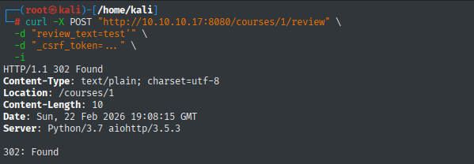
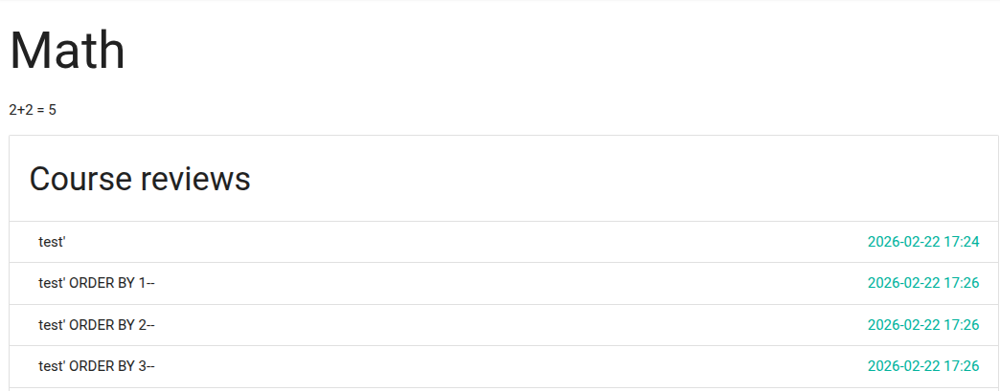
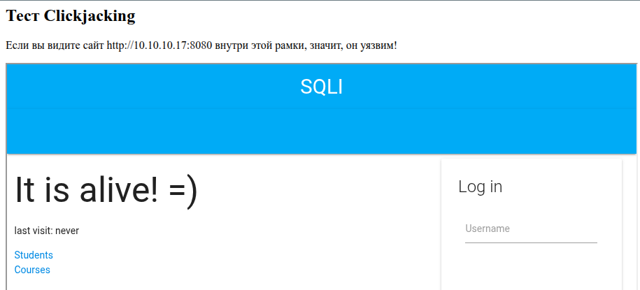
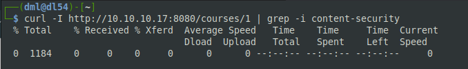
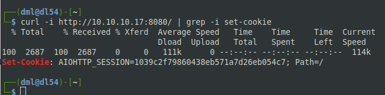

# 09.03.03. Penetration Testing. Часть 2.
https://github.com/netology-code/ibdef-homeworks/tree/master/07_pentest_2
### Задание 1
> 1. Запустите приложение из файла [docker-compose.yml](_att/docker-compose.yml).
> 2. Проведите пентест приложения и найдите как минимум 4 уязвимости.
> 3. Напишите в ответе, какие уязвимости были найдены.

**Ответ:**

**В результате пентеста были найдены следующие уязвимости:**

- SQL Injection в форме отправки отзывов (`/courses/1/review`, поле `review_text`), позволяющая выполнять произвольные SQL-запросы к базе данных PostgreSQL.
- Использование устаревшей версии jQuery (3.2.1) с известными уязвимостями (CVE-2019-11358, CVE-2020-11022, CVE-2020-11023).
- Небезопасная конфигурация сессионной cookie (AIOHTTP_SESSION) - отсутствие флагов `HttpOnly` и `SameSite`, что делает её уязвимой для кражи через XSS и CSRF-атаки.
- Утечка информации о версиях ПО через HTTP-заголовок Server, раскрывающая использование `Python 3.7` и `aiohttp 3.5.3`.

**Дополнительно выявлены проблемы конфигурации безопасности:**

- Отсутствие защиты от Clickjacking (нет X-Frame-Options).
- Отсутствие Content Security Policy (CSP).
- Отсутствие заголовка X-Content-Type-Options: nosniff.

### Задание 2
> После проведённого аудита напишите отчёт в формате markdown или doc.
> 
> Отчёт должен содержать:
> - полезную информацию об уязвимостях;
> - оценку критичности;
> - подтверждения нахождения;
> - предложения по исправлению.
> 
> Загрузите отчёт в личном кабинете студента.

**Ответ:**
# Отчет по результатам пентеста веб-приложения "SQLI"

**Дата проведения:** 22 февраля 2026  
**Цель:** http://10.10.10.17:8080  
**Методология:** Black Box  
**Инструменты:** Nmap, cURL, OWASP ZAP 

[Отчет ZAP](_att/090303/ZAP%20by%20Checkmarx%20Scanning%20Report.pdf)

---

## Общая информация

В ходе пентеста было обнаружено 7 уязвимостей различной степени критичности, включая `SQL Injection`, использование устаревших компонентов и проблемы конфигурации безопасности.

| Уровень риска | Количество |
|---------------|------------|
| Высокий | 1 |
| Средний | 3 |
| Низкий | 3 |

---

## Детальное описание уязвимостей
### 1. SQL Injection в форме отправки отзывов

| Свойство | Значение |
|----------|----------|
| **Критичность** | **Высокая** |
| **Компонент** | `/courses/*/review` |
| **Параметр** | `review_text` (POST) |
| **CWE** | [CWE-89: SQL Injection](https://cwe.mitre.org/data/definitions/89.html) |

#### Описание
Поле ввода отзыва на странице курса не фильтрует и не экранирует специальные символы SQL, что позволяет злоумышленнику выполнять произвольные запросы к базе данных PostgreSQL.

#### Подтверждение



При отправке отзыва с символом кавычки:
```bash
curl -X POST "http://10.10.10.17:8080/courses/1/review" \
  -d "review_text=test'" \
  -d "_csrf_token=..." \
  -i
```
Сервер вернул `302 Found` (успешное выполнение), что подтверждает выполнение SQL-запроса.

ZAP зафиксировал множественные `500 Internal Server Error` при тестировании этого эндпоинта (Alert ID: 10023, 90022), что является признаком нарушения синтаксиса SQL.

#### Потенциальный ущерб
- Полная компрометация базы данных
- Кража учетных данных пользователей
- В PostgreSQL возможно выполнение системных команд и чтение файлов сервера
- Получение несанкционированного доступа к приложению

#### Рекомендации по исправлению
1. Использовать параметризованные запросы
2. Применить ORM с автоматическим экранированием
3. Валидировать входные данные (тип, длина, формат)
4. Ограничить права учетной записи БД (не использовать суперпользователя)

---
### 2. Использование устаревшей версии jQuery

| Свойство | Значение |
|----------|----------|
| **Критичность** | **Средняя** |
| **Компонент** | `/static/js/jquery-3.2.1.min.js` |
| **CVE** | CVE-2019-11358, CVE-2020-11022, CVE-2020-11023 |
| **CWE** | [CWE-1395: Use of Known Vulnerable Component](https://cwe.mitre.org/data/definitions/1395.html) |

#### Описание
Приложение использует jQuery версии 3.2.1, для которой существуют публично известные уязвимости, связанные с Cross-site Scripting (XSS).

#### Подтверждение
Отчет OWASP ZAP (Alert ID: 10003):
> "The identified library jquery, version 3.2.1 is vulnerable.  
> CVE-2020-11023, CVE-2020-11022, CVE-2019-11358"

#### Эксплуатация

*Отправка вредоносного кода:*

```sh
# Получаем CSRF-токен
REVIEW_CSRF=$(curl -s "http://10.10.10.17:8080/courses/1/review" | grep _csrf_token | grep -o 'value="[^"]*"' | cut -d'"' -f2)

# Отправляем XSS-эксплоит (пытаемся украсть куку)
curl -X POST "http://10.10.10.17:8080/courses/1/review" \
  -d "review_text=" \
  -d "_csrf_token=$REVIEW_CSRF" \
  -i
```

*Отправляем простой тест:*

```sh
curl -X POST "http://10.10.10.17:8080/courses/1/review" \
  -d "review_text=<script>alert('XSS')</script>" \
  -d "_csrf_token=$REVIEW_CSRF" \
  -i
```

Затем заходим на страницу курса http://10.10.10.17:8080/courses/1

Отзывы отображаются на странице - XSS работает.


#### Потенциальный ущерб
- Возможность выполнения XSS-атак через уязвимости jQuery
- Кража сессионных cookie (особенно с учетом отсутствия HttpOnly флага)
- Выполнение произвольного JavaScript от имени пользователя

#### Рекомендации по исправлению
1. Обновить jQuery до актуальной версии
2. Регулярно проводить аудит используемых библиотек
3. Использовать менеджер пакетов (npm, yarn) для контроля версий

---
### 3. Отсутствие защиты от Clickjacking

| Свойство | Значение |
|----------|----------|
| **Критичность** | **Средняя** |
| **Компонент** | Все страницы |
| **CWE** | [CWE-1021: Improper Restriction of Rendered UI Layers](https://cwe.mitre.org/data/definitions/1021.html) |

#### Описание
В HTTP-ответах отсутствует заголовок `X-Frame-Options` или директива `frame-ancestors` в CSP, что позволяет встраивать страницы приложения в iframe на сторонних сайтах.

#### Подтверждение
Отчет OWASP ZAP (Alert ID: 10020) показывает отсутствие защиты на всех проверенных страницах.
#### Эксплуатация

Создаем и открываем html-файл:

```html
<html>
<head><title>Clickjack Test</title></head>
<body>
    <h2>Тест Clickjacking</h2>
    <p>Если вы видите сайт http://10.10.10.17:8080 внутри этой рамки, значит, он уязвим!</p>
    <iframe src="http://10.10.10.17:8080" width="900" height="600"></iframe>
</body>
</html>
```

Результат - сервер не отправляет запрещающий заголовок:



#### Потенциальный ущерб
- Проведение кликджекинг-атак (перехват кликов пользователя)
- Встраивание страницы логина в iframe для кражи учетных данных
- Социальная инженерия с использованием доверенного интерфейса

#### Рекомендации по исправлению
1. Добавить заголовок `X-Frame-Options: DENY` или `X-Frame-Options: SAMEORIGIN`
2. Настроить CSP с директивой `frame-ancestors 'none'` или `frame-ancestors 'self'`

---
### 4. Отсутствие Content Security Policy (CSP)

| Свойство | Значение |
|----------|----------|
| **Критичность** | **Средняя** |
| **Компонент** | Все страницы |
| **CWE** | [CWE-693: Protection Mechanism Failure](https://cwe.mitre.org/data/definitions/693.html) |

#### Описание
Приложение не использует заголовок `Content-Security-Policy`, что увеличивает поверхность для XSS-атак.

#### Подтверждение
Отчет OWASP ZAP (Alert ID: 10038) фиксирует отсутствие CSP на всех страницах.

#### Эксплуатация

Пустой вывод (отсутствие заголовка) на команду:



Отсутствие заголовка Content-Security-Policy в ответе сервера. Браузер не получает инструкций о том, какие источники ресурсов (скрипты, стили, изображения) считать доверенными

#### Потенциальный ущерб
- Повышенный риск успешных XSS-атак
- Возможность загрузки ресурсов с недоверенных источников
- Отсутствие защиты от data-инъекций

#### Рекомендации по исправлению
- Внедрить политику CSP

---
### 5. Небезопасная конфигурация сессионных cookie

| Свойство | Значение |
|----------|----------|
| **Критичность** | **Низкая** |
| **Компонент** | Сессионная cookie `AIOHTTP_SESSION` |
| **CWE** | [CWE-1004: Sensitive Cookie Without HttpOnly Flag](https://cwe.mitre.org/data/definitions/1004.html), [CWE-1275: Sensitive Cookie with Improper SameSite Attribute](https://cwe.mitre.org/data/definitions/1275.html) |

#### Описание
Сессионная cookie не имеет флага `HttpOnly` (доступна из JavaScript) и атрибута `SameSite`.

#### Подтверждение
Отчет OWASP ZAP (Alert ID: 10010, 10054):
- "Cookie No HttpOnly Flag" - 3 экземпляра
- "Cookie без атрибута SameSite" - 3 экземпляра

#### Эксплуатация



Отсутствие флагов безопасности означает, что этот идентификатор можно украсть и зайти под чужим именем

#### Потенциальный ущерб
- Кража сессионной cookie через XSS (из-за отсутствия HttpOnly)
- CSRF-атаки (из-за отсутствия SameSite)

#### Рекомендации по исправлению
- Настройка безопасной обработки cookie, добавление специальных флагов, которые защищают пользовательские данные от кражи и подделки

---
### 6. Отсутствие заголовка X-Content-Type-Options

| Свойство | Значение |
|----------|----------|
| **Критичность** | **Низкая** |
| **Компонент** | Все страницы |
| **CWE** | [CWE-693: Protection Mechanism Failure](https://cwe.mitre.org/data/definitions/693.html) |

#### Описание
Заголовок `X-Content-Type-Options: nosniff` не установлен, что позволяет браузерам выполнять MIME-сниффинг.

#### Подтверждение
Отчет OWASP ZAP (Alert ID: 10021) - системная проблема на всех страницах.

#### Потенциальный ущерб
- Браузер может интерпретировать файлы неверно (например, .txt как .html)
- Возможность XSS-атак при загрузке файлов

#### Рекомендации по исправлению
Добавить заголовок:
```
X-Content-Type-Options: nosniff
```

---
### 7. Утечка информации о версиях ПО

| Свойство | Значение |
|----------|----------|
| **Критичность** | **Низкая** |
| **Компонент** | HTTP-заголовок `Server` |
| **CWE** | [CWE-497: Exposure of Sensitive System Information](https://cwe.mitre.org/data/definitions/497.html) |

#### Описание
Сервер передает точные версии ПО в заголовке `Server`: Python/3.7 aiohttp/3.5.3.

#### Подтверждение
Отчет OWASP ZAP (Alert ID: 10036) и результаты nmap:
```
Server: Python/3.7 aiohttp/3.5.3
```


#### Потенциальный ущерб
- Злоумышленник может искать эксплойты под конкретные версии
- Упрощение подбора векторов атаки

#### Рекомендации по исправлению
1. Настроить сервер на сокрытие точных версий
2. Использовать общие значения (например, `Server: Web Server`)

---
## Заключение

В результате пентеста выявлено **7 уязвимостей**, из которых **1 имеет высокую критичность**. Наиболее опасной является SQL Injection в форме отзывов, позволяющая потенциально получить полный контроль над базой данных и сервером.

**Первоочередные меры:**
1. Исправить SQL Injection (параметризованные запросы)
2. Обновить jQuery до актуальной версии
3. Настроить заголовки безопасности (CSP, X-Frame-Options, X-Content-Type-Options, HttpOnly, SameSite)

---
