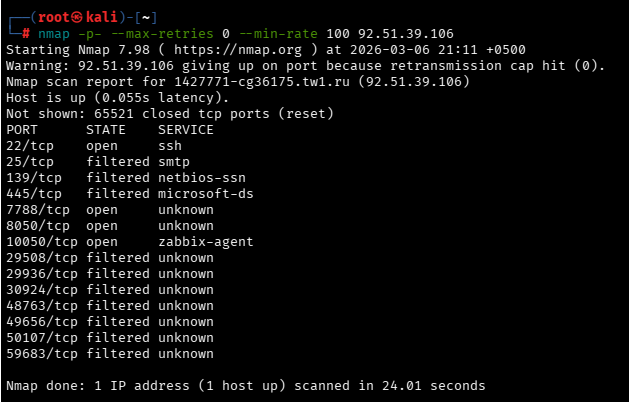
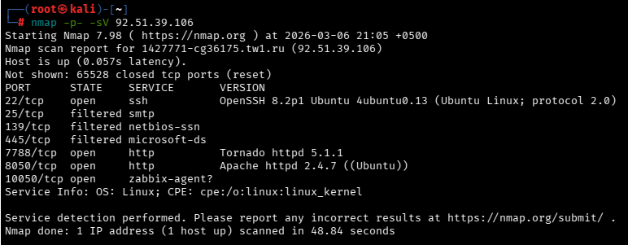
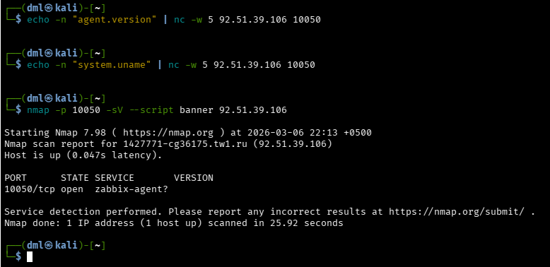
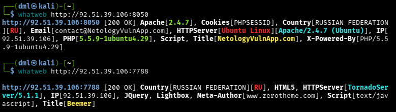

## Используемые инструменты

- Nmap
- WhatWeb
- Nikto
- Gobuster
- OWASP ZAP

## Сканирование NMap

Проведение быстрого сканирования всех портов со скоростью минимум 100 пакетов/сек и без повторных попыток выявило наличие базовых средств защиты от сканирования у провайдера или сервера (порты 29508–59683 перешли в статус filtered):

  

Определение открытых портов с версиями сервисов:

  

Сканирование подтверждает 4 активные цели:

- 22/tcp (SSH): Версия 8.2p1-4ubuntu0.13. **Вывод**: Ложная цель (False Positive на CVE). Патчи безопасности актуальны.
- 7788/tcp (Tornado 5.1.1): Нестандартный веб-сервер. **Вывод**: Вероятна утечка информации или слабые настройки доступа.
- 8050/tcp (Apache 2.4.7): Старая версия. **Вывод**: Критическая цель. Вероятны SQLi и Broken Authentication.
- 10050/tcp (Zabbix Agent): Прямой доступ к агенту мониторинга. **Вывод**: Потенциальный RCE или утечка данных о системе (CPU, RAM, процессы).

### Сканирование порта 10050

Результат сканирования показывает, что порт 10050 открыт, но сервис защищен: он не отдает баннер и не отвечает на стандартные пробы Nmap. Это означает, что агент принимает соединения только с определенных IP-адресов (сервера мониторинга). Уязвимость не подтверждена из-за ограничений ACL.

**Вывод** по порту 10050 - прямая эксплуатация извне невозможна (без подмены IP).

## Сканирование WhatWeb + Nikto + Gobuster + ZAP

### Методология и настройки инструментов

`WhatWeb` применялся для пассивного анализа технологического стека в стандартной конфигурации.

 

[Gobuster](_att/100200-gobuster.md) версии 3.8 использовался для перебора директорий и файлов со списком расширений. Для порта 8050 применялись расширения php, txt, html, bak, old. Для порта 7788 применялись расширения py, json, html.

[Nikto](_att/100200-nikto.md) версии 2.5.0 использовался для базового сканирования известных уязвимостей и ошибок конфигурации в стандартной конфигурации.

[OWASP ZAP](_att/100200-zap.md) применялся для глубокого анализа уязвимостей в активном режиме с максимальной глубиной сканирования и использованием всех техник инъекций, включая time-based атаки.

### Отчет о результатах сканирования

- Openssh сервер (порт 22) - Ложная цель (False Positive на CVE). Патчи безопасности актуальны.
- Неизвестное приложение, предположительно Agent Zabbix (порт 10050) - прямая эксплуатация невозможна.
- Веб-приложения, развернутые на целевом хосте (порты 8050, 7788) - приоритетная цель.
 
Использован комбинированный подход, включающий пассивную разведку, перебор директорий, сканирование уязвимостей и активный анализ. Обнаружен ряд уязвимостей различного уровня критичности. Все найденные уязвимости провалидированы для исключения ложных срабатываний.

## Цель: Порт 8050

#### Идентифицированный технологический стек

На порту 8050 функционирует веб-сервер Apache версии 2.4.7 под управлением операционной системы Ubuntu. Серверная часть реализована на языке PHP версии 5.5.9, которая достигла конца жизненного цикла. Приложение идентифицировано как NetologyVulnApp. Cookie PHPSESSID используется без флага HttpOnly.

#### Обнаруженные ресурсы

В ходе перебора директорий Gobuster обнаружены следующие страницы: about.php, calendar.php, error.php, guestbook.php, index.php, tos.php, test.php.

Обнаружены директории: admin, cart, comments, css, images, pictures, upload, users.

В директории users включен листинг, что позволило обнаружить файлы: check_pass.php, home.php, login.php, logout.php, register.php, sample.php, similar.php, view.php.

Выявлены подозрительные находки: директория include возвращает статус 500, страница action имеет большой размер, обнаружен артефакт wp-config.php.

## Цель: Порт 7788

#### Идентифицированный технологический стек

На порту 7788 функционирует веб-сервер TornadoServer версии 5.1.1. Серверная часть реализована на языке Python с использованием фреймворка Tornado. Приложение использует HTML5, библиотеки jQuery и Lightbox. Приложение идентифицировано как Beemer, использующее шаблон с zerotheme.com.

#### Обнаруженные ресурсы

В ходе перебора директорий Gobuster обнаружены страницы index.html, login.html, read, search, server.html. Обнаружен функционал upload, принимающий запросы методом POST.

## Вывод по результатам сканирования

В результате проведенной сканирования выявлены четыре открытых порта на целевом хосте: 22/tcp, 7788/tcp, 8050/tcp и 10050/tcp.

Порт 22/tcp с SSH-сервером OpenSSH 8.2p1 признан ложной целью, так как использует актуальную версию с установленными патчами безопасности. Порт 10050/tcp идентифицирован как Zabbix Agent, однако прямая эксплуатация извне невозможна ввиду наличия ограничений доступа по IP-адресам.

Приоритетными целями для дальнейшего тестирования определены два веб-приложения на портах 8050 и 7788.

На порту 8050 функционирует веб-сервер Apache 2.4.7 с PHP 5.5.9, приложение идентифицировано как NetologyVulnApp. Устаревшая версия PHP, достигшая конца жизненного цикла, представляет потенциальную угрозу. В ходе перебора директорий обнаружены страницы about.php, calendar.php, error.php, guestbook.php, index.php, tos.php, test.php, а также директории admin, cart, comments, css, images, pictures, upload, users. В директории users выявлен открытый листинг с файлами check_pass.php, home.php, login.php, logout.php, register.php, sample.php, similar.php, view.php. Подозрительными находками являются директория include со статусом 500, страница action большого размера и артефакт wp-config.php.

На порту 7788 функционирует веб-сервер TornadoServer 5.1.1, приложение идентифицировано как Beemer, использующее HTML5, библиотеки jQuery и Lightbox. Обнаружены страницы index.html, login.html, read, search, server.html, а также функционал upload, принимающий запросы методом POST.

Таким образом, в ходе разведки определены два веб-приложения, содержащие множественные точки входа, потенциально уязвимые к различным классам атак. Указанные цели требуют проведения дальнейшего тестирования для выявления и подтверждения уязвимостей.